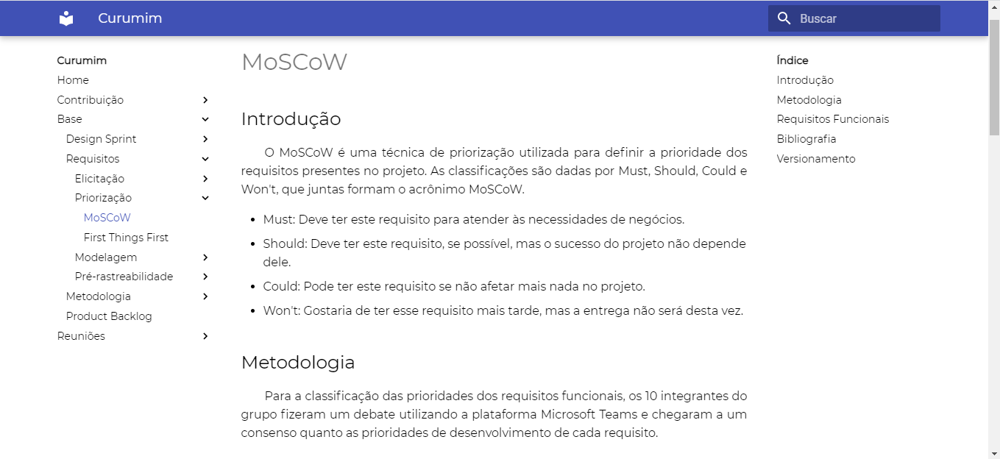

# 2021.1_G6_Curumim
<!-- # RepositorioTemplate
Esse repositório é para ser utilizado pelos grupos como um template inicial, da home page do Projeto.
Demais diretrizes sobre a organização da wiki constam no Moodle Aprender 3.

**!! Atenção: Renomeie o seu repositório para (Ano.Semestre)_(Grupo)_(NomeDoProjeto)*. !!** 

**!! *Não coloque os nomes dos alunos no título do repositório*. !!**

**!! *Exemplo de título correto: 2021.1_G1_ProjetoPandora*. !!** 
 
 (Apague essa seção) -->

# <!-- Nome do Projeto --> Grupo 06

**Código da Disciplina**: FGA0208 
**Número do Grupo**: 06 

## Alunos
|Matrícula | Aluno |
| -- | -- |
| 16/0114705  | Bruno Alves Félix |
| 18/0149687  | Daniel Porto de Souza |
| 19/0105381  | Edson de Araújo Soares |
| 18/0015834  | Eliseu Kadesh Rosa Assunção Júnior |
| 16/0119006  | Enzo Gabriel Guedes Queiroz Saraiva |
| 17/0142329  | Francisco Emanoel Ferreira da Penha |
| 18/0145088  | Gabriel Bonifácio Perez Nunes |
| 16/0152615  | João Pedro Elias de Moura |
| 16/0015006  | Mateus Oliveira Patrício |
| 16/0037522  | Nilo Mendonça de Brito Júnior |

## Sobre  
&emsp;&emsp;
Considerando a atual relação entre professores e administradores com os responsáveis de crianças em centros educacionais, a proposta do projeto Curumim é justamente fazer com que os responsáveis possam ter um contato maior com suas crianças, e com professores e administradores. Além disso, terão acesso a informações e dados, para que possa participar mais da educação delas. Por outro lado, os professores poderão registrar e gerenciar atividades, para possivelmetne poder até mesmo notificar esses responsáveis sobre quaisquer observações a serem feitas. Este é o projeto Curumim. 
&emsp;&emsp;

<!-- ## Screenshots Primeira Entrega <<FOCO: DSW(Base)>>
Adicione 2 ou mais screenshots do projeto em termos de artefatos da Primeira Entrega.
--->

## Projeto Wiki
&emsp;&emsp;
    No momento que estamos, ainda não há uma aplicação pronta, por estamos na fase inicial. Para que se possa "saborerar" — mesmo que minimamente — parte do que será o projeto Curumim, seguem algumas imagens da nossa documentação que está sendo feita durante esses dias na Wiki:

- Imagem 1 - Wiki - Brainstorming:

[Figura 1: Wiki - Brainstorming](docs/assets/sobre/wiki-imagem1.png)

 

- Imagem 2 - Wiki - MosCoW:

[Figura 2: Wiki - MosCoW](docs/assets/sobre/wiki-imagem2.png)

 

- Imagem 3 - Wiki - BPMN:

[Figura 3: Wiki - BPMN](docs/assets/sobre/wiki-imagem3.png)

 

- Imagem 4 - Wiki - Argumentação:

[Figura 4: Wiki - Argumentação](docs/assets/sobre/wiki-imagem4.png)

 

&emsp;&emsp;
Estas são 4 imagens que dão início a nossa documentação aqui no README sobre as documentações. Conforme o projeto for andando e se aprimorando, a ideia é retratar aqui no README todas essas novas evoluções.

<!--

## Vídeo(s) Primeira Entrega <<FOCO: DSW(Base)>>
Adicione o(s)s vídeo(s) da Primeira Entrega.

## Screenshots Segunda Entrega <<FOCO: DSW(Modelagem)>>
Adicione 2 ou mais screenshots do projeto em termos de artefatos da Segunda Entrega.

## Vídeo(s) Segunda Entrega <<FOCO: DSW(Modelagem)>>
Adicione o(s)s vídeo(s) da Segunda Entrega.

## Screenshots Terceira Entrega <<FOCO: DSW(Padrões de Projeto)>>
Adicione 2 ou mais screenshots do projeto em termos de artefatos da Terceira Entrega.

## Vídeo(s) Terceira Entrega <<FOCO: DSW(Padrões de Projeto)>>
Adicione o(s)s vídeo(s) da Terceira Entrega.

## Screenshots Quarta Entrega (FINAL) <<FOCOS: Arquitetura & Reutilização de Software & PROJETO FINAL>>
Adicione 2 ou mais screenshots do projeto em termos de interface e/ou funcionamento.

## Vídeo(s) Quarta Entrega (FINAL) <<FOCOS: Arquitetura & Reutilização de Software & PROJETO FINAL>>
Adicione o(s)s vídeo(s) da Entrega Final.

## Descritivo dos Principais Aspectos Técnicos 
**Principal(is) Metodologia(s) Adotada(s)**: xxxxxx 
**Principais Linguagens Utilizadas e/ou Pretendidas**: xxxxxx 
**Principais Tecnologias Utilizadas e/ou Pretendidas**: xxxxxx 
**Principal(is) Estilo(s) Arquitetural(is) Adotado(s)**: xxxxxx 

## O Projeto está rodando?
( ) SIM
( ) NÃO
Se SIM, insira um manual (ou um script) para auxiliar ainda mais os interessados em consultar o projeto.

## Informações Complementares 
Quaisquer outras informações sobre seu projeto podem ser descritas nessa seção. -->
