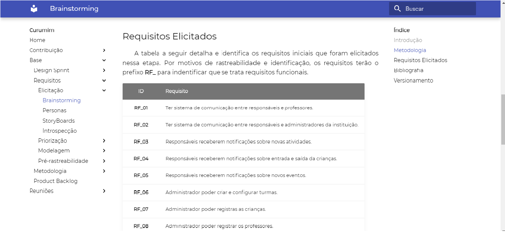
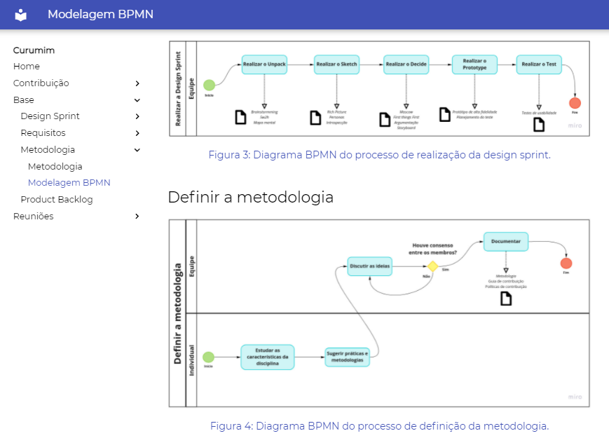
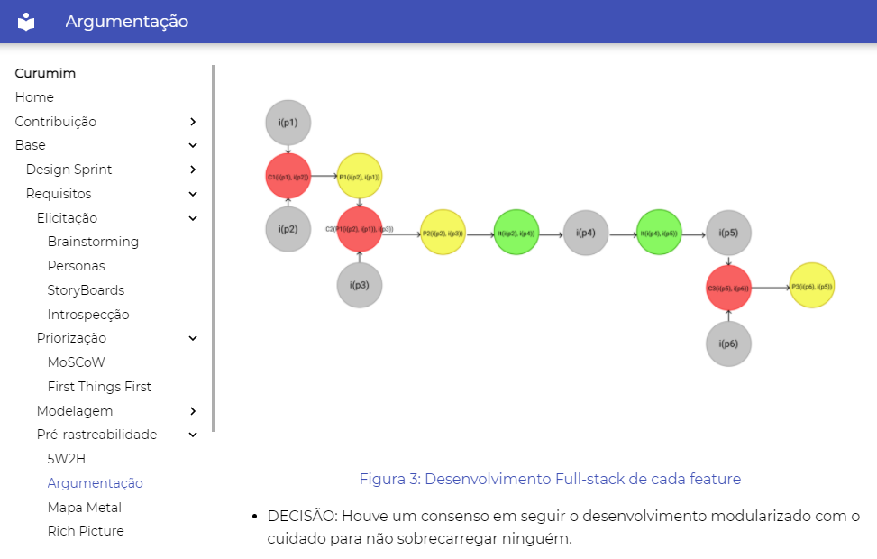
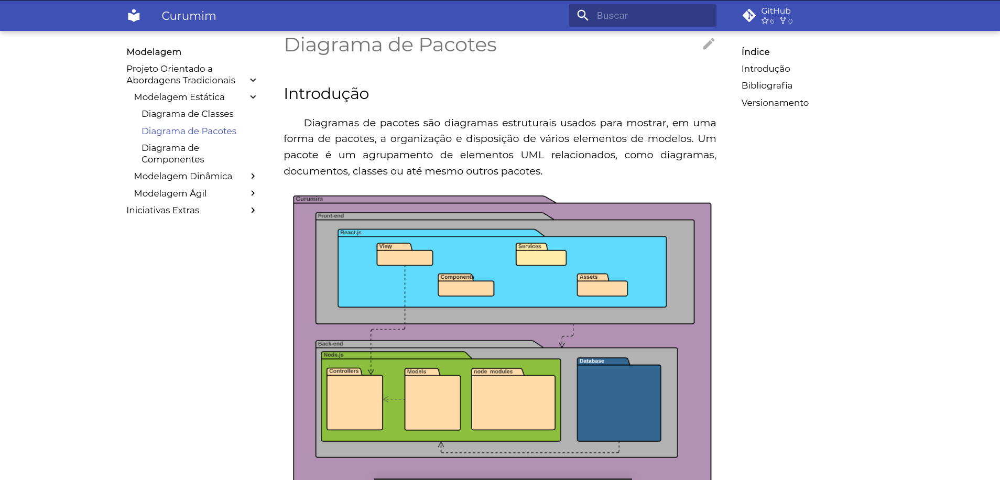
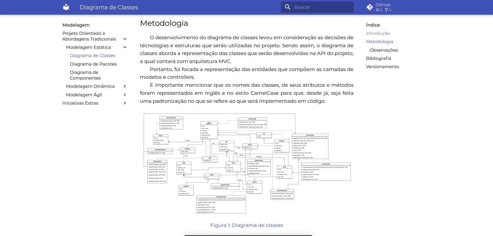
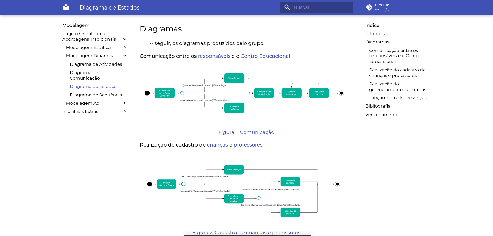
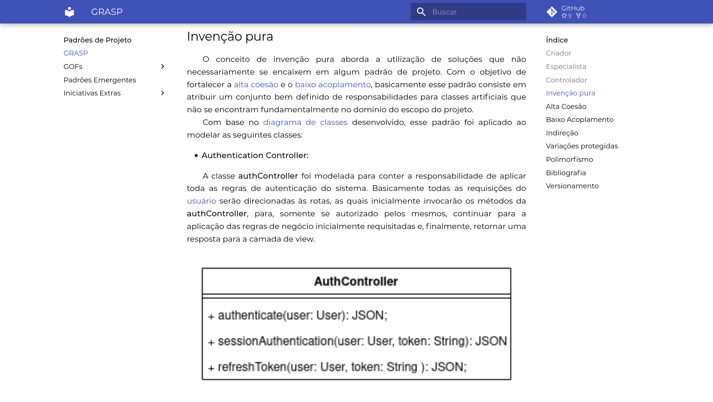
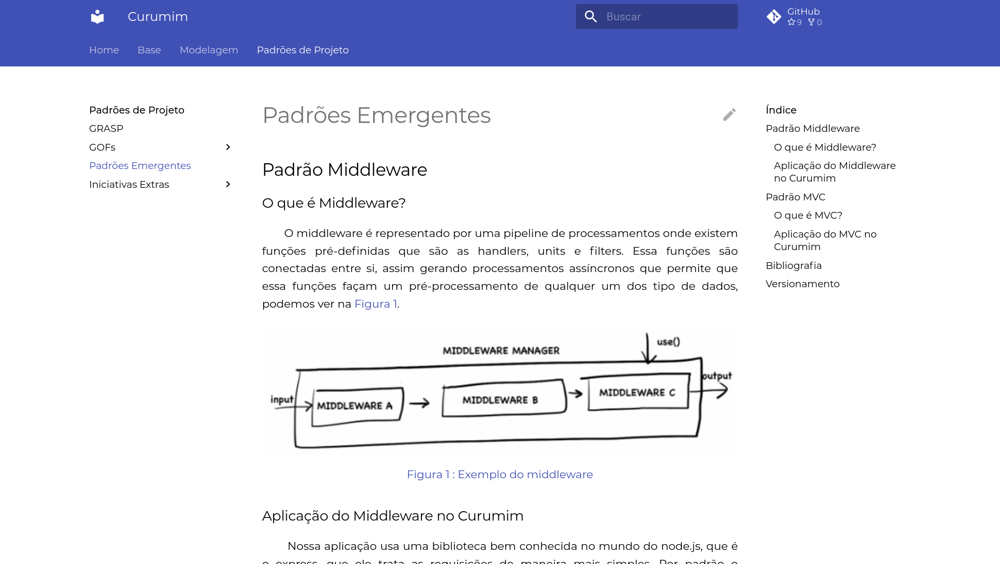
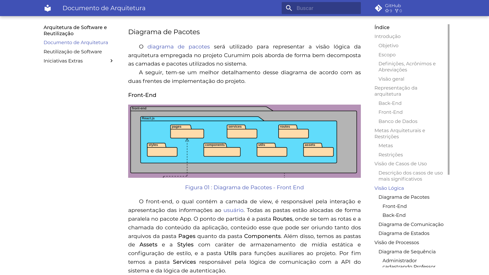

# 2021.1_G6_Curumim
<!-- # RepositorioTemplate
Esse repositório é para ser utilizado pelos grupos como um template inicial, da home page do Projeto.
Demais diretrizes sobre a organização da wiki constam no Moodle Aprender 3.

**!! Atenção: Renomeie o seu repositório para (Ano.Semestre)_(Grupo)_(NomeDoProjeto)*. !!** 

**!! *Não coloque os nomes dos alunos no título do repositório*. !!**

**!! *Exemplo de título correto: 2021.1_G1_ProjetoPandora*. !!** 
 
 (Apague essa seção) -->

# <!-- Nome do Projeto --> Grupo 06

**Código da Disciplina**: FGA0208 
**Número do Grupo**: 06 

## Alunos
|Matrícula | Aluno |
| -- | -- |
| 16/0114705  | Bruno Alves Félix |
| 18/0149687  | Daniel Porto de Souza |
| 19/0105381  | Edson de Araújo Soares |
| 18/0015834  | Eliseu Kadesh Rosa Assunção Júnior |
| 16/0119006  | Enzo Gabriel Guedes Queiroz Saraiva |
| 17/0142329  | Francisco Emanoel Ferreira da Penha |
| 18/0145088  | Gabriel Bonifácio Perez Nunes |
| 16/0152615  | João Pedro Elias de Moura |
| 16/0015006  | Mateus Oliveira Patrício |
| 16/0037522  | Nilo Mendonça de Brito Júnior |

## Sobre  
&emsp;&emsp;Considerando a atual relação entre [professores](docs/base/requisitos/modelagem/lexicos.md/#l%C3%A9xico----professor) e [administradores](docs/base/requisitos/modelagem/lexicos.md/#l%C3%A9xico---administrador) com os [responsáveis](docs/base/requisitos/modelagem/lexicos.md/#l%C3%A9xico---respons%C3%A1vel) de [crianças](docs/base/requisitos/modelagem/lexicos.md/#l%C3%A9xico----crian%C3%A7a) em [centros educacionais](docs/base/requisitos/modelagem/lexicos.md/#l%C3%A9xico---centro-educacional), a proposta do projeto Curumim é justamente fazer com que os [responsáveis](docs/base/requisitos/modelagem/lexicos.md/#l%C3%A9xico---respons%C3%A1vel) possam ter um contato maior com suas [crianças](docs/base/requisitos/modelagem/lexicos.md/#l%C3%A9xico----crian%C3%A7a), e com [professores](docs/base/requisitos/modelagem/lexicos.md/#l%C3%A9xico----professor) e [administradores](docs/base/requisitos/modelagem/lexicos.md/#l%C3%A9xico---administrador). Além disso, terão acesso a informações e dados, para que possa participar mais da [educação](docs/base/requisitos/modelagem/lexicos.md/#l%C3%A9xico---educa%C3%A7%C3%A3o) delas. Por outro lado, os [professores](docs/base/requisitos/modelagem/lexicos.md/#l%C3%A9xico----professor) poderão registrar e gerenciar [atividades](docs/base/requisitos/modelagem/lexicos.md/#l%C3%A9xico---atividade), para possivelmente poder até mesmo [notificar](docs/base/requisitos/modelagem/lexicos.md/#l%C3%A9xico---notificar) esses [responsáveis](docs/base/requisitos/modelagem/lexicos.md/#l%C3%A9xico---respons%C3%A1vel) sobre quaisquer observações a serem feitas. Este é o projeto Curumim. 

## Vídeo da Primeira Entrega DSW(Base)

- [O vídeo da Primeira entrega pode ser acessado clicando aqui!](https://www.youtube.com/embed/sEOklsIoxgY)

## Wiki do Projeto - Primeira Entrega:
&emsp;&emsp;No momento que estamos, ainda não há uma aplicação pronta, por estarmos na fase inicial. Para que se possa "saborerar" — mesmo que minimamente — parte do que será o projeto Curumim, seguem algumas imagens da nossa documentação que está sendo feita durante esses dias na Wiki:

- Imagem 1 - Wiki - Brainstorming:

 
[Figura 1: Wiki - Brainstorming](docs/assets/imagens/sobre/entrega1/wiki-imagem1.png)

 

- Imagem 2 - Wiki - MosCoW:

 
[Figura 2: Wiki - MosCoW](docs/assets/imagens/sobre/entrega1/wiki-imagem2.png)

 

- Imagem 3 - Wiki - BPMN:

 
[Figura 3: Wiki - BPMN](docs/assets/imagens/sobre/entrega1/wiki-imagem3.png)

 

- Imagem 4 - Wiki - Argumentação:

 
[Figura 4: Wiki - Argumentação](docs/assets/imagens/sobre/entrega1/wiki-imagem4.png)

 

&emsp;&emsp;Estas são 4 imagens que dão início a nossa documentação aqui no README sobre as documentações. Conforme o projeto for andando e se aprimorando, a ideia é retratar aqui no README todas essas novas evoluções.

## Vídeos Segunda Entrega: DSW(Modelagem)
- [Vídeo 1 da segunda entrega: modelagem estática](https://www.youtube.com/watch?v=JoXI1bMMnsY)
- [Vídeo 2 da segunda entrega: modelagem dinâmica](https://www.youtube.com/watch?v=KigxCIalYMk)
- [Vídeo 3 da segunda entrega: modelagem ágil](https://www.youtube.com/watch?v=a6LLD7Fk-SY)

## Wiki do Projeto - Segunda Entrega:

- Imagem 5 - Wiki - Diagrama de Pacotes:

 
[Figura 5: Wiki - Diagrama de Pacotes](docs/assets/imagens/sobre/entrega2/img1.png)

 

- Imagem 6 - Wiki - Diagrama de Classes:

 
[Figura 6: Wiki - Diagrama de Classes](docs/assets/imagens/sobre/entrega2/img2.png)

 

- Imagem 7 - Wiki - Diagrama de Estados:

 
[Figura 7: Wiki - Diagrama de Estados](docs/assets/imagens/sobre/entrega2/img3.png)

 

## Vídeos Terceira Entrega: DSW(Modelagem)
- [Vídeo 1 da terceira entrega: GRASPs](https://youtu.be/mbvHbWMJyx8)
- [Vídeo 2 da terceira entrega: GOFs](https://youtu.be/lU1N1XQrQQg)
- [Vídeo 3 da terceira entrega: Emergentes e iniciativas extras](https://youtu.be/jgxKgl4xUcA)

## Wiki do Projeto - Terceira Entrega:

- Imagem 8 - Wiki - GRASPs:

 
[Figura 8: Wiki - GRASPs](docs/assets/imagens/sobre/entrega3/img1.png)

 

 Imagem 9 - Wiki - GOFs:

 
[Figura 9: Wiki - GOFs](docs/assets/imagens/sobre/entrega3/img2.png)

 

 Imagem 10 - Wiki - Emergentes:

 
[Figura 10: Wiki - Emergentes](docs/assets/imagens/sobre/entrega3/img3.png)

 

## Vídeos Terceira Entrega: DSW(Modelagem)

- [Vídeo 1 da quarta entrega: Documento de Arquitetura](https://www.youtube.com/watch?v=U9OZuPLXc9k)
- [Vídeo 2 da quarta entrega: Reutilização de Software](https://www.youtube.com/watch?v=o6Stv2kmE1Q)

## Wiki do Projeto - Quarta Entrega:

- Imagem 11 - Wiki - Documento de Arquitetura:

 
[Figura 11: Wiki - Documento de Arquitetura](docs/assets/imagens/sobre/entrega4/img1.png)

 

 Imagem 12 - Wiki - Diagrama de Pacotes:

 
[Figura 12: Wiki - Diagrama de Pacotes](docs/assets/imagens/sobre/entrega4/img2.png)

 

 Imagem 13 - Wiki - Reutilização de Software:

 
[Figura 13: Wiki - Reutilização de Software](docs/assets/imagens/sobre/entrega4/img3.png)

 

<!-- ## Screenshots Terceira Entrega <<FOCO: DSW(Padrões de Projeto)>>
Adicione 2 ou mais screenshots do projeto em termos de artefatos da Terceira Entrega.

## Vídeo(s) Terceira Entrega <<FOCO: DSW(Padrões de Projeto)>>
Adicione o(s)s vídeo(s) da Terceira Entrega.

## Screenshots Quarta Entrega (FINAL) <<FOCOS: Arquitetura & Reutilização de Software & PROJETO FINAL>>
Adicione 2 ou mais screenshots do projeto em termos de interface e/ou funcionamento.

## Vídeo(s) Quarta Entrega (FINAL) <<FOCOS: Arquitetura & Reutilização de Software & PROJETO FINAL>>
Adicione o(s)s vídeo(s) da Entrega Final.

## Descritivo dos Principais Aspectos Técnicos 
**Principal(is) Metodologia(s) Adotada(s)**: xxxxxx 
**Principais Linguagens Utilizadas e/ou Pretendidas**: xxxxxx 
**Principais Tecnologias Utilizadas e/ou Pretendidas**: xxxxxx 
**Principal(is) Estilo(s) Arquitetural(is) Adotado(s)**: xxxxxx 

## O Projeto está rodando?
( ) SIM
( ) NÃO
Se SIM, insira um manual (ou um script) para auxiliar ainda mais os interessados em consultar o projeto.

## Informações Complementares 
Quaisquer outras informações sobre seu projeto podem ser descritas nessa seção. -->