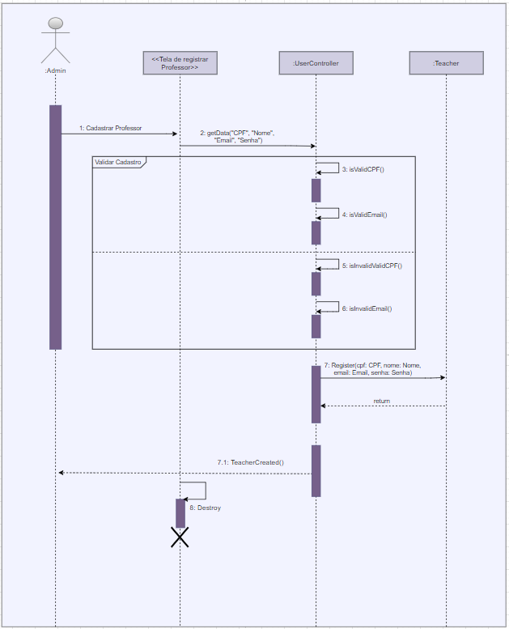
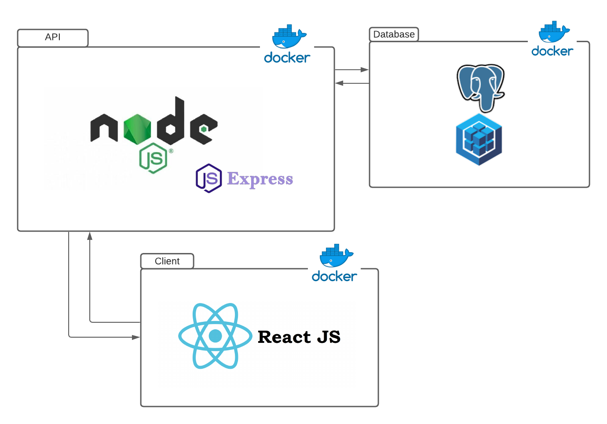
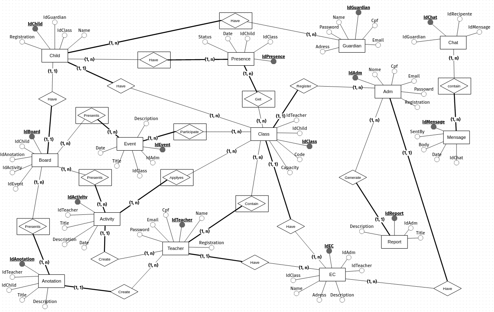

## Introdução
### Objetivo
&emsp;&emsp;O presente documento de arquitetura tem como objetivo elucidar e descrever os aspectos mais importantes no que tange os estilos e padrões arquiteturais acerca da concepção e desenvolvimento do projeto Curumim.

### Escopo
&emsp;&emsp;Através desse documento é possível se ter um entendimento detalhado sobre os aspectos inerentes ao projetos contidos no conjunto "4 + 1" de visões arquiteturais definido pelo RUP[[1]](#bibliografia) e a visão de dados. 
&emsp;&emsp;Além disso, esse documento aborda uma representação mais detalhada da arquitetura, as metas arquiteturais, restrições e aspectos acerca da qualidade, tamanho e desempenho do produto 
&emsp;&emsp;Sendo assim, esse documento serve de guia para o entendimento do design e desenvolvimento do projeto.

### Definições, Acrônimos e Abreviações
&emsp;&emsp;A tabela a seguir contém as definições dos mais variados termos utilizados neste documento de arquitetura. Mais definições sobre termos pertencentes ao domínio do projeto podem ser encontrados no documento de [***Léxicos***](../../base/requisitos/modelagem/lexicos).

| Termo | Descrição |
| :-: | -- |
| RUP | Rational Unified Process |
| MVC | Model View Controller |

### Visão geral
&emsp;&emsp;Esse documento de arquitetura é composto pelos seguintes tópicos:

 - [Introdução](#introducao): Provê uma visão ampla sobre o presente documento.
 - [Representação da arquitetura](#representacao-da-arquitetura): Descreve e representa a arquitetura escolhida para o projeto;
 - [Metas Arquiteturais e Restrições](#metas-arquiteturais-e-restricoes): Descreve as metas arquiteturais e as restrições que têm impacto significativo na arquitetura;
 - [Visão de Casos de Uso](#visao-de-casos-de-uso): Descreve e detalha os casos de uso;
 - [Visão Lógica](#visao-logica): Descreve as partes arquitetonicamente significativas do modelo de projeto;
 - [Visão de Processos](#visao-de-processos): Descreve a decomposição do sistema em processos menores e seus agrupamentos;
 - [Visão de Implantação](#visao-de-implantacao): Descreve a disponibilização da aplicação para uso;
 - [Visão de Implementação](#visao-de-implementacao): Descreve a estrutura e decomposição do modelo de implementação do projeto;
 - [Visão de Dados](#visao-de-dados): Descreve a persistência de dados armazenados;
 - [Tamanho e Desempenho](#tamanho-e-desempenho): Descreve as principais características de dimensionamento afetam a arquitetura, bem como as restrições de desempenho;
 - [Qualidade](#qualidade): Descreve como a arquitetura contribui com as mais variadas características de qualidade.
 - [Bibliografia](#bibliografia): Fontes utilizadas para a construção desse artefato;
 - [Versionamento](#versionamento): Histórico de alterações do documento.

## Representação da arquitetura

## Metas Arquiteturais e Restrições

## Visão de Casos de Uso
&emsp;&emsp;Apresentando uma representação mais próxima do usuário, a visão de casos de uso auxilia no entendimento das interações dos atores com o sistema de forma a descrever os cenários de uso da aplicação. O diagrama de casos de uso do projeto Curumim pode ser acessado pelo [documento de casos de uso](../../modelagem/modelagem-dinamica/casos-de-uso) desenvolvido anteriormente. 
&emsp;&emsp;A seguir, tem-se uma descrição resumida dos casos de uso mais significativos do projeto, os quais contemplam as funcionalidades mais prioritárias do sistema.
#### Descrição dos casos de uso mais significativos

- **UC01 - Cadastrar [criança](../../base/requisitos/modelagem/lexicos/#lexico-crianca):** este caso de uso é exclusivo do ator [administrador](../../base/requisitos/modelagem/lexicos/#lexico-administrador) e consiste em registrar uma [criança](../../base/requisitos/modelagem/lexicos/#lexico-crianca) dentro do sistema da aplicação com o objetivo de colocá-la no banco de dados, tornando essa [criança](../../base/requisitos/modelagem/lexicos/#lexico-crianca) uma [aluna](../../base/requisitos/modelagem/lexicos/#lexico-aluno) no [centro educacional](../../base/requisitos/modelagem/lexicos/#lexico-centro-educacional).

- **UC02 - Gerenciar [turmas](../../base/requisitos/modelagem/lexicos/#lexico-turma):** este caso de uso é exclusivo do ator [administrador](../../base/requisitos/modelagem/lexicos/#lexico-administrador) e consiste em fazer o gerenciamento das [turmas](../../base/requisitos/modelagem/lexicos/#lexico-turma). O [centro educacional](../../base/requisitos/modelagem/lexicos/#lexico-centro-educacional) pode possuir diversas divisões de [alunos](../../base/requisitos/modelagem/lexicos/#lexico-aluno) que estejam no mesmo nível educacional, o que podemos definir como [turmas](../../base/requisitos/modelagem/lexicos/#lexico-turma), e esse caso de uso trata justamente do gerenciamento de todas essas divisões por parte do [administrador](../../base/requisitos/modelagem/lexicos/#lexico-administrador).

- **UC03 - Cadastrar [professor](../../base/requisitos/modelagem/lexicos/#lexico-professor):** este caso de uso é exclusivo do ator [administrador](../../base/requisitos/modelagem/lexicos/#lexico-administrador) e consiste em registrar um [professor](../../base/requisitos/modelagem/lexicos/#lexico-professor) dentro do sistema da aplicação com o objetivo de dar-lhe permissão à funcionalidades na aplicação exclusivas do [professor](../../base/requisitos/modelagem/lexicos/#lexico-professor) e cadastrá-lo no sistema. 

- **UC04 - Gerenciar [eventos](../../base/requisitos/modelagem/lexicos/#lexico-evento):** este caso de uso é exclusivo do ator [administrador](../../base/requisitos/modelagem/lexicos/#lexico-administrador) e consiste em fazer o gerenciamento de [eventos](../../base/requisitos/modelagem/lexicos/#lexico-evento). Durante toda a temporada escolar, diversos [eventos](../../base/requisitos/modelagem/lexicos/#lexico-evento) podem acontecer. Para que [responsável](../../base/requisitos/modelagem/lexicos/#lexico-responsavel) e [professores](../../base/requisitos/modelagem/lexicos/#lexico-professor) tenham conhecimento desses [eventos](../../base/requisitos/modelagem/lexicos/#lexico-evento), o [administrador](../../base/requisitos/modelagem/lexicos/#lexico-administrador) pode fazer todo o gerenciamento com o objetivo de expô-los na aplicação.

- **UC05 - Gerenciar [anotações](../../base/requisitos/modelagem/lexicos/#lexico-anotacao) sobre os [alunos](../../base/requisitos/modelagem/lexicos/#lexico-aluno):** este caso de uso é exclusivo do ator [professor](../../base/requisitos/modelagem/lexicos/#lexico-professor) e consiste em fazer o gerenciamento das [anotações](../../base/requisitos/modelagem/lexicos/#lexico-anotacao) sobre os [alunos](../../base/requisitos/modelagem/lexicos/#lexico-aluno) de acordo com os acontecimentos diários observados pelo [professor](../../base/requisitos/modelagem/lexicos/#lexico-professor) no [centro educacional](../../base/requisitos/modelagem/lexicos/#lexico-centro-educacional).

- **UC06 - Gerenciar [atividades](../../base/requisitos/modelagem/lexicos/#lexico-atividade) da [turma](../../base/requisitos/modelagem/lexicos/#lexico-turma):** este caso de uso é exclusivo do ator [professor](../../base/requisitos/modelagem/lexicos/#lexico-professor) e consiste em fazer o gerenciamento de [atividades](../../base/requisitos/modelagem/lexicos/#lexico-atividade) da [turma](../../base/requisitos/modelagem/lexicos/#lexico-turma) com o objetivo de apresentar aos [responsáveis](../../base/requisitos/modelagem/lexicos/#lexico-responsavel) as [atividades](../../base/requisitos/modelagem/lexicos/#lexico-atividade) que foram pedidas aos [alunos](../../base/requisitos/modelagem/lexicos/#lexico-aluno) do [centro educacional](../../base/requisitos/modelagem/lexicos/#lexico-centro-educacional).

- **UC07 - Efetuar login:** este caso de uso pode ser feito pelos atores [professor](../../base/requisitos/modelagem/lexicos/#lexico-professor), [responsável](../../base/requisitos/modelagem/lexicos/#lexico-responsavel) e [administrador](../../base/requisitos/modelagem/lexicos/#lexico-administrador), e consiste em se conectar à aplicação por parte desses atores, utilizando um registro próprio com seu devido usuário e senha.

- **UC08 - Verificar senha:** este caso de uso pode ser feito pelos atores [professor](../../base/requisitos/modelagem/lexicos/#lexico-professor), [responsável](../../base/requisitos/modelagem/lexicos/#lexico-responsavel) e [administrador](../../base/requisitos/modelagem/lexicos/#lexico-administrador), e consiste na verificação da senha digitada por parte desses atores, para que possa se analisar se o seu registro inicial coincide com o digitado no momento. 

- **UC09 - Exibir mensagem de erro:** este caso de uso pode ser feito pelos atores [professor](../../base/requisitos/modelagem/lexicos/#lexico-professor), [responsável](../../base/requisitos/modelagem/lexicos/#lexico-responsavel) e [administrador](../../base/requisitos/modelagem/lexicos/#lexico-administrador) e consiste na exibição de uma mensagem de erro, caso a senha digitada no caso de uso 07 ([UC07](#visao-de-casos-de-uso)) não coincida com a senha registrada anteriormente.

- **UC10 - Visualizar todas as minhas [turmas](../../base/requisitos/modelagem/lexicos/#lexico-turma):** este caso de uso é exclusivo do ator [professor](../../base/requisitos/modelagem/lexicos/#lexico-professor) e consiste na visualização de todas as  [turmas](../../base/requisitos/modelagem/lexicos/#lexico-turma) por parte do [professor](../../base/requisitos/modelagem/lexicos/#lexico-professor) para que ele possa analisar todos os aspectos que envolvem uma  [turma](../../base/requisitos/modelagem/lexicos/#lexico-turma).

- **UC11 - [Lançar presença](../../base/requisitos/modelagem/lexicos/#lexico-lancar-presenca) dos [alunos](../../base/requisitos/modelagem/lexicos/#lexico-aluno):** este caso de uso é exclusivo para o ator [professor](../../base/requisitos/modelagem/lexicos/#lexico-professor) e consiste em confirmar a [presença](../../base/requisitos/modelagem/lexicos/#lexico-presenca) de [alunos](../../base/requisitos/modelagem/lexicos/#lexico-aluno) à aula.

- **UC12 - Efetuar cadastro:** este caso de uso é exclusivo para o ator [responsável](../../base/requisitos/modelagem/lexicos/#lexico-responsavel), onde apenas um [responsável](../../base/requisitos/modelagem/lexicos/#lexico-responsavel) pode realizar o seu cadastro na plataforma.

- **UC13 - Conversar com o [centro educacional](../../base/requisitos/modelagem/lexicos/#lexico-centro-educacional):** este caso consiste em um [responsável](../../base/requisitos/modelagem/lexicos/#lexico-responsavel) entrar em contato com um [professor](../../base/requisitos/modelagem/lexicos/#lexico-professor) ou [administrador](../../base/requisitos/modelagem/lexicos/#lexico-administrador) por meio do chat da plataforma.

- **UC16 - Obter informações da minha [criança](../../base/requisitos/modelagem/lexicos/#lexico-crianca):** o caso ocorre caso um [responsável](../../base/requisitos/modelagem/lexicos/#lexico-responsavel) queira visualizar as [presenças](../../base/requisitos/modelagem/lexicos/#lexico-presenca), as [atividades](../../base/requisitos/modelagem/lexicos/#lexico-atividade), a [agenda](../../base/requisitos/modelagem/lexicos/#lexico-agenda), as [anotações](../../base/requisitos/modelagem/lexicos/#lexico-anotacao) ou os [eventos](../../base/requisitos/modelagem/lexicos/#lexico-evento) de sua [criança](../../base/requisitos/modelagem/lexicos/#lexico-crianca).

- **UC22 - Receber [notificações](../../base/requisitos/modelagem/lexicos/#lexico-notificacao) com informações da minha [criança](../../base/requisitos/modelagem/lexicos/#lexico-crianca):** caso exista alguma informação nova da [criança](../../base/requisitos/modelagem/lexicos/#lexico-crianca) o [responsável](../../base/requisitos/modelagem/lexicos/#lexico-responsavel) deve ser notificado.

- **UC23 - Receber [relatórios](../../base/requisitos/modelagem/lexicos/#lexico-relatorio) com o desempenho da minha [criança](../../base/requisitos/modelagem/lexicos/#lexico-crianca):** neste caso o [responsável](../../base/requisitos/modelagem/lexicos/#lexico-responsavel) deve receber periodicamente [relatórios](../../base/requisitos/modelagem/lexicos/#lexico-relatorio) contendo informações sobre o desempenho de sua [criança](../../base/requisitos/modelagem/lexicos/#lexico-crianca).

## Visão Lógica
&emsp;&emsp;A visão lógica consiste na organização conceitual do projeto. O tópico de visão lógica é utilizado para mostrar de forma a decompor o agrupamento dos subsistemas e pacotes da arquitetura do sistema. 
&emsp;&emsp;O projeto Curumim é estruturado no padrão [MVC](../padroes-de-projeto/padroes_emergentes.md), o qual consiste em três camadas lógicas que interagem entre si. Aqui dividimos os pacotes em agrupamentos lógicos e apresentamos suas dependências entre eles.

### Diagrama de Pacotes
&emsp;&emsp;O [diagrama de pacotes](../../modelagem/modelagem-estatica/diagrama-de-pacotes) será utilizado para representar a visão lógica da arquitetura empregada no projeto Curumim pois aborda de forma bem decomposta as camadas e pacotes utilizados no sistema. 
&emsp;&emsp;A seguir, tem-se um melhor detalhamento desse diagrama de acordo com as duas frentes de implementação do projeto.

#### Front-End

[Figura 01 : Diagrama de Pacotes - Front End](../assets/imagens/arquitetura/front_end_visao_logica.png)
 

&emsp;&emsp;O front-end, o qual contém a camada de view, é responsável pela interação e apresentação das informações ao usuário. Todas as pastas estão alocadas de forma paralela no pacote App. O ponto de partida é a pasta **Routes**, onde se tem as rotas e a chamada do conteúdo da aplicação, conteúdo esse que pode ser oriundo tanto dos arquivos da pasta **Pages** quanto da pasta **Components**. Além disso, temos as pastas de **Assets** e a **Styles** com caráter de armazenamento de mídia estática e configuração de estilo, e a pasta **Utils** para funções auxiliares ao projeto. Por fim temos a pasta **Services** responsável pela lógica de comunicação com a API do sistema e da lógica de autenticação.

#### Back-End

[Figura 02 : Diagrama de Pacotes - Back End](../assets/imagens/arquitetura/back_end_visao_logica.png)
 
&emsp;&emsp;No back-end está contida a camada de controle (controller do MVC), onde os componentes recebem requisições de componentes externos. Conforme o necessário, a camada de controle cuida das solicitações de requisições enviadas pela visão. Segundo os autores do artigo, Arquitetura de Software de Referência para Sistemas de Informação Governamentais. “Deve-se considerar que a camada de controle é responsável por colaborar com a camada de modelo.” (XI Brazilian Symposium on Information System, Goiânia, GO, Maio 26-29, 2015, p.81)[[4]](#bibliografia) 
&emsp;&emsp;As classes de domínio do sistema estão contidas na camada de modelo (model do MVC), que contém, também, as relações entre as classes bem como a definição das informações que serão persistidas no banco de dados e suas regras. 
&emsp;&emsp;Controller e model estão representadas no [diagrama de pacotes](../../modelagem/modelagem-estatica/diagrama-de-pacotes) pelos diretórios **controllers** e **models** que estão dentro do diretório **app**. 
&emsp;&emsp;Ainda no diretório **app**, estão contidos os diretórios **middlewares** e **utils** os quais contém classes que dão auxílio à camada de controle na aplicação das regras de negócios e dos [padrões de projeto](../padroes-de-projeto/grasp.md). 
&emsp;&emsp;Paralelamente ao diretório **app**, estão o diretório **config**, o qual contém definições e variáveis referentes a configurações de ambiente, autenticação e banco de dados, e o diretório **database**, o qual contém as regras de criação e modificação de tabelas no diretório **migrations** e se estabelece a conexão com o banco de dados. 
&emsp;&emsp;Todos os diretórios citados acima são subdiretórios do diretório **src**, o qual agrupa todo o código fonte desenvolvido da aplicação. Esse diretório está em paralelo com o diretório **node_modules**, o qual é composto dos módulos e bibliotecas da ferramenta [Node.js](https://nodejs.org/en/about/).

### Diagrama de Comunicação
&emsp;&emsp;Utilizados para definir e esclarecer funções de objetos e classes, os [diagramas de comunicação](../../modelagem/modelagem-dinamica/diagrama-de-comunicacao) mostram as interações entre objetos e/ou partes. Dessa forma, esses diagramas podem ser utilizados para complementar a representação da visão lógica da arquitetura do projeto, visto que sua modelagem se deu forma a abordar um contexto mais macro do sistema mais focado na lógica da aplicação. 
&emsp;&emsp;Tais artefatos podem ser acessados pelo [documento dos diagramas de comunicação](../../modelagem/modelagem-dinamica/diagrama-de-comunicacao).

### Diagrama de Estados
&emsp;&emsp;Esses diagramas visam demonstrar as transições entre os diferentes objetos que compõem o sistema. E, seguindo a mesma linha do que foi citado no tópico acima, também contribui para uma melhor representação da visão lógica da arquitetura. 
&emsp;&emsp;Sendo assim, tais artefatos pode ser acessados pelo [documento dos diagramas de estados](../../modelagem/modelagem-dinamica/diagrama-estados).

## Visão de Processos

&emsp;&emsp;A visão de Processo evidencia as ações processadas pelo sistema em tempo de execução, além da alocação de objetos e classes para tarefas. É uma visão que permite a visualização das partes dinâmicas do sistema, onde é evidenciado os processos, as threads e as interações entre elas. 
### Diagrama de Sequência

&emsp;&emsp;O diagrama de sequência é uma solução dinâmica de modelagem em UML bastante utilizada para demonstrar um conjunto de interações entre os componentes de um sistema. Em nossa implementação utilizamos de alguns [diagramas de sequência](../modelagem/modelagem-dinamica/diagrama-de-sequencia.md) para mostrar alguns processos de nosso sistema.

#### [Administrador](../../../base/requisitos/modelagem/lexicos/#lexico-administrador) cadastrando [Professor](../../../base/requisitos/modelagem/lexicos/#lexico-professor)

[Figura 03: Diagrama de sequência do administrador cadastrando professor](../assets/imagens/diagrama-de-sequencia/Diagrama-de-sequencia-admin-cadastrando-prof.png)

#### [Administrador](../../../base/requisitos/modelagem/lexicos/#lexico-administrador) cadastrando [Evento](../../../base/requisitos/modelagem/lexicos/#lexico-evento)

[Figura 04: Diagrama de sequência do administrador cadastrando evento](../assets/imagens/diagrama-de-sequencia/../../../assets/imagens/diagrama-de-sequencia/Diagrama-de-sequencia-admin-cadastrando-evento.png)

#### [Responsável](../../../base/requisitos/modelagem/lexicos/#lexico-responsavel) fazendo Login

[Figura 05: Diagrama de sequência do guardian fazendo login](../assets/imagens/diagrama-de-sequencia/Diagrama-de-sequencia-pais-responsaveis-login.png)

### Diagrama de Atividades
&emsp;&emsp;Se tratam de diagramas de comportamento UML que demonstram os fluxos de controle ou os fluxos de objetos focados na sequência e nas condições de cada um de forma a elucidar o fluxo entre as ações de uma determinada atividade. 
&emsp;&emsp;Para complementar a representação da visão de processos da arquitetura, e tomando uma abordagem com ênfase no fluxo de controle de atividades, podem ser utilizados os [diagramas de atividades](../../modelagem/modelagem-dinamica/diagrama-de-atividades) desenvolvidos anteriormente.

## Visão de Implantação
&emsp;&emsp;A visão de implantação aborda a disponibilização da aplicação para uso. Dessa forma o seguinte fluxo elucida como se dá a implantação do projeto curumim:

- **Desenvolvimento de funcionalidade:** Etapa na qual os desenvolvedores aplicam as [metodologias](../base/metodologia/metodologia.md) de acordo com as [políticas](../politicas.md) para criar novas funcionalidades;
- **Pull-request para a branch develop:** Um pull-request do código desenvolvido é criado para a branch de desenvolvimento;
- **Build do software através de um sistema de integração contínua:** Utilizando o GitHub, é realizado o build da branch da nova funcionalidade para certificar a consistência do código da aplicação na branch de desenvolvimeto da nova funcionalidade;
- **Realização de revisão por pares:** Os revisores avaliam se o que foi desenvolvido atendem aos critérios de aceitação e está dentro dos padrões;
- **Mesclagem do código na branch develop:** É realizada a mesclagem do código desenvolvido com o da branch de desenvolvimento;
- **Deploy do software para o ambiente de homologação:** É realizado o deploy da branch de desenvolvimento para o ambiente de homologação;
- **Fechamento de Release:** É criada uma branch release para o fechamento de uma versão da aplicação;
- **Mesclagem do código na branch main:** A branch release é mesclada na branch main e, caso tenha ajustes, na de desenvolvimento;
- **Deploy do software para o ambiente de produção:** É realizado o deploy da branch main para o ambiente de produção;

&emsp;&emsp;Para tal implantação, são utilizadas as ferramentas **Docker** para padronização de recursos e empacotamento do software, **GitHub** para controle de versões e realização de rotinas CI/CD e **Heroku** para deploy da aplicação em homologação e produção.
## Visão de Implementação

&emsp;&emsp;A visão de implementação se caracteriza como uma das cinco visões de arquitetura de um sistema e sua finalidade é captar as decisões de arquitetura tomadas para a implementação, buscando descrever como os artefatos de desenvolvimento estão organizados. 
&emsp;&emsp;Geralmente, a visão de implementação possui:

- Uma enumeração de todos os subsistemas no modelo de implementação;
- Diagramas de componentes que ilustram os subsistemas, organizados em camadas e hierarquias;
- Ilustrações de dependências de importação entre subsistemas;

&emsp;&emsp;Sendo considerado extremamente útil em questões relacionadas a atribuição do trabalho de implementação a indivíduos e equipes, na avaliação da quantidade de código que será excluído, modificado ou desenvolvido e também para discussões a respeito de reutilização em larga escala e estratégias de release.

### Padrão MVC
#### Camadas

- Model: Essa camada na aplicação Curumim tem a responsabilidade de encapsular estados da aplicação, assim é possível tratar modificações de estado e notificações de estado;
- View: Essa segunda camada tem como objetivo apresentar a interface para o usuário, na aplicação Curumim ela é a principal responsável por mostrar informações da Model para a interface do cliente;
- Controller: Essa é camada que faz o intermédio entre as camadas View e Model, assim mapeando as ações do usuário na view para possíveis mudanças na Model;

#### Conclusão
&emsp;&emsp;Algumas literaturas ao falar do padrão MVC acabam abordando a aplicabilidade dessa arquitetura principalmente a aplicações web, visto sua facilidade e flexibilidade de interação e visualização de dados, além disso a arquitetura MVC trás alguns padrões já conhecidos como os:

* [GRASPs(Indireções e Controller)](../padroes-de-projeto/grasp.md)
* [GoFs Estruturais (Facade)](../padroes-de-projeto/gofs-estruturais.md)
* [GoFs Comportamentais (Observer)](../padroes-de-projeto/gofs-comportamentais.md)

&emsp;&emsp; Essa foi a principal arquitetura aplicada no projeto Curumim, visto sua eficiência e simplicidade, e por fim trazendo um código mais manutenível [[2]](#bibliografia). 

### API
&emsp;&emsp;API pode ser definida como um conjunto de protocolos e definições usados na integração e no desenvolvimento de softwares de aplicações, permitindo que uma solução ou serviço se comunique com outros produtos e serviços sem haver a necessidade de saber como eles foram implementados, simplificando assim o desenvolvimento de aplicações. 
&emsp;&emsp;No projeto Curumim o objetivo da divisão em camadas é possibilitar a reutilização da solução para diversas interfaces. Especificamente no [back-end](https://github.com/UnBArqDsw2021-1/2021.1_G6_Curumim_Back-end) da aplicação a estrutura foi dividida em três componentes principais: 

- Models: Assim como explicado no item anterior, tem a responsabilidade de encapsular os estados da aplicação;
- Controllers: Que realiza a ponte entre as Model e o cliente que consome a API;
- Middlewares: Que são representados por uma pipeline de processamentos, com funções pré-definidas que são handles, units e filters;
- Others: Que auxilia a implementação dos padrões de projetos provendo interfaces e classes mais complementares.

&emsp;&emsp;O [diagrama de componentes](../../modelagem/modelagem-estatica/diagrama-de-componentes) ilustra bem as camadas e subcamadas da aplicação. Já para um melhor entendimento de cada subcamada se faz necessário uma análise do [diagrama de classes](../../modelagem/modelagem-estatica/diagrama-de-classes) o qual mostra com mais detalhes os métodos e as relações entre as classes contidas nas camadas de Model e Controller.

<!-- ### Diagrama de camadas

&emsp;&emsp;Para melhor visualização das camadas da aplicação, foi elaborado um diagrama, composto pelas três principais camadas da aplicação:

- Client: Representa o [Front-end](../../base/requisitos/modelagem/lexicos/#front-end) , sendo implementado utilizando o React js;
- API: Representa o [Back-end](../../base/requisitos/modelagem/lexicos/#back-end), sendo implementado em Node js e utilizando o Express js;
- Database: Representa o banco de dados, utilizando o Postgresql;

 
[Figura 1 - Diagrama de camadas](../assets/imagens/arquitetura-reutilizacao/Diagrama-de-camadas.png)

 -->
## Visão de Dados

&emsp;&emsp;Enquanto a [visão lógica](#visao-logica) descreve como o sistema é estruturado, a visão de dados vem com o objetivo de se tratar de uma especialização nessa mesma visão lógica. A ideia principal é que essa visão seja utilizada se a persistência for um aspecto realmente significativo do sistema e se a conversão do modelo de design — para o modelo de dados — não for feita automaticamente pelos mecanimos de persistência. É possível considerar diversas visões, mas nem todas são relevantes, e a visão de dados muitas vezes é considerada uma dessas opcionais.

&emsp;&emsp;Tratamos dessa visão quando o sistema tem camadas de persistência, visto que também ela contém um detalhamento do banco de dados. Um exemplo utilizado pelo projeto [Curumim](https://github.com/UnBArqDsw2021-1/2021.1_G6_Curumim) é o modelo conceitual ([MER](../modelagem/modelagem-estatica/MER.md)), o Modelo de Entidade-Relacionamento. Um outro que podemos utilizar como referência nessa visão de dados, é justamente o [DER](../modelagem/modelagem-estatica/DER.md),  o diagrama de Entidade-Relacionamento, que aborda uma forma de representar graficamente a modelagem do banco de dados. A figura abaixo representa o DER Conceitual.

[Figura 06: Diagrama Conceitual - DER](../assets/imagens/DER/der-conceitual-curumim.png)

&emsp;&emsp;Nota-se também que podemos citar o [Diagrama Lógico](../modelagem/modelagem-estatica/diagrama-logico-bd.md) ao entendê-lo como uma descrição de um banco de dados, se diferenciando do [DER](../modelagem/modelagem-estatica/DER.md) por ter um nível de abstração menor.
 
&emsp;&emsp;Por fim, parte dessa persistência se encaixa no nosso projeto no [Front-End](https://github.com/UnBArqDsw2021-1/2021.1_G6_Curumim_Front-end) quando o [usuário](../../base/requisitos/modelagem/lexicos/#lexico-usuario), após o login, fica com acesso contínuo às suas funções. Para detalhar mais,
basicamente um "LocalStorage" é acionado, afim de conseguir identificar um "token", que é uma identificação individual dos usuários. Caso esse "token" seja identificado e realmente exista, a aplicação apresentará uma tela ao usuário, caso não, o usuário é redirecionado para a tela de Login. Nesse caso, a persistência é um aspecto realmente significativo.

## Tamanho e Desempenho

## Qualidade

&emsp;&emsp;A arquitetura adotada pelo grupo para construção da aplicação utiliza o padrão MVC, possibilitando a divisão dos principais componentes do projeto em camadas e subcamadas bem definidas, conferindo uma maior organização ao projeto e facilitando o desenvolvimento pelos diferentes integrantes do grupo. Foram seguidos alguns padrões [GRASP](../padroes-de-projeto/grasp.md) como o [Controlador](../padroes-de-projeto/grasp.md), o [Invenção pura](../padroes-de-projeto/grasp.md) e o [Polimorfismo](../padroes-de-projeto/grasp.md). Para a manutenção, portabilidade e futuras features foram utilizados padrões criacionais entre eles o [Factory Method](../padroes-de-projeto/gofs-criacionais.md), o [Abstract Factory](../padroes-de-projeto/gofs-criacionais.md) e o [Singleton](../padroes-de-projeto/gofs-criacionais.md). Além de serem seguidos alguns padrões comportamentais capazes de trazer confiabilidade tais como o [Command](../padroes-de-projeto/gofs-comportamentais.md), o [Iterator](../padroes-de-projeto/gofs-comportamentais.md) e o [Observer](../padroes-de-projeto/gofs-comportamentais.md).

| Critérios| Descrição|
|-------|---------|
|Portabilidade| Em relação a portabilidade o projeto foi baseado em divisões entre o [Front-end](../../base/requisitos/modelagem/lexicos/#front-end) e o [Back-end](../../base/requisitos/modelagem/lexicos/#Back-end), sendo o [Back-end](../../base/requisitos/modelagem/lexicos/#Back-end) nossa API, onde se localizar as principais features, pensando nesse modelo, qualquer outra stack pode consumir essa API, assim garantindo a portabilidade para vários [Front-end](../../base/requisitos/modelagem/lexicos/#front-end) diferentes.|
|Segurança| Na aplicação da API do Curumim foram adicionados alguns gatilhos que melhoram nossa segurança, principalmente no banco de dados, como a biblioteca bcrypt, além disso usamos um sistema de autenticação que usa token para verificações, usando o JWT.|
|Usabilidade| Para a aplicação Curumim foi escolhido algumas stack bem utilizadas no mercado de trabalho para construção de aplicação web, focamos em uma linguagem de programação que foi o javascript com auxílios de bibliotecas e frameworks.|
|Eficiência| Utilizamos padrões de projeto principalmente na API resolvendo um problema de design existente e a escolha por WebApp permite uma fácil execução por parte dos usuários.|
|Manutenibilidade| Foram utilizadas ferramentas populares no mercado o que tanto facilitou no desenvolvimento do projeto quanto poderá facilitar futuras manutenções uma vez que existe uma grande comunidade de desenvolvedores, além de como já citado terem sido empregados padrões de projeto que facilitam por terem caracteristicas como o alto desacoplamento. |

&emsp;&emsp;Para ter uma melhor visão dos principais requisitos não funcionais do projeto tem os documentos [NFR-FRAMEWORK](../../base/requisitos/modelagem/nfr-framework) e a [Especificação Suplementar](../../base/requisitos/modelagem/especificacao-suplementar).

## Bibliografia

> - [1] Visões Arquiteturais. Disponível em <https://www.inf.ufpr.br/andrey/ci163/VisoesAl.pdf>. Acesso em 29 set. 2021.
> - [2] O que é MVC?. Disponível em <https://www.treinaweb.com.br/blog/o-que-e-mvc>. Acesso em 02 de out. 2021
> - [3] UniGrade. Documento de Arquitetura de Software. Disponível em: <https://ads-unigrade-2019-1.github.io/Wiki/dinamica06/DAS/#7-visao-da-implementacao>. Acesso em 02 de out. 2021
> - [4] SERRANO,Milene; SERRANO, Maurício; CAVALCANTE, André Cruz. Arquitetura de Software deReferência para Sistemas de Informação Governamentais. In: XI Brazilian Symposium on Information System, Goiânia, Maio 26-29, 2015. Disponível em: <https://sol.sbc.org.br/index.php/sbsi/article/view/5886/5784>. Acesso em: 04/10/2021 
> - [5] Documento de Arquitetura de Software. Disponível em <https://www.cin.ufpe.br/~gta/rup-vc/core.base_rup/guidances/guidelines/software_architecture_document_F4C93435.html>. Acesso em: 04 de out. de 2021.    
> - Videoaulas e materiais complementares presentes no moodle da disciplina Arquitetura e Desenho de Software. Disponível em <https://aprender3.unb.br/course/view.php?id=8603>. Acesso em: 14 de out. 2021.  
> - "Diretriz. Visão Arquitetural". Disponível em <https://www.trt9.jus.br/pds/pdstrt9/guidances/guidelines/architectural_view_FF6EDA37.html>. Acesso em 14 de out. 2021.
> - "Artefato: Documento de Arquitetura de Software". Disponível em <https://www.cin.ufpe.br/~gta/rup-vc/core.base_rup/workproducts/rup_software_architecture_document_C367485C.html?nodeId=8d5440e6>. Acesso em 14 de out. 2021.

## Versionamento

| Versão | Data | Modificação | Autor |
|:-:|--|--|--|
|1.0|29/09/2021| Abertura do documento e inclusão da introdução | Daniel Porto |
|1.1|02/10/2021| Criando tópico de visão de implementação | Francisco Ferreira e Nilo Mendonça|
|1.2|03/10/2021| Criação da estrutura Visão Lógica | Bruno Félix e Edson Soares |
|1.3|04/10/2021| Adição da Visão de Processos | João Pedro, Enzo Gabriel |
|1.4|05/10/2021| Argumentação da Visão Lógica (Intro/backend) | Bruno Félix e Edson Soares |
|1.5|05/10/2021| Inserção do tópico Front End da Visão Lógica | Bruno Félix |
|1.6|05/10/2021| Adição da visão dos casos de uso | Mateus O. Patrício e Gabriel Bonifácio |
|1.7|08/10/2021| Ajustes das visões de casos de uso, lógica, de processos e de implementação | Daniel Porto |
|1.9|14/10/2021| Revisão do tópico de qualidade | Daniel Porto, Mateus O. Patrício e Gabriel Bonifácio |
|2.0|14/10/2021| Criação do tópico Visão de Dados | Mateus O. Patrício e Gabriel Bonifácio |
|2.1|14/10/2021| Adição da visão de implantação e atualização do diagrama de pacotes | Daniel Porto |