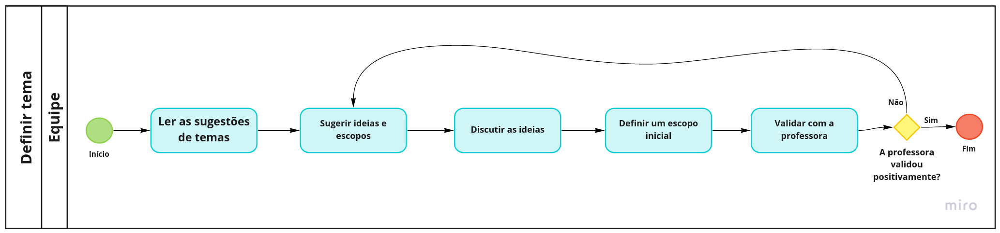
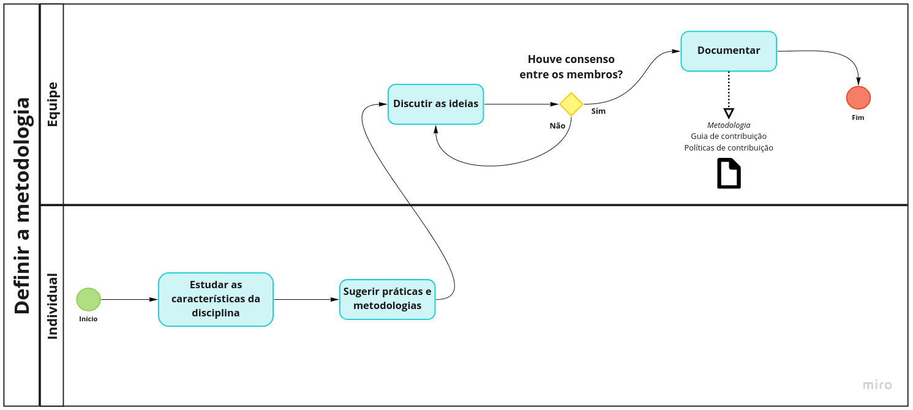
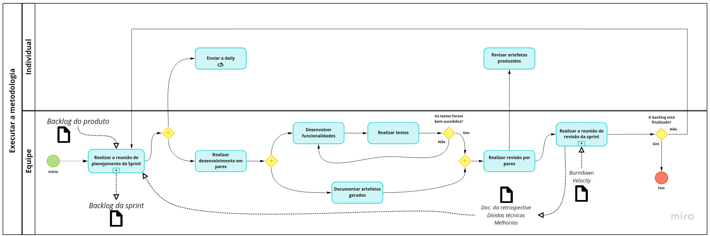
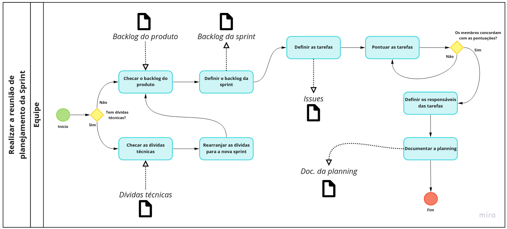
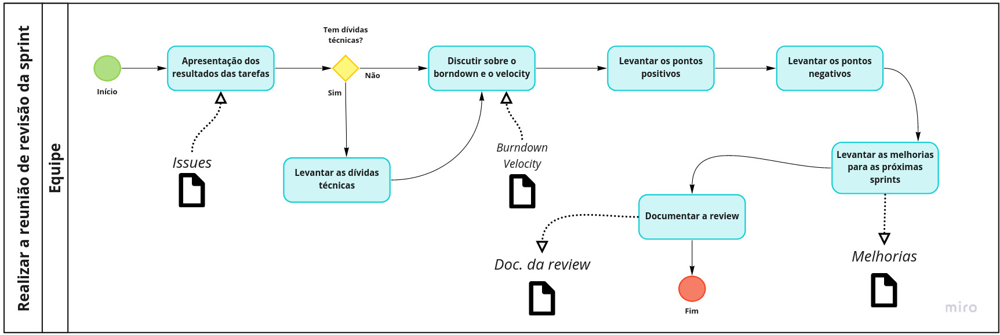

## Introdução
&emsp;&emsp;A Business Process Model and Notation (BPMN), proporciona uma visualização gráfica de processos. Assim, ao se desenhar um diagrama de processos, será possível usar símbolos universais que serão entendidos por diversos profissionais que tenham acesso a este padrão internacional de notação.
&emsp;&emsp;Os diagramas contidos no documento presente, foram desenvolvidos usando o padrão da linguagem e simbologia BPMN para uma visualização mais fácil e um entendimento melhor sobre os fluxos dos processos implementados ao longo do projeto. 
&emsp;&emsp;Para tal, foi utilizada a [ferramenta Miro](https://miro.com/) e os resultados estão apresentados a seguir.

## Processo geral

[Figura 1: Diagrama BPMN do processo geral.](../../assets/imagens/BPMN/bpmn-geral.jpg)

## Definir tema

[Figura 2: Diagrama BPMN do processo de definição do tema.](../../assets/imagens/BPMN/bpmn-tema.jpg)

## Realizar a design sprint

[Figura 3: Diagrama BPMN do processo de realização da design sprint.](../../assets/imagens/BPMN/bpmn-ds.jpg)

## Definir a metodologia

[Figura 4: Diagrama BPMN do processo de definição da metodologia.](../../assets/imagens/BPMN/bpmn-metodologia.jpg)

## Executar a metodologia

[Figura 5: Diagrama BPMN do processo de execução da metodologia.](../../assets/imagens/BPMN/bpmn-ex-metodologia.jpg)

## Realizar a reunião de planejamento da Sprint

[Figura 6: Diagrama BPMN do processo de realização do planning.](../../assets/imagens/BPMN/bpmn-planning.jpg)

## Realizar a reunião de revisão da sprint

[Figura 7: Diagrama BPMN do processo de realização da review.](../../assets/imagens/BPMN/bpmn-review.jpg)

## Bibliografia
> - Videoaulas e materiais complementares presentes no moodle da disciplina Arquitetura e Desenho de Software. Disponível em <https://aprender3.unb.br/course/view.php?id=8603>. Acesso em: 04 jul. 2021.
> - "Notação BPMN": [https://www.heflo.com/pt-br/bpm/notacao-bpmn/](https://www.heflo.com/pt-br/bpm/notacao-bpmn/). Acesso em: 17 set. 2021.

## Versionamento
| Versão | Data | Modificação | Autor |
|:-:|--|--|--|
|1.0|05/08/2021| Abertura do documento | Daniel Porto |
|1.1|05/08/2021| Adição dos diagramas | Daniel Porto |
|1.2|17/09/2021| Atualização de informações de acordo com o feedback da entrega 1 | Gabriel Bonifácio |
|1.3|19/09/2021| Revisão por pares | Bruno Félix e Daniel Porto |