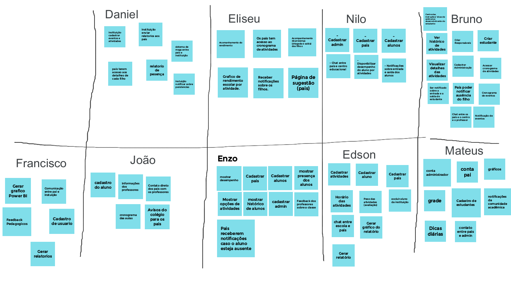

## Introdução

&emsp;&emsp;Visando uma explanação inicial sobre o tema proposto, a equipe optou por aplicar a técnica de brainstoming para colher opiniões e as diferentes visões dos integrantes a cerca do projeto já elicitando alguns requisitos iniciais. 
&emsp;&emsp;O brainstorming é uma técnica muito dinâmica que permite uma discussão bem abrangente levando em consideração opiniões e pontos de vistas pessoais de cada participante sobre os aspectos do projeto e as possíveis abordagens.

## Metodologia

&emsp;&emsp;Utilizando a ferramenta Google Jamboard, foi feita uma bateria com três rounds de um minuto e meio. Para cada round, cada integrante usou a funcionalidade de post-it do Jamboard para colocar uma ideia ou opinião sobre o que o sistema do projeto em questão deveria conter. No fim de cada round foi dado tempo para que todos os integrantes lessem os post-it dos demais com o intuito de inspirar novas ideias a partir do que já está no quadro. 
&emsp;&emsp;Ao final dos três rounds, começam as discurssões. Foi dada a oportunidade para cada participante defender suas ideias e questionar as dos demais para que todos escolherem, juntos, um conjunto de requisitos iniciais.

[Figura 1: Quadro de Braistoming](../../../assets/imagens/brainstorming/brainstorming.png)

## Requisitos Elicitados

&emsp;&emsp;A tabela a seguir detalha e identifica os requisitos iniciais que foram elicitados nessa etapa. Por motivos de rastreabilidade e identificação, os requisitos terão o prefixo **RF_** para indentificar que se trata requisitos funcionais.

|    ID     | Requisito                                                                       |
| :-------: | ------------------------------------------------------------------------------- |
| **RF_01** | Ter sistema de comunicação entre [responsáveis](/base/requisitos/modelagem/lexicos/#lexico-responsavel) e [professores](/base/requisitos/modelagem/lexicos/#lexico-professor).                    |
| **RF_02** | Ter sistema de comunicação entre [responsáveis](/base/requisitos/modelagem/lexicos/#lexico-responsavel) e administradores da instituição. |
| **RF_03** | [Responsáveis](/base/requisitos/modelagem/lexicos/#lexico-responsavel) receberem notificações sobre novas atividades.                     |
| **RF_04** | [Responsáveis](/base/requisitos/modelagem/lexicos/#lexico-responsavel) receberem notificações sobre entrada e saída da crianças.          |
| **RF_05** | [Responsáveis](/base/requisitos/modelagem/lexicos/#lexico-responsavel) receberem notificações sobre novos eventos.                        |
| **RF_06** | Administrador poder criar e configurar turmas.                                  |
| **RF_07** | Administrador poder registras as crianças.                                      |
| **RF_08** | Administrador poder registrar os [professores](/base/requisitos/modelagem/lexicos/#lexico-professor).                                   |
| **RF_09** | Administrador poder criar e configurar eventos.                                 |
| **RF_10** | Poder disponibilizar relatórios gerais.                                         |
| **RF_11** | [Responsáveis](/base/requisitos/modelagem/lexicos/#lexico-responsavel) terem acessoa as informações e dados de suas crianças.             |
| **RF_12** | [Professor](/base/requisitos/modelagem/lexicos/#lexico-professor) poder registra e gerenciar atividades.                                |
| **RF_13** | [Professor](/base/requisitos/modelagem/lexicos/#lexico-professor) poder lançar presença.                                                |
| **RF_14** | [Professor](/base/requisitos/modelagem/lexicos/#lexico-professor) poder notificar [responsáveis](/base/requisitos/modelagem/lexicos/#lexico-responsavel) com observações.                         |

## Bibliografia

> - BARBOSA. Simone. SILVA. Bruno. 2010. Interação Humano-computador.

## Versionamento

| Versão | Data | Modificação |Autor|
|:-:|--|--|--|
| 0.1| 24/07/2021 | Realização do Brainstorming | Bruno Félix, Daniel Porto, Edson Soares, Eliseu Kadesh, Enzo Gabriel, Francisco Emanoel, João Pedro, Mateus Oliveira e Nilo Mendonça |
| 1.0 | 28/07/2021 | Abertura do documento| Daniel Porto |
| 1.1 | 01/08/2021 | Atualização dos prefixos da identificação dos requisitos | Daniel Porto |
| 1.2 | 05/08/2021 | Atualização título dos requisitos 3 e 5 | Enzo Gabriel|
| 1.3 | 06/08/2021 | Adicionando os hiperlinks do léxicos | Daniel Porto |