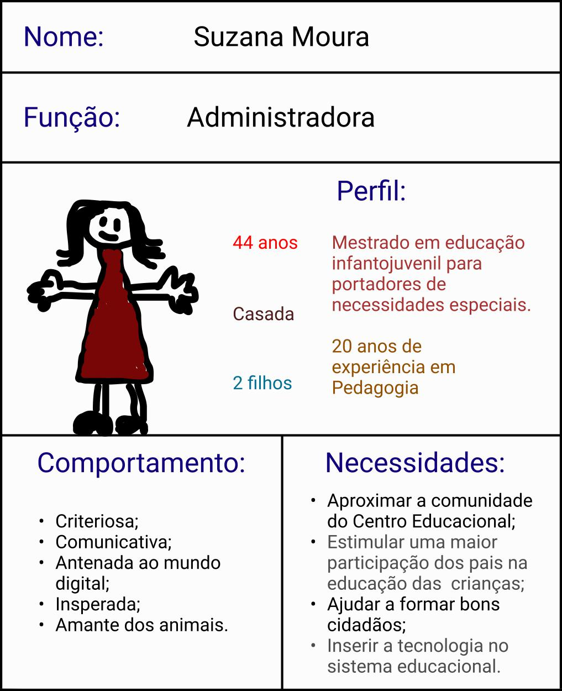
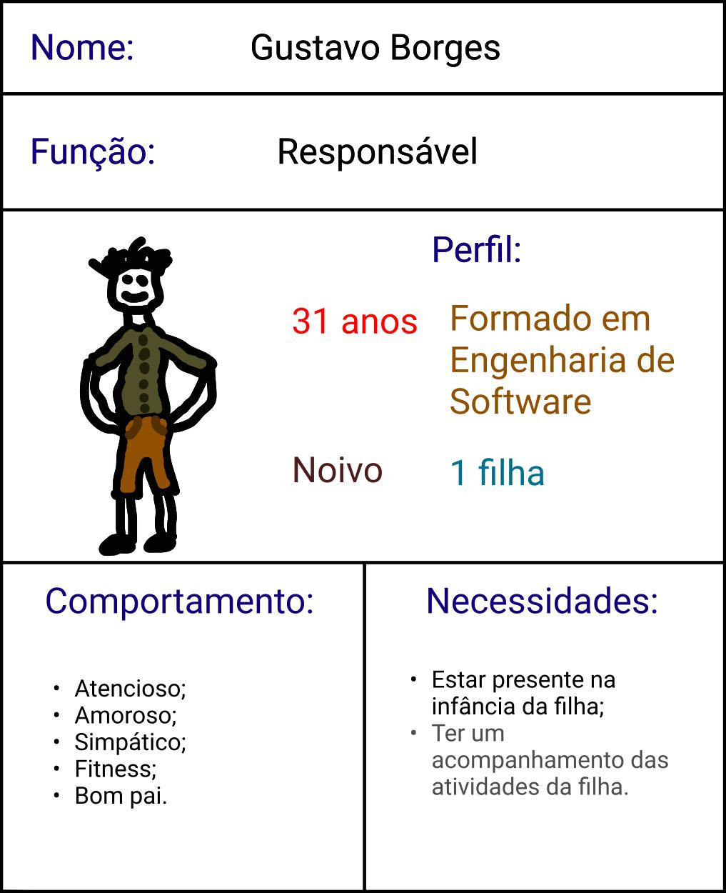
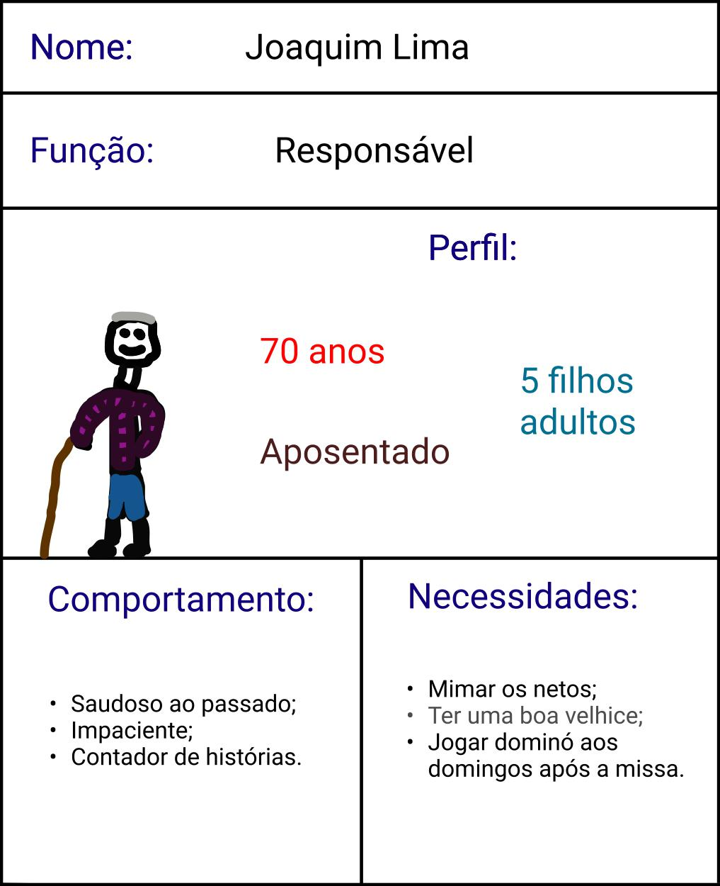

## Introdução
&emsp;&emsp;
Uma persona é um personagem fictício, arquétipo hipotético de um grupo de usuários reais, criada para descrever um usuário típico (Cooper et al., 2007; Pruitt e Adlin, 2006; Cooper, 1999).
&emsp;&emsp;

&emsp;&emsp;
É utilizada principalmente para representar um grupo de usuários finais durante discussões de design, mantendo todos focados no mesmo alvo.
&emsp;&emsp;

&emsp;&emsp;
Fizemos a divisão dessas personas em alguns elementos caractéristicos:
&emsp;&emsp;

- **Perfil:** aqui está a identidade da persona, composto pelo nome, idade, estado civil, profissão, família, e outras coisas que definem seu perfil;
- **Comportamentos:** características específicas da persona; 
- **Necessidades:** define as necessidades da persona, que terá relação direta com a aplicação — que irá ajudá-la com suas necessidades (ou não, no caso da anti-persona).
&emsp;&emsp;
## Objetivo
&emsp;&emsp;
O objetivo principal da criação das personas foi justamente para ter um auxílio na hora de usar a técnica de introspecção para elicitar requisitos e criação dos storyboards.

## Personas
&emsp;&emsp;
Seguem as figuras das personas, retratando sua função, perfil, comportamentos e necessidades. 

### 1. Suzana (administradora):

[Figura 1: Persona 1 - Suzana Moura](../../../assets/imagens/personas/1persona-suzana-administradora.jpg)

### 2. Poliana (professora):

[Figura 2: Persona 2 - Poliana Vitória](../../../assets/imagens/personas/2persona-poliana-professora.jpg)

### 3. Gustavo (responsável):

[Figura 3: Persona 3 - Gustavo Borges](../../../assets/imagens/personas/3persona-gustavo-responsavel.jpg)

## Anti-persona
&emsp;&emsp;
Segue a figura da anti-persona, retratando sua função, perfil, comportamentos e necessidades. 

### 1. Joaquim (anti-persona):

[Figura 4: Antipersona 1 - Joaquim Lima](../../../assets/imagens/personas/1antipersona-joaquim.jpg)

## Bibliografia

> - BARBOSA. Simone. SILVA. Bruno. 2010. Interação Humano-computador.

## Versionamento
| Versão | Data | Modificação | Autor |
|--|--|--|--|
|0.1|28/07/2021| Criação das personas | Bruno Félix, Daniel Porto, Edson Souza, Enzo Gabriel, Francisco Ferreira, Gabriel Bonifácio, Mateus Oliveiro e Nilo Mendonça |
|1.0|29/07/2021| Abertura de Documento | Gabriel Bonifácio |
|2.0|04/08/2021| Vetorização das personas e ajuste de espaçamento | Gabriel Bonifácio |
|2.1|05/08/2021| Ajustando vetorização das personas | Gabriel Bonifácio |