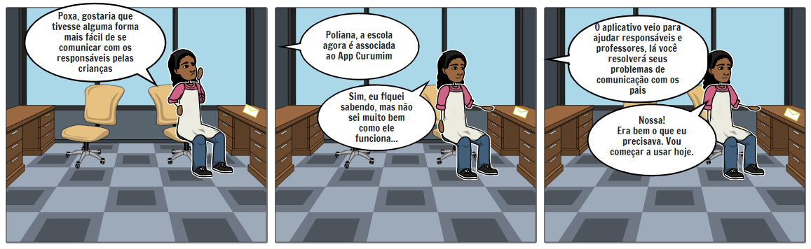
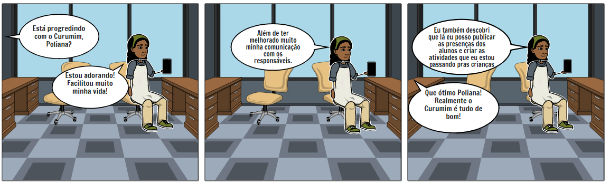
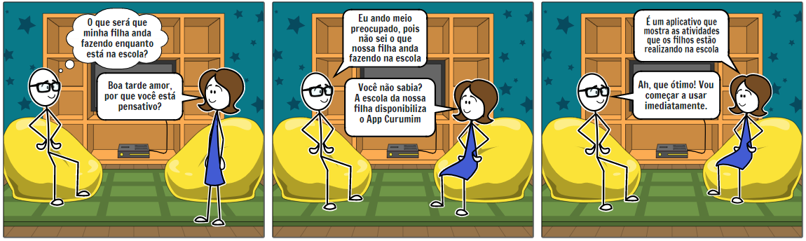

# Storyboards

## Introdução

&emsp;&emsp;Um storyboard é uma representação gráfica que é composta de uma série de quadrados com ilustrações ou fotos que representam cada foto, com notas sobre o que está acontecendo na cena e o que está sendo dito no roteiro durante essa foto. Pense nisso como uma espécie de versão em quadrinhos do seu roteiro.

## Historias

### Administradora

&emsp;&emsp;Suzana é uma ex-professora que tevem um vasto conheciento na área de padagogia, e conhece de perto muitas dores da área, principalmente na inclusão digital na educação.

**Problemas do dia-a-dia**: Um dia na rotina de Suzana.
 

[Figura 1- Persona Suzana ](https://raw.githubusercontent.com/francisco1code/docs/master/images/1.png)

**Soluções da aplicação:** Suzana conversa com colega de trabalho.
 

[Figura 2- Persona Suzana](https://raw.githubusercontent.com/francisco1code/docs/master/images/2.png)

**Mais funcionalidades**: Suzana descobre mais funcionalidades e fica super feliz.
 

[Figura 3- Persona Suzana](https://raw.githubusercontent.com/francisco1code/docs/master/images/3333.png)

### Professor

&emsp;&emsp;Poliana é uma jovem professora de crianças, muita extrovertida, que gosta de sempre estar em contato com os responsáveis de seus alunos.

**Problemas do dia-a-dia**: Um dia de Poliana na sala dos professores.
 
 
[Figura 4- Persona Poliana](../../../assets/imagens/storyboards/storyboard_poliana_1.png) 

**Soluções da aplicação e mais funcionalidade**:
 

[Figura 5- Persona Poliana](../../../assets/imagens/storyboards/storyboard_poliana_2.png) 

### Pais/Responsáveis

&emsp;&emsp;Gustavo é um homem de 31 anos, ele é o pai muito presente de uma menina de 5 anos, ele é formado em engenharia de software, então é uma pessoa muito atualizada com tecnologias.

**Problemas do dia-a-dia**: Um dia na rotina de Gustavo com sua esposa.
 
 

[Figura 6- Persona Gustavo](../../../assets/imagens/storyboards/storyboard_gustavo_1.png)

**Soluções da aplicação e mais funcionalidades:**: Gustavo conversa com sua esposa dias depois.

 

[Figura 7- Persona Gustavo](../../../assets/imagens/storyboards/storyboard_gustavo_2.png)

## Bibliografia

> - Vyond Team. what is a storyboard and why do you need one. Vyond, 2021. Disponível em: <https://www.vyond.com/resources/what-is-a-storyboard-and-why-do-you-need-one/>. Acesso em: 05/08/2021.

## Versionamento

| Versão | Data  | Modificação                                      | Autor             |
| ------ | ----- | ------------------------------------------------ | ----------------- |
| 1.0    | 05/08 | Abertura do Documento                            | Francisco Emanoel |
| 1.1    | 05/08 | Criando história da persona Suzana               | Francisco Emanoel |
| 1.2    | 05/08 | Criando histórias das personas Poliana e Gustavo | Enzo Gabriel      |
