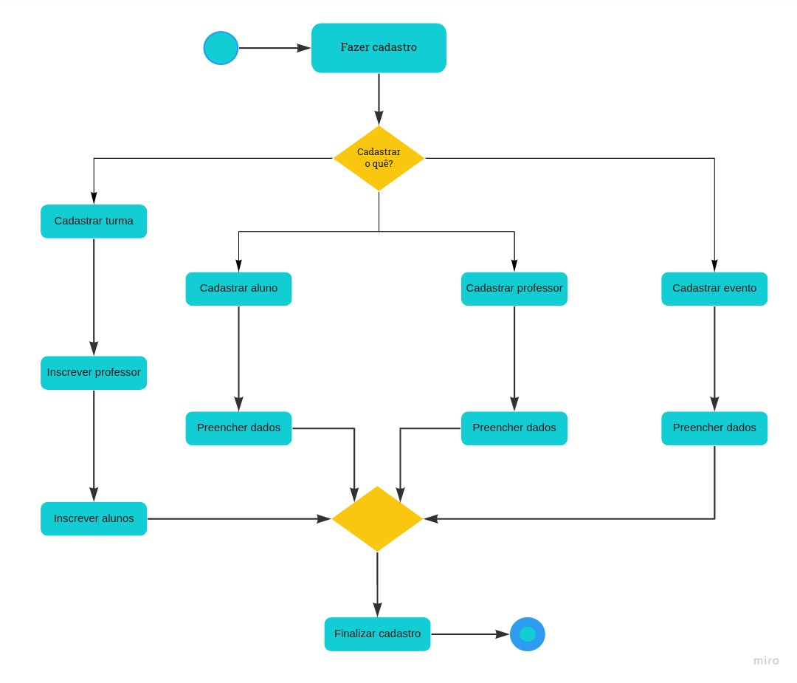
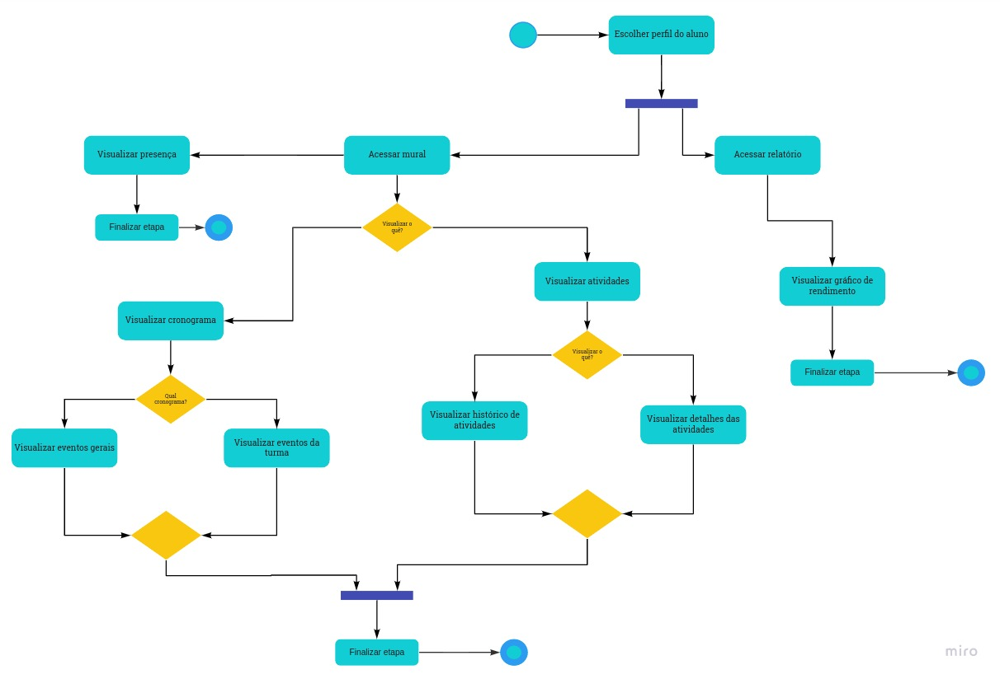
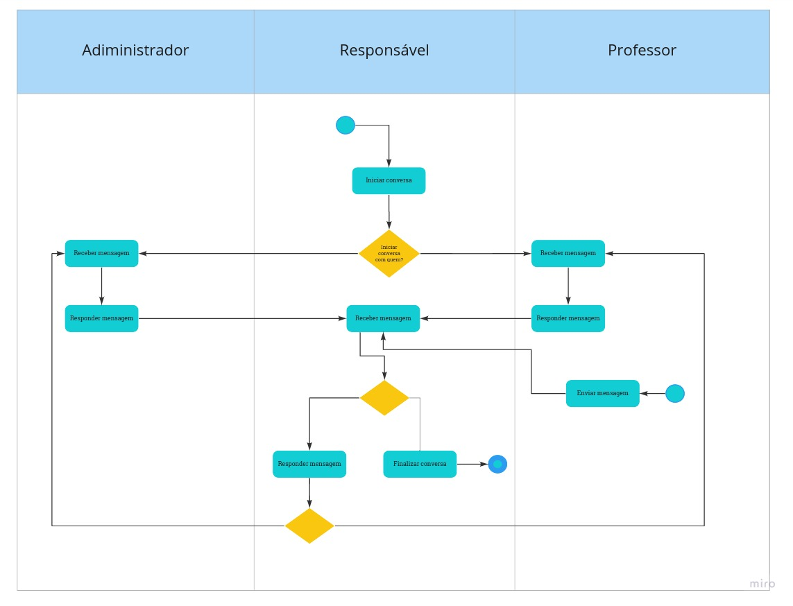

## Introdução

&emsp;&emsp;
O diagrama de atividades é um diagrama de comportamento UML que mostra o fluxo de controle ou fluxo de objetos com ênfase na sequência e nas condições do fluxo. Diagramas de atividade ajudam a unir as pessoas das áreas de negócios e de desenvolvimento de uma organização para entender o mesmo processo e comportamento. As ações coordenadas por modelos de atividades podem ser iniciadas porque outras ações terminaram suas execuções, ou porque ocorrem alguns eventos externos ao fluxo. 

## Diagramas

### Diagrama de atividades - Administrador

[Figura 1: Diagrama de atividades - Administrador](assets/imagens/diagrama-atividades/Diagr.Atividades_Admin.jpg)

### Diagrama de atividades - Responsável

[Figura 2: Diagrama de atividades - Responsável](assets/imagens/diagrama-de-atividades/Diagr.Atividades_Responsavel.jpg)

### Diagrama de atividades - Professor

[Figura 3: Diagrama de atividades - Professor](assets/imagens/diagrama-atividades/Diagr.Atividades_Prof.jpg)

### Diagrama de atividades - Chat

[Figura 4: Diagrama de atividades - Chat](assets/imagens/diagrama-atividades/Diagr.Atividades_Chat.jpg)

## Bibliografia

> - Fakhroutdinov, Kirill. Activity Diagrams. UML Diagrams. Disponível em: <https://www.uml-diagrams.org/activity-diagrams.html/>. Acesso em: 14 de agosto de 2021.

> - O que é diagrama de atividades UML?. Lucidchart. Disponível em: <https://www.lucidchart.com/pages/pt/o-que-e-diagrama-de-atividades-uml/#section_0/>. Acesso em: 14 de agosto de 2021.

## Versionamento
| Versão | Data | Modificação | Autor |
|:-:|--|--|--|
|1.0|14/08/2021| Criação do documento | João Pedro e Edson |
|1.1|14/08/2021| Ajustes do caminho das imagens | Edson |
|1.2|14/08/2021| Correção da numeração das figuras | Edson |
|1.3|14/08/2021| Mudança no caminho das imagens | Edson e francisco |
