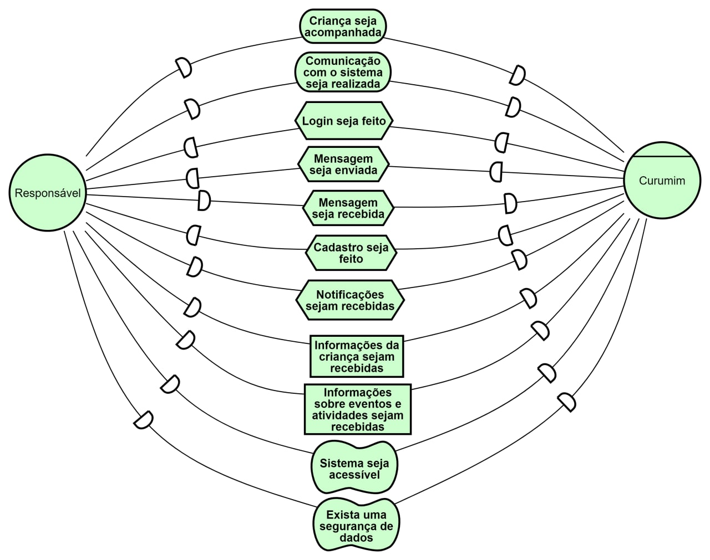

# iStar   Iniciativa Extra

## Introdução

&emsp;&emsp;O  _i* Framework_  é uma linguagem de modelagem que permite modelar situações atuais ou futuras. Foi originalmente desenvolvida para modelagem e raciocínio sobre ambientes organizacionais e seus sistemas de informação, que dependem uns dos outros para realizar suas tarefas e atingir esses objetivos. Ele se apresenta como uma abordagem que leva em consideração aspectos sociais e interativos que influenciam a estrutura de [requisitos funcionais](../../priorizacao/moscow/#requisitos-funcionais) e [não-funcionais](../../priorizacao/moscow/#requisitos-nao-funcionais)[1].

## Objetivo

&emsp;&emsp;A proposta do i* é orientada pela especificação de metas, essas mesmas que capturam, em diferentes níveis de abstração, objetivos que o sistema precisa satisfazer. A proposta dessa abordagem é apresentar os objetivos (goals) e atores, com intenções e objetivos distintos, como forma abstrata de expor as características que são interessantes aos [stakeholders](../lexicos/#lexico-stakeholder)[2][3].

## Metodologia

&emsp;&emsp;Para produzir os [Strategic Dependency Models](http://istarwiki.org/tiki-index.php?page=Strategic+Dependency+%28SD%29+Model) aqui presentes, sem um foco específico, foram utilizados artefatos produzidos anteriormente pela equipe com o intuito de entender melhor o relacionamento de cada agente com a plataforma.

## Strategic Dependency Models

### Versões 1.0

#### SD - [Responsável](../lexicos/#lexico-responsavel)

[Figura 1: SD de responsável](https://user-images.githubusercontent.com/37383185/128371414-57d2590a-7a01-499f-b589-34b4832a39ca.png)

#### SD - [Professor](../lexicos/#lexico-professor)

[Figura 2: SD de Professor](https://user-images.githubusercontent.com/37383185/128371492-016cb26c-ec8b-425d-8364-8ef0a55d6a3d.png)

#### SD - [Administrador](../lexicos/#lexico-administrador)

[Figura 3: SD de Administrador](https://user-images.githubusercontent.com/37383185/128371542-9dfa7da1-0964-4bfd-9b20-7c5e03761671.png)

## Strategic Dependency Models

### Versões 2.0

[Figura 1: SD de Responsável](../../../assets/imagens/i-star/responsavel-curumim.jpeg)

[Figura 2: Figura 2: SD de Professor](../../../assets/imagens/i-star/professor-curumim.jpeg)

[Figura 3: SD de Administrador](../../../assets/imagens/i-star/administrador_curumim.jpeg)

## Referências

> - [1] - YU, E. S. K. (1995). Modelling Strategic Relationships For Process Reengineering. Ph. D. dissertation. Dept. of Computer Science, University of Toronto, 1995.
> - [2] - ALI, R., DALPIAZ, F. and GIORGINI, P. (2010). A goal-based framework for contextual requirements modeling and analysis. Requirements Engineering, 15(4), pp.439-458.
> - [3] - YU E., MYLOPOLOUS J, (1998) Why goal-oriented requirements engineering. In: Dubois E, Opdahl AL, Pohl K (eds) Proceedings of the 4th international workshop on requirements engineering: foundation for software quality (RESFQ 1998). Presses Universitaires de Namur, Namur.
> - iStar2.0: A Guided Tour: https://www.dropbox.com/s/4l2k4tbywb8wekk/iStar-tutorial-online.pdf?dl=0. Último acesso em 05/08/2021.
> - i* Wiki: http://www.istarwiki.org/tiki-view_articles.php. Último acesso em 05/08/2021.
> - "iStar4G". Disponível em: http://r1.ufrrj.br/nuesgames/Sanderson.pdf. Último acesso em 28/08/2021.

## Versionamento
| Versão | Data | Modificação | Autor |
|--|--|--|--|
|0.1|04/08/2021| Criação das primeiras versões de Strategic Dependency Models | Mateus O. Patrício |
|1.0|05/08/2021| Criação do documento e adição das versões 1.0 dos SD1, SD2 e SD3 | Mateus O. Patrício |
|1.1|05/08/2021| Padronização do documento | Mateus O. Patrício |
|1.2|06/08/2021| Adição de hiperlinks dos léxicos | Mateus O. Patrício |
|1.3|21/08/2021| Correção dos links dos léxicos | Gabriel Bonifácio |
|1.4|28/08/2021| Adição de novas informações e referências | Gabriel e Francisco |
|1.4|28/08/2021| Atualizando o diagrama versão 2| Gabriel e Francisco |