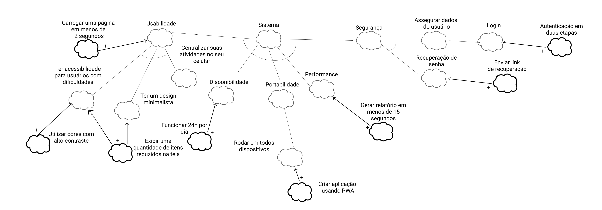

## Introdução
&emsp;&emsp;Requisitos não funcionais em um sistema de software não descrevem o que o software irá fazer, mas como o software irá fazer, levando em consideração características que não são funcionais, como performance, requisitos de interface, design e qualidade(CHUNG et al, 2012).

&emsp;&emsp;O objetivo do NFR framework é a modelagem dos requisitos não funcionais.

&emsp;&emsp;A modelagem começa com os "softgoals", que são as qualidades do sistema num nível mais abrangente de abstração e são decompostos e refinados até descobrirem uma estrutura de metas e sub-objetivos(DOS REIS NUNES, LEAL).

[Figura 1: Legenda NFR](../../../assets/imagens/nfr-framework/legenda-nfr.png)

## Diagrama
&emsp;&emsp;A seguir, o diagrama produzido pelo grupo.

[Figura 2: Diagrama NFR](../../../assets/imagens/nfr-framework/diagrama-nfr.png)

## Bibliografia
> - CHUNG, Lawrence et al. Non-functional requirements in software engineering. Springer Science & Business Media, 2012.
> - DOS REIS NUNES, Gustavo Garcia; LEAL, André Castro. NON-FUNCTIONAL REQUIREMENTS FRAMEWORK: INFLUÊNCIAS NA​​​​ QUALIDADE DE JOGOS DE ENTRETENIMENTO COM TEMÁTICA​​ ROLE-PLAYING GAME.
> - NFR Framework. Disponível em: <http://jaejaneiro.orgfree.com/engsofnfr.pdf>. Acesso em: 03 de ago. de 2021.
> - SILVA, Reinaldo Antônio da. NFR4ES: Um Catálogo de Requisitos Não-Funcionais para Sistemas Embarcados. 2019
> - Requisitos Não-Funcionais. UFPE. Disponível em: <https://www.cin.ufpe.br/~if716/arquivos20152/experimentoBruno/Aula2/Aula2-Parte2-NFR%20Framework.pdf>. Acesso em: 03 de ago. de 2021.

## Versionamento
| Versão | Data | Modificação | Autor |
| :-: | -- | -- | -- |
|0.1| 03/08/2021 | Adição da introduçao, da metodologia, do diagrama e da bibliografia  | Nilo Mendonça |
