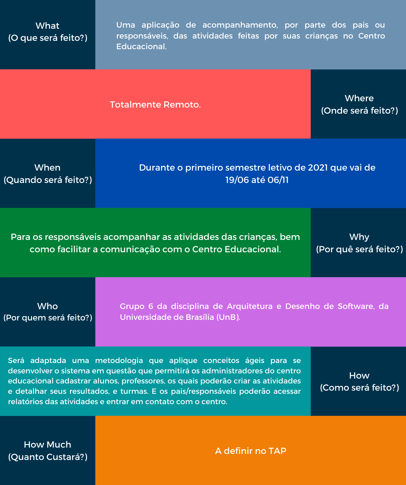

## Introdução
&emsp;&emsp;O 5W2H é uma ferramenta utilizada para auxiliar na compreensão de um problema ou para facilitar na compreensão de uma oportunidade de melhoria, constituído basicamente de 7 perguntas, que ao serem respondidas, proporcionam uma melhor visualização do domínio analisado.

&emsp;&emsp;Lista das perguntas:

- What (O quê será feito?);
- Where(Onde será feito?);
- When(Quando será feito?);
- Why(Por quê será feito?);
- Who(Por Quem será feito?);
- How(Como será feito?);
- How Much(Quanto irá custar?).

&emsp;&emsp;A equipe optou pela utilização da ferramenta 5W2H para permitir uma visualização mais ampla do domínio do problema, empregando a ferramenta em um primeiro momento de forma individual e gerando ao final da produção um documento em conjunto com o consenso de todos os integrantes do grupo.

## Visão final do grupo
&emsp;&emsp; Após debate e compartilhamento de ideias, a equipe chegou em uma versão final para as respostas do 5w2H que está representada na figura 1.

[Figura 1: Versão final 5w2h](../../../assets/imagens/5w2h/5w2h.png)

## Metodologia
&emsp;&emsp;Para a o desenvolvimento desse artefato, a equipe utilizou um [issue no GitHub](https://github.com/UnBArqDsw2021-1/2021.1_G6_Curumim/issues/9) para debater e compartilhar as visões individuais de cada integrante da equipe. Tendo todos os participantes compartilhado as suas visões e opiniões no issue, a equipe se reuniu numa chamada para tirar dúvidas e definir a versão final que seria documentada.

### Visões individuais
&emsp;&emsp;A seguir, tem-se as versões individuais compartilhadas pelos integrantes.

#### 5W2H - [Bruno Alves](https://github.com/Bruno-Felix)
| O que?(What) | Quem?(Who) | Onde?(Where) | Porque?(Why) | Quando?(When) | Como?(How) | Quanto?(How Much) |
| -- | -- | -- | -- | -- | -- | -- |
| O aplicativo é uma ferramenta de comunicação entre o Centro Acadêmico e os pais das crianças ali matriculadas. Através da plataforma os pais poderão acompanhar as atividades realizadas em sala de aula, os eventos festivos e ter uma linha direta de diálogo tanto com o professor, tanto com a administração da instituição | Alunos da Universidade de Brasília (UnB) | No 1º semestre letivo de 2021 | Virtualmente, na disciplina Arquitetura e Desenho de Software | Para auxiliar e facilitar a comunicação entre os pais e o centro acadêmico, além do monitoramento das atividades realizadas por seus filhos | Será feita um aplicativo para uso dos pais | A Confirmar |

#### 5W2H - [Daniel Porto](https://github.com/DanielPortods)
| O que?(What) | Quem?(Who) | Onde?(Where) | Porque?(Why) | Quando?(When) | Como?(How) | Quanto?(How Much) |
| -- | -- | -- | -- | -- | -- | -- |
| AtividApp, plataforma para ajudar no gerenciamento das atividades de um centro de ensino | Integrantes do grupo 6 da disciplina de Arquitetura e desenho de software da UnB | O desenvolvimento será realizado de forma totalmente remota. Incluindo, também, todas as reuniões e discussões | Para ajudar no acompanhamento das participações das crianças nas atividades do centro de ensino por parte dos [responsáveis](/base/requisitos/modelagem/lexicos/#lexico-responsavel) | Será feito durante o primeiro semestre letivo de 2021 que vai de 19/06 até 06/11 | Será adaptada uma metodologia que aplique conceitos de metodologias ágeis como scrum, xp e kanbam | Terá o custo baseado no tempo e no esforço dos integrantes da equipe 6. O custo será detalhado nos artefatos de estimativas |

#### 5W2H - [Edson de Araújo](https://github.com/edsondearaujo)
| O que?(What) | Quem?(Who) | Onde?(Where) | Porque?(Why) | Quando?(When) | Como?(How) | Quanto?(How Much) |
| -- | -- | -- | -- | -- | -- | -- |
| Uma aplicação que mostre para os pais o rendimento do seu filho, nas atividades do centro educacional | Grupo de estudantes do curso de Engenharia de Software da Universidade de Brasília. No âmbito da disciplina de Arquitetura e Desenho de software | Aplicação mobile para acesso dos pais e aplicação PWA para o centro educacional | dar visibilidade aos pais. Com relação ao rendimento de atividade dos filhos e comunicação direta com professores e diretoria do centro educacional | O desenvolvimento do projeto acontece entre Julho e Novembro de 2021. A aplicação será utilizada nos dias de funcionamento do centro educacional. De segunda-feira à sexta-feira | Administradores e Professores do centro educacional, criarão eventos, postagens das atividades e mais informações sobre o dia a dia do aluno. Os pais, por sua vez, terão acesso às informações diretamente no Aplicativo | Hora de trabalho dos desenvolvedores e tempo dos professores e mantenedores do sistema |

#### 5W2H - [Eliseu Kadesh](https://github.com/eliseukadesh67)
| O que?(What) | Quem?(Who) | Onde?(Where) | Porque?(Why) | Quando?(When) | Como?(How) | Quanto?(How Much) |
| -- | -- | -- | -- | -- | -- | -- |
| Uma aplicação que possibilita a comunicação entre uma instituição de ensino para crianças de até 5 anos e seus [responsáveis](/base/requisitos/modelagem/lexicos/#lexico-responsavel) | Através de uma plataforma com informativos sobre atividades e eventos, fóruns e chats entre a instituição, professores e [responsáveis](/base/requisitos/modelagem/lexicos/#lexico-responsavel), e também notificações aos [responsáveis](/base/requisitos/modelagem/lexicos/#lexico-responsavel) sobre a situação do(s) filho(s) | Em uma aplicação feita para uma instituição de ensino específica | 2º Semestre de 2021 | Facilitar a comunicação entre instituição e os [responsáveis](/base/requisitos/modelagem/lexicos/#lexico-responsavel) das crianças, e oferecer transparência | Administradores da insituição, professores e [responsáveis](/base/requisitos/modelagem/lexicos/#lexico-responsavel) | A definir |

#### 5W2H - [Enzo Gabriel](https://github.com/enzoggqs)
| O que?(What) | Quem?(Who) | Onde?(Where) | Porque?(Why) | Quando?(When) | Como?(How) | Quanto?(How Much) |
| -- | -- | -- | -- | -- | -- | -- |
| Um aplicativo para um centro educacional, voltado para crianças, para auxiliar os pais no controle das atividades de seus filhos estão realizando no local | O intuito é ajudar no monitoramento das atividades que os filhos estão praticando | Um grupo de estudantes de Engenharia de Software na UnB | No centro educacional, pelos professores e administradores e pelos pais dos alunos acessando a aplicação mobile | Durante o primeiro 1º período de 2021 na UnB | Os professores irão montar suas turmas na aplicação e lá darão as informações necessárias sobre os alunos, os pais dos alunos terão acesso às turmas de seus respectivos filhos e poderão também se comunicar com o professor de forma privada. E ao redor de tudo terá um administrador para mediar tudo que acontece | A princípio não há um valor proposto |

#### 5W2H - [Francisco Emanoel](https://github.com/francisco1code)
| O que?(What) | Quem?(Who) | Onde?(Where) | Porque?(Why) | Quando?(When) | Como?(How) | Quanto?(How Much) |
| -- | -- | -- | -- | -- | -- | -- |
| AtividApp é uma aplicação que melhora e facilita a comunicação entre os pais e a instituição de educação de seus filhos| Alunos da disciplina de Desenho e Arquitetura de Software | Voltado a educação infantil com idade máxima de até 5 anos | No 1° semestre de 2021 da Universidade de Brasília (UnB) | Para facilitar o acompanhamento dos filhos nos centros educacionais | Através de feedbacks frequentes e sempre mantendo a transparência entre ambas as partes | Não se aplica no momento |

#### 5W2H - [Gabriel Bonifácio](https://github.com/gabrielbpn)
| O que?(What) | Quem?(Who) | Onde?(Where) | Porque?(Why) | Quando?(When) | Como?(How) | Quanto?(How Much) |
| -- | -- | -- | -- | -- | -- | -- |
| Um projeto chamado AtividApp em prol da melhoria de centros educacionais | Será feito pelo grupo 6 da matéria Arquitetura e Desenho de Software do 1° semestre letivo do ano de 2021 | Será feito pela internet | O objetivo é melhorar a comunicação entre pais e professores em centros educacionais, onde as informações fiquem centralizadas em um só lugar | O processo já começou a ser feito: desde o dia 20 de julho de 2021 | Será feito e colocado num aplicativo ou aplicação web, após a codificação e o gerenciamento desse projeto | A princípio, não sei exatamente o valor que isso custará, já que a hora de cada integrante do grupo difere e não temos experiência suficiente para designar as coisas valiosas que faltam |

#### 5W2H - [João Pedro](https://github.com/Joao-Pedro-Moura)
| O que?(What) | Quem?(Who) | Onde?(Where) | Porque?(Why) | Quando?(When) | Como?(How) | Quanto?(How Much) |
| -- | -- | -- | -- | -- | -- | -- |
| Aplicativo chamado AtividApp | Alunos do grupo 6 de Arquitetura e Desenho de Software da turma A | Por meio remoto | Para facilitar o acompanhamento dos pais com relação ao desempenho de seus filhos | Durante o semestre 2021.1 | Os administradores cadastram as crianças, então os pais irão acessar o aplicativo e visualizarão relatórios, gráficos e demais dados de seus filhos, como também informações sobre seus professores | 600 horas de trabalho, visto que são 10 alunos no grupo e cada um trabalhará por 60 horas |

#### 5W2H - [Mateus Oliveira](https://github.com/omateusp)
| O que?(What) | Quem?(Who) | Onde?(Where) | Porque?(Why) | Quando?(When) | Como?(How) | Quanto?(How Much) |
| -- | -- | -- | -- | -- | -- | -- |
| AtividApp, um aplicativo que facilita e agiliza a comunicação entre pais e mantenedores de um centro educacional, provendo informações sobre atividades e presença de seus filhos | Grupo 6 da disciplina de Desenho e Arquitetura de Software | A ideia inicial é para um centro educacional específico, podendo ser replicado em outros centros | Para facilitar o acompanhamento dos filhos de até 5 anos pelos pais | No 1º semestre letivo de 2021 da Universidade de Brasília(UnB) | Os gerentes do centro educacional irão cadastrar os alunos, adicionar informações sobre os mesmos também podendo mandar notícias sobre o centro educacional ou até mesmo eventos e atividades. Já os pais poderão acessar relatórios sobre o mesmo ou entrar em contato com o centro | Valor a ser descrito no TAP |

#### 5W2H - [Nilo Mendonça](https://github.com/NiloMendonca)
| O que?(What) | Quem?(Who) | Onde?(Where) | Porque?(Why) | Quando?(When) | Como?(How) | Quanto?(How Much) |
| -- | -- | -- | -- | -- | -- | -- |
| Uma aplicação para um Centro Educacional que atende crianças de até 5 anos que ajudará no gerenciamento de atividades e na comunicação com a comunidade participante | Equipe 6 da disciplina de desenho e arquitetura de software | Poderá ser utilizado pelos administradores e professores do Centro Educacional, assim como os pais dos estudantes através de uma aplicação móvel para dispositivos Android | Para facilitar a comunicação e o acesso a informações entre pais e o Centro Educacional | Ao final do 2º semestre de 2021 | A aplicação contará basicamente com três tipos de usuários: Os administradores do Centro Educacional que terão opções de adicionar/editar/remover cadastros de professores, turmas e eventos, os professores que poderão criar/editar/remover atividades e os pais que poderão visualizar a informações disponibilizadas pelos dois outros usuários | O valor para a produção do aplicativo |

## Bibliografia
> - Videoaulas e materiais complementares presentes no moodle da disciplina Arquitetura e Desenho de Software. Disponível em <https://aprender3.unb.br/course/view.php?id=8603>. Acesso em: 27 jul. 2021.
> - ENDEAVOR BRASIL. 5W2H: é hora de tirar as dúvidas e colocar a produtividade no seu dia a dia. [S. l.], 8 fev. 2017. Disponível em: <https://endeavor.org.br/pessoas/5w2h/>. Acesso em: 27 jul. 2021.

## Versionamento
| Versão | Data | Descrição | Autor(es) |
| :-: | -- | -- | -- |
| 0.1 | 27/07/2021 | Compartilhamento das visões individuais | Todos os integrantes |
| 1.0 | 27/07/2021 | Adição da introdução, da visão individual(Nilo Mendonça) e da bibliografia | Nilo Mendonça |
| 1.1 | 28/07/2021 | Adição das visões individuais(Bruno Alves, Daniel Porto, Edson de Araújo, Eliseu Kadesh, Enzo Gabriel, Francisco Emanoel, Gabriel Bonifácio e Mateus Oliveira) | Nilo Mendonça |
| 1.2 | 29/07/2021 | Adição das visões individuais (João Pedro) e a visão final do grupo | Nilo Mendonça |
| 2.0 | 01/08/2021 | Padronização e correção do documento | Daniel Porto |