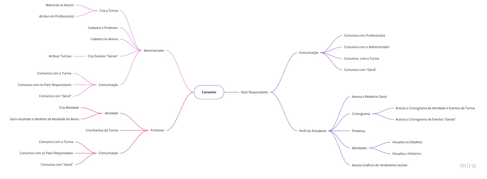
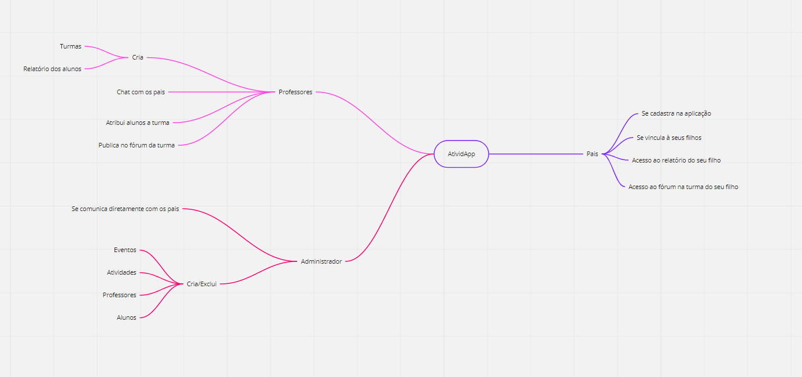
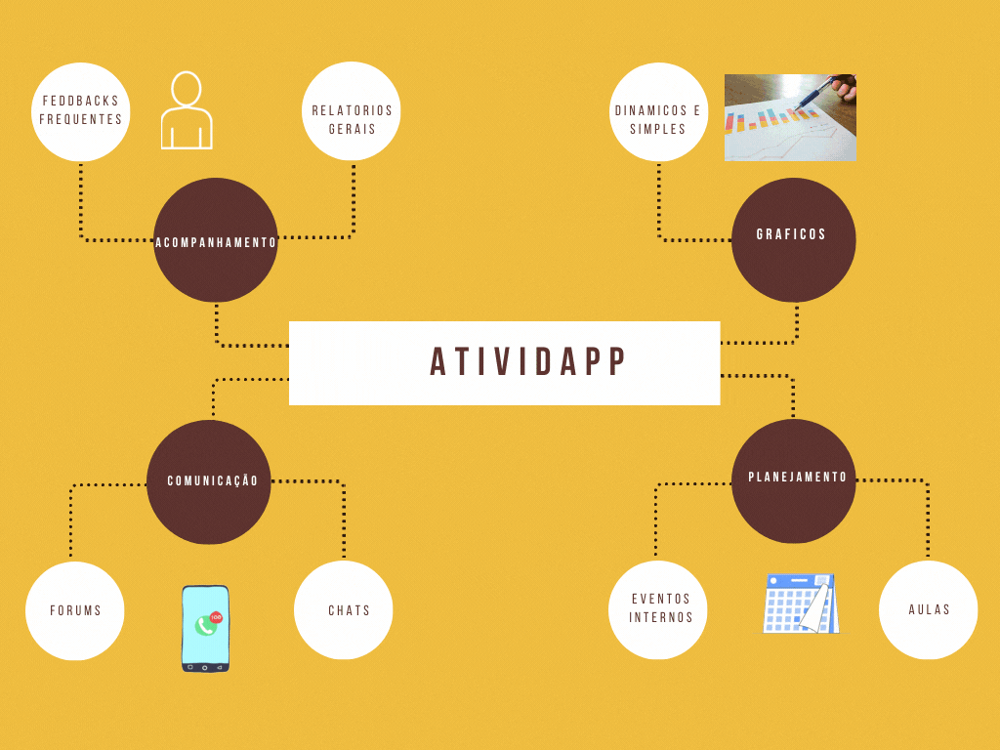
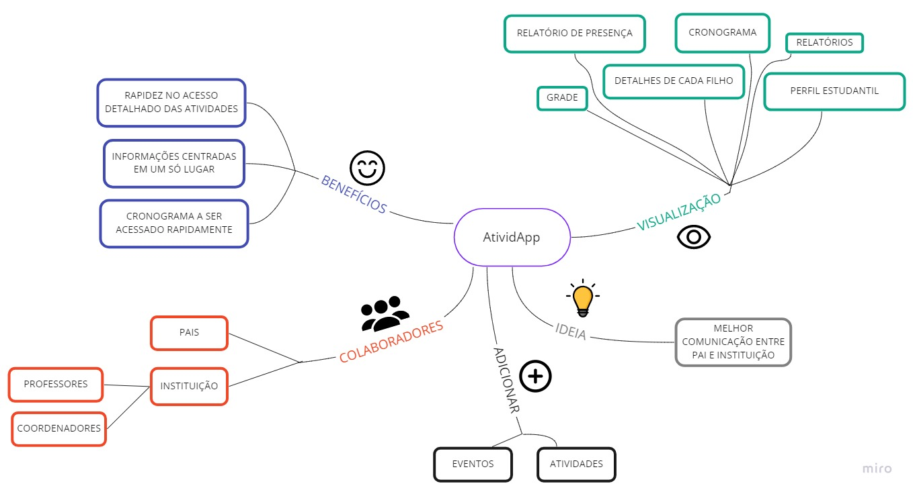
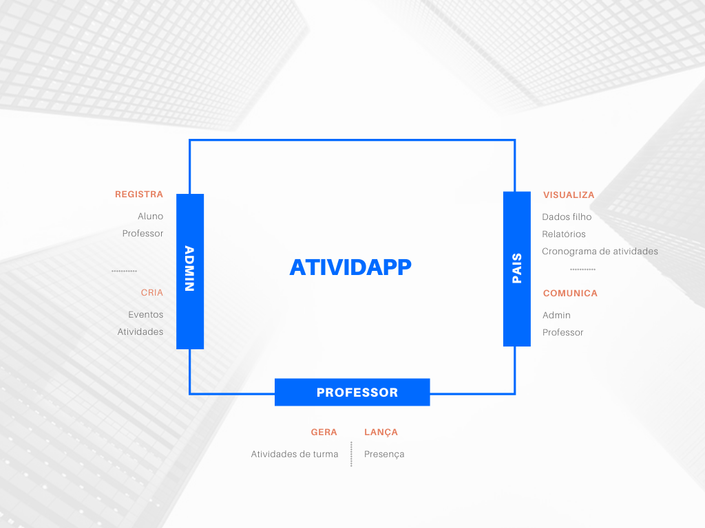
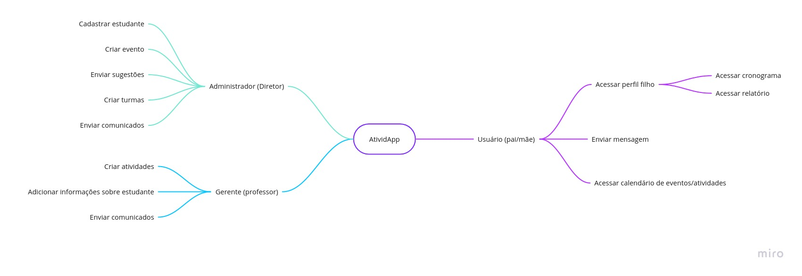
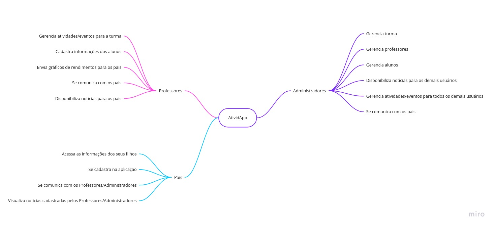

## Introdução
&emsp;&emsp;O Mapa mental é uma ferramenta que busca auxiliar na visualização e sistematização das conexões e relações entre conceitos e ideias. Sendo extremamente útil na transmissão de informações, dados e conhecimentos. 
&emsp;&emsp;O objetivo principal do Mapa mental é realçar as ideias centrais e mostrar as conexões existentes entre essas ideias e os objetivos secundários, que também possuem importância na construção geral da ideia proposta. 
&emsp;&emsp;O grupo buscou utilizar o recurso do Mapa mental visando obter um apanhado geral das funcionalidades que cada membro achasse interessante para a aplicação e, com isso, organizar e definir o escopo do projeto.

## Visão do grupo
&emsp;&emsp; Após debate e compartilhamento de ideias, a equipe chegou em uma versão final para o mapa mental que está representada na figura 1.

[Figura 1: Mapa mental do grupo](../../../assets/imagens/mapa-mental/versao-grupo.jpg)

## Metodologia
&emsp;&emsp;Para a o desenvolvimento desse artefato, a equipe utilizou um [issue no GitHub](https://github.com/UnBArqDsw2021-1/2021.1_G6_Curumim/issues/8) para debater e compartilhar as visões individuais de cada integrante da equipe. Tendo todos os participantes compartilhado as suas visões e opiniões no issue, a equipe se reuniu numa chamada para tirar dúvidas e definir a versão final que seria documentada.

### Visões individuais
&emsp;&emsp;A seguir, tem-se as versões individuais compartilhadas pelos integrantes.

#### Mapa Mental - [Bruno Alves](https://github.com/Bruno-Felix)

[Figura 2: Mapa mental do Bruno Alves](../../../assets/imagens/mapa-mental/bruno.jpg)

#### Mapa Mental - [Daniel Porto](https://github.com/DanielPortods)

[Figura 3: Mapa mental do Daniel Porto](../../../assets/imagens/mapa-mental/daniel.png)

#### Mapa Mental - [Edson de Araújo](https://github.com/edsondearaujo)

[Figura 4: Mapa mental do Edson de Araújo](../../../assets/imagens/mapa-mental/edson.png)

#### Mapa Mental - [Eliseu Kadesh](https://github.com/eliseukadesh67)

[Figura 5: Mapa mental do Eliseu Kadesh](../../../assets/imagens/mapa-mental/kadesh.jpg)

#### Mapa Mental - [Enzo Gabriel](https://github.com/enzoggqs)

[Figura 6: Mapa mental do Enzo Gabriel](../../../assets/imagens/mapa-mental/enzo.png)

#### Mapa Mental - [Francisco Emanoel](https://github.com/francisco1code)

[Figura 7: Mapa mental do Francisco Emanoel](../../../assets/imagens/mapa-mental/francisco.gif)

#### Mapa Mental - [Gabriel Bonifácio](https://github.com/gabrielbpn)

[Figura 8: Mapa mental do Gabriel Bonifácio](../../../assets/imagens/mapa-mental/gabriel.jpg)

#### Mapa Mental - [João Pedro](https://github.com/Joao-Pedro-Moura)

[Figura 9: Mapa mental do João Pedro](../../../assets/imagens/mapa-mental/joao.png)

#### Mapa Mental - [Mateus Oliveira](https://github.com/omateusp)

[Figura 10: Mapa mental do Mateus Oliveira](../../../assets/imagens/mapa-mental/mateus.jpg)

#### Mapa Mental - [Nilo Mendonça](https://github.com/NiloMendonca)

[Figura 11: Mapa mental do Nilo Mendonça](../../../assets/imagens/mapa-mental/nilo.jpg)

## Bibliografia
> - Videoaulas e materiais complementares presentes no moodle da disciplina Arquitetura e Desenho de Software. Disponível em <https://aprender3.unb.br/course/view.php?id=8603>. Acesso em: 27 jul. 2021.
> - LCM TREINAMENTO. Mapa mental: pra que serve?. Disponível em <https://lcmtreinamento.com.br/mapa-mental-para-que-serve/>. Acesso em: 27 jul. 2021.

## Versionamento
| Versão | Data | Modificação | Autor |
| :-: | -- | -- | -- |
|0.1| 27/07/2021 | Compartilhamento das visões individuais | Todos os integrantes |
|1.0| 27/07/2021 | Adição da introdução, do Mapa mental individual(Nilo Mendonça) e da bibliografia | Nilo Mendonça |
|1.1| 28/07/2021 | Adição dos mapas mentais individuais(Bruno Alves, Daniel Porto, Edson de Araújo, Eliseu Kadesh, Enzo Gabriel, Francisco Emanoel, Gabriel Bonifácio, João Pedro e Mateus Oliveira) | Nilo Mendonça |
|1.2| 29/07/2021 | Adição da visão final do grupo | Nilo Mendonça |
|1.3| 01/08/2021 | Padronização e correção do documento| Daniel Porto |