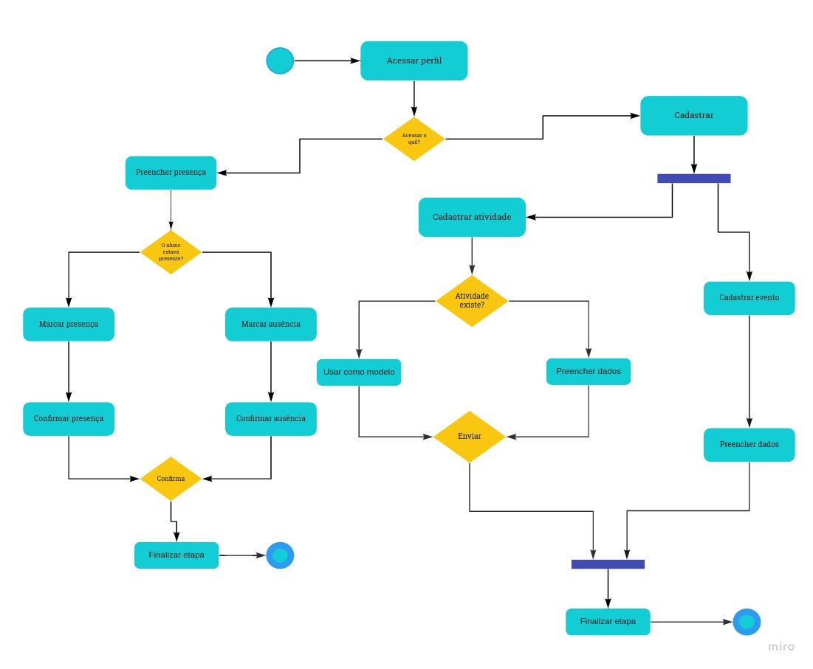

## Introdução

&emsp;&emsp;
Os diagramas de atividades são diagramas de comportamento UML que mostram os fluxos de controle ou os fluxos de objetos com ênfase na sequência e nas condições de cada fluxo. Os diagramas de atividades mostram o fluxo entre as ações de uma determinada atividade. Segundo a documentação da IBM Corporation [[3]](#bibliografia), "Os diagramas de atividades também podem mostrar fluxos paralelos ou simultâneos e fluxos alternativos."  
&emsp;&emsp;
De acordo com as especificações da (OMG Unified Modeling Language (OMG UML), v2.1.2) [[4]](#bibliografia). "Uma atividade especifica a coordenação de execuções de comportamentos subordinados, utilizando um modelo de controle e fluxo de dados."

## Diagramas

### Diagrama de atividades - Administrador

[Figura 1: Diagrama de atividades - Administrador](../../../assets/imagens/diagrama-de-atividades/Diagr.Atividades_Admin.jpg)

### Diagrama de atividades - Responsável

[Figura 2: Diagrama de atividades - Responsável](../../../assets/imagens/diagrama-de-atividades/Diagr.Atividades_Responsavel.jpg)

### Diagrama de atividades - Professor

[Figura 3: Diagrama de atividades - Professor](../../../assets/imagens/diagrama-de-atividades/Diagr.Atividades_Prof.jpg)

### Diagrama de atividades - Chat

[Figura 4: Diagrama de atividades - Chat](../../../assets/imagens/diagrama-de-atividades/Diagr.Atividades_Chat.jpg)

## Bibliografia

> - [1]Fakhroutdinov, Kirill. Activity Diagrams. UML Diagrams. Disponível em: <https://www.uml-diagrams.org/activity-diagrams.html/>. Acesso em: 14 de agosto de 2021.

> - [2]O que é diagrama de atividades UML?. Lucidchart. Disponível em: <https://www.lucidchart.com/pages/pt/o-que-e-diagrama-de-atividades-uml/#section_0/>. Acesso em: 14 de agosto de 2021.

> - [3]IBM Corporation, Diagramas de atividades, v2.1.2, IBM. Disponível em: <https://www.ibm.com/docs/en/rsas/7.5.0?topic=diagrams-activity>. Acesso em: 19/09/2021

> - [4]OMG Unified Modeling Language (OMG UML), Activity, Superstructure, V2.1.2, OMG. Disponível em: <https://www.omg.org/spec/UML/2.1.2/Superstructure/PDF/>, p.316-324. Acesso em: 19/09/2021

## Versionamento
| Versão | Data | Modificação | Autor |
|:-:|--|--|--|
|1.0|14/08/2021| Criação do documento | João Pedro e Edson |
|1.1|14/08/2021| Ajustes do caminho das imagens | Edson |
|1.2|14/08/2021| Correção da numeração das figuras | Edson |
|1.3|14/08/2021| Mudança no caminho das imagens | Edson e Francisco Emanoel|
|1.4|21/08/2021| Revisão por pares | Nilo Mendonça, Francisco Emanoel |
