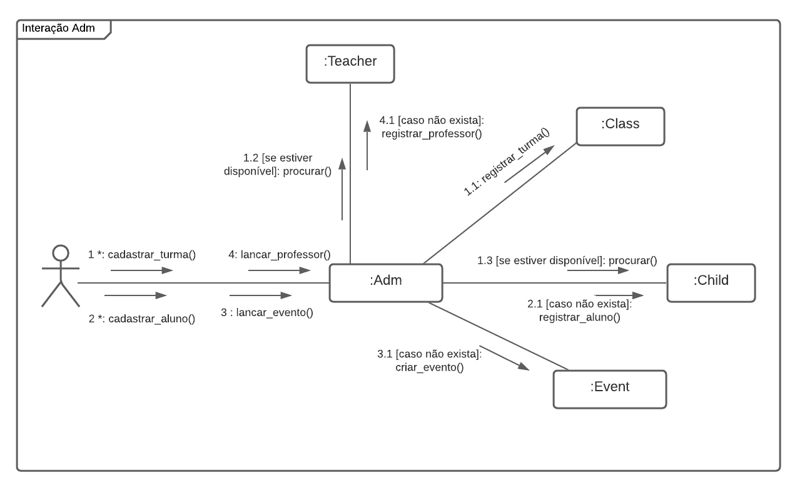
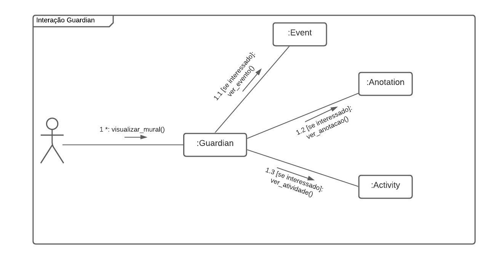
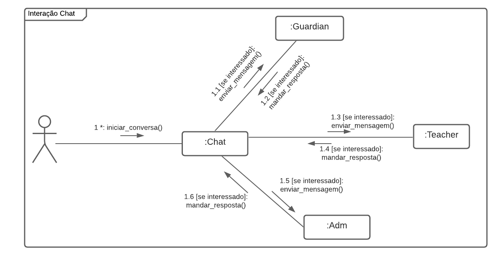

## Introdução

&emsp;&emsp;
O diagrama de comunicação é um tipo de diagrama de interação UML que mostra as interações entre objetos e/ou partes usando mensagens sequenciadas em um arranjo de forma livre. A ordem das mensagens normalmente seguem um cenário de uso. 

&emsp;&emsp;
Os diagramas de comunicação são utilizados pelos designers para definir e esclarecer as funções dos objetos que executam um fluxo específico de eventos de um caso de uso. Eles são a principal fonte de informações usada para determinar interfaces e responsabilidades de classe.

## Diagramas

### Diagrama de comunicação - [Administrador](/base/requisitos/modelagem/lexicos/#lexico-administrador)

[Figura 1: Diagrama de comunicação - Adm](../../assets/imagens/comunicacao/comunicacao-adm.png)

### Diagrama de comunicação - [Responsável](/base/requisitos/modelagem/lexicos/#lexico-responsavel)

[Figura 2: Diagrama de comunicação - Guardian](../../assets/imagens/comunicacao/comunicacao-guardian.png)

### Diagrama de comunicação - [Professor](/base/requisitos/modelagem/lexicos/#lexico-professor)

[Figura 3: Diagrama de comunicação - Teacher](../../assets/imagens/comunicacao/comunicacao-teacher.png)

### Diagrama de comunicação - Chat

[Figura 4: Diagrama de comunicação - Chat](../../assets/imagens/comunicacao/comunicacao-chat.png)

## Bibliografia

> - Fakhroutdinov, Kirill. UML Communication Diagrams Overview. UML Diagrams. Disponível em: <https://www.uml-diagrams.org/communication-diagrams.html/>. Acesso em: 19 de agosto de 2021.
> - Diretriz: Diagrama de Comunicação. Disponível em: <https://www.cin.ufpe.br/~gta/rup-vc/core.base_rup/guidances/guidelines/communication_diagram_FFFEA1B5.html#>. Acesso em: 19 de agosto de 2021.

## Versionamento
| Versão | Data | Modificação | Autor |
|:-:|--|--|--|
|1.0|19/08/2021| Criação do documento | João Pedro |
|1.1|21/08/2021| Modificação da nomenclatura das classes dos diagramas | João Pedro |