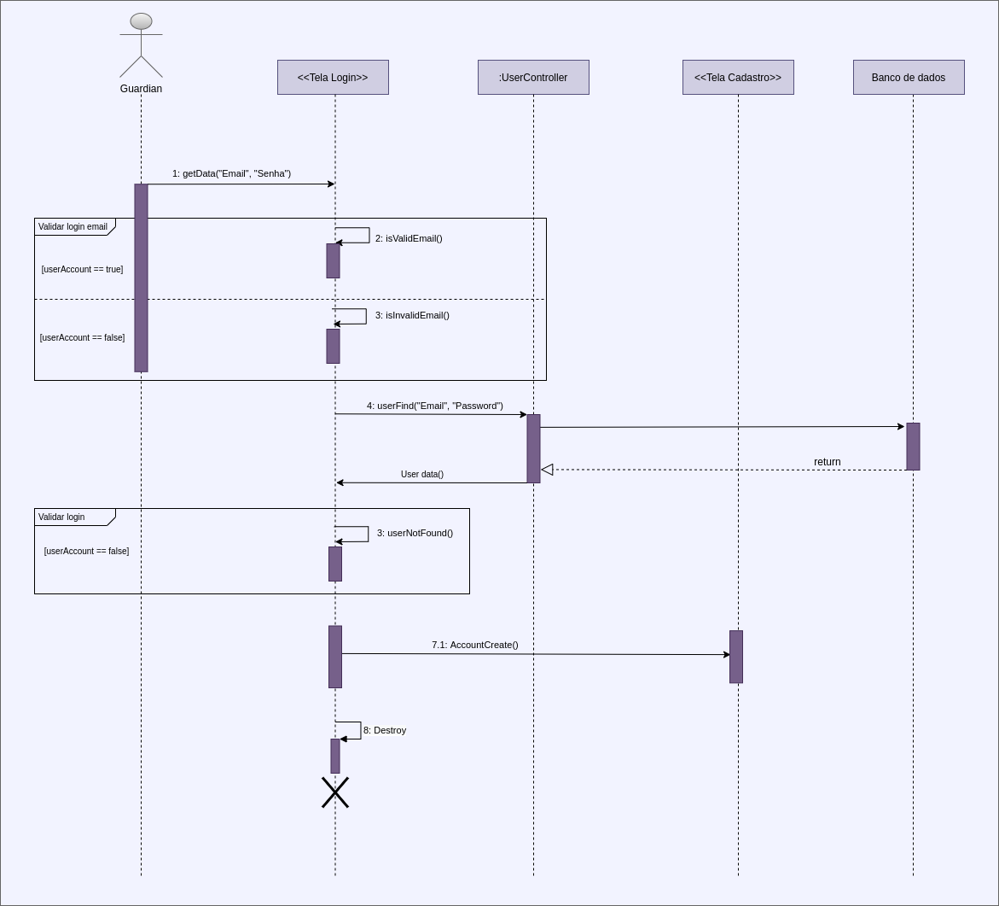

# Diagrama de sequência

## Introdução
&emsp;&emsp;Os diagramas de sequências são soluções dinâmicas de modelagem muito populares. Um diagrama de sequência descreve a maneira como os grupos de objetos colaboram em algum comportamento ao longo do tempo e registra o comportamento de um caso de uso, exibindo os objetos e as mensagens passadas entre esses objetos ao longo do caso de uso. Este diagrama busca determinar a sequência de eventos que acontecem em um determinado processo, identifica quais métodos devem ser disparados entre os atores e objetos envolvidos em um mesmo cenário.

&emsp;&emsp;O diagrama de sequência fundamenta-se no diagrama de [casos de uso](./casos-de-uso.md), geralmente existe um diagrama de sequência para cada caso de uso. Segundo (Gilleanes,2.ed. 2014)[[3]](#bibliografia), "uma vez que um caso de uso, em geral, refere-se a um processo disparado por um ator. Assim, um diagrama de sequência também permite documentar um caso de uso." Vale ressaltar que o diagrama de sequência depende também do [diagrama de classes](../modelagem-estatica/diagrama-de-classes.md), pois as classes dos objetos estão descritas no diagrama de classe, assim, como os métodos que são disparados no diagrama de sequência.

## Metodologia

&emsp;&emsp;Os diagramas foram criados utilizando a ferramenta [DrawIO](https://app.diagrams.net/) para realizar a modelagem. Os diagramas representam algumas features do sistema, buscando a compreensão lógica dos cenários de uso do sistema, e a lógica de métodos proposta pela equipe.
## Diagramas

&emsp;&emsp;Nas figuras abaixo temos exemplos de diagramas de sequência de algumas features:

### [Administrador](/2021.1_G6_Curumim/base/requisitos/modelagem/lexicos/#lexico-administrador) cadastrando [professor](/2021.1_G6_Curumim/base/requisitos/modelagem/lexicos/#lexico-professores)

[Figura 1: Diagrama de sequência do administrador cadastrando professor](../../../assets/imagens/diagrama-de-sequencia/../../../assets/imagens/diagrama-de-sequencia/Diagrama-de-sequencia-admin-cadastrando-prof.png)

### [Administrador](/2021.1_G6_Curumim/base/requisitos/modelagem/lexicos/#lexico-administrador) cadastrando [evento](/2021.1_G6_Curumim/base/requisitos/modelagem/lexicos/#lexico-evento)

[Figura 1: Diagrama de sequência do administrador cadastrando professor](../../../assets/imagens/diagrama-de-sequencia/../../../assets/imagens/diagrama-de-sequencia/Diagrama-de-sequencia-admin-cadastrando-evento.png)

### [Guardian](/2021.1_G6_Curumim/base/requisitos/modelagem/lexicos/#lexico-responsavel) fazendo [login](/2021.1_G6_Curumim/base/requisitos/modelagem/lexicos/#lexico-login) 

[Figura 2: Diagrama de sequência do guardian fazendo login](../../../assets/imagens/diagrama-de-sequencia/Diagrama-de-sequencia-pais-responsaveis-login.png)

## Bibliografia

> - [1] Diagrama de sequência. Disponível em:
<https://pt.wikipedia.org/wiki/Diagrama_de_sequ%C3%AAncia>. Acesso em: 20/08/2021
> - [2] O que é um diagrama de sequência UML?. Disponível em:
<https://www.lucidchart.com/pages/pt/o-que-e-diagrama-de-sequencia-uml>. Acesso em: 20/08/2021
> - [3] Guedes, Gilleanes. UML 2: Guia Prático. 2.ed. 2014. Disponível em: <https://books.google.com.br/books?hl=pt-BR&lr=&id=YEaGDQAAQBAJ&oi=fnd&pg=PA15&dq=diagrama+de+sequ%C3%AAncia&ots=rcapyCFtE8&sig=Rga-K79MS9fnPoi6j2suTk3nfzc#v=onepage&q=diagrama%20de%20sequ%C3%AAncia&f=false> Acesso em: 21/09/2021.

## Versionamento
| Versão | Data | Modificação | Autor |
| :-: | -- | -- | -- |
|1.0| 21/08/2021 | Criando documento, adicionando introdução, imagens e bibliografia | Enzo Gabriel e Edson Soares |
|1.1| 21/08/2021 | Fazendo correções no documento | Enzo Gabriel e Edson Soares |
|1.2| 21/08/2021 | Revisão por pares| Nilo Mendonça e Eliseu Kadesh |
|1.3| 19/09/2021 | Adicionando diagrama de administrador cadastrando evento | Enzo Gabriel |
|1.4| 20/09/2021 | Adicionando metodologia | Enzo Gabriel |
|1.5| 20/09/2021 | Revisão por pares| Nilo Mendonça e Daniel Porto |
|2.0| 21/09/2021 | Revisão segundo feedback da professora | Edson Soares, Nilo Mendonça |
|2.1| 21/09/2021 | Feedback da professora (ajustes no Login) | Edson Soares |
|2.2| 21/09/2021 | Revisores do documento | Gabriel Bonifácio, Mateus O. Patrício |

