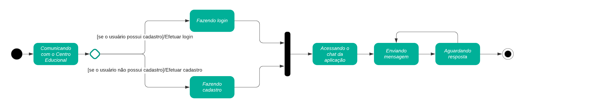
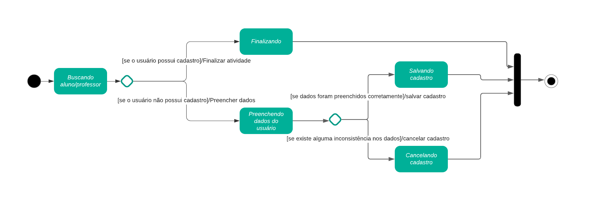
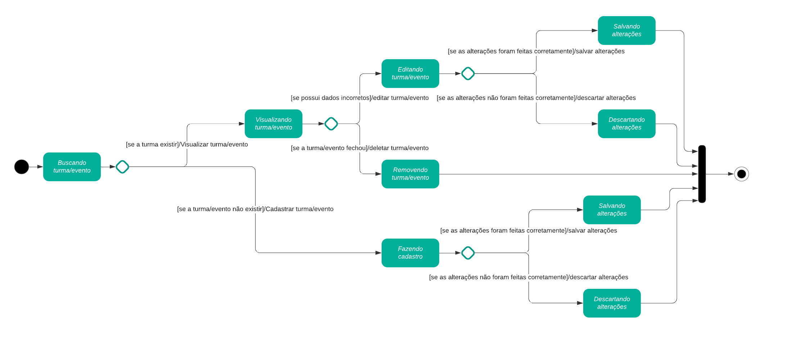

## Introdução
&emsp;&emsp;Os diagramas de estados, também chamados de diagrama de máquina de estados, é um dos tipos de diagramas UML que visa demonstrar as transições entre os diferentes objetos que compõem o sistema. Basicamente ele visa armazenar o status de um objeto em um determinado momento para então poder modificar essa tal status de acordo com a entrada recebida.

&emsp;&emsp;Os principais elementos que constituem um diagrama de estados são:

- Estado inicial: Ponto inicial, onde começa a utilização do objeto;
- Evento ou Transição: Representa uma ação externa sobre um objeto;
- Estado: Representa um dos possíveis estados que um objeto pode ter;
- Ações: Processo associado à transição de estados. São representadas por "/", seguidas das ações contidas no estado. As ações são: 
	- Ação de entrada: executada para chegar a algum estado; 
	- Ação de atividade: é executada dentro do estado;
	- Ação de saída: executada quando se sai de um estado.
- Estado final: Ponto de saída do objeto.

## Diagramas
&emsp;&emsp;A seguir, os diagramas produzidos pelo grupo.

#### Comunicação entre os responsáveis e o [Centro Educacional](../../../base/requisitos/modelagem/lexicos/#lexico-centro-educacional)

[Figura 1: Comunicação](../../../assets/imagens/diagrama-estados/comunicacao.png)

#### Realização do cadastro de crianças e [professores](../../../base/requisitos/modelagem/lexicos/#lexico-professores)

[Figura 2: Cadastro de crianças e professores](../../../assets/imagens/diagrama-estados/cadastro-crianca-professor.png)

#### Realização do gerenciamento de [turmas](../../../base/requisitos/modelagem/lexicos/#lexico-turmas)

[Figura 3: Gerenciamento de turmas](../../../assets/imagens/diagrama-estados/gerencia-turma.png)

#### Lançamento de [presenças](../../../base/requisitos/modelagem/lexicos/#lexico-presenca)

[Figura 4: Lançamento de presenças](../../../assets/imagens/diagrama-estados/lancamento-presenca.png)

## Bibliografia
> - LUCIDCHART. O que é um diagrama de máquina de estados?. Disponível em: <https://www.lucidchart.com/pages/pt/o-que-e-diagrama-de-maquina-de-estados-uml>. Acesso em: 17 de ago. 2021.
> - Máquina de Estados. Disponível em: <http://msoo.pbworks.com/f/Diagrama+de+Estados.pdf>. Acesso em: 17 de ago. 2021.

## Versionamento
| Versão | Data | Modificação | Autor |
| :-: | -- | -- | -- |
|1.0| 18/08/2021 | Adição da introduçao, da metodologia, dos diagramas e da bibliografia  | Nilo Mendonça |
|1.1| 21/08/2021 | Adição da léxicos  | Bruno Félix |
|1.2| 21/08/2021 | Revisão por pares  | Enzo Gabriel e Gabriel Bonifácio |
