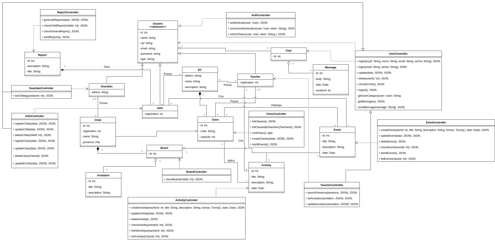

# Diagrama de Classes
 
## Introdução
 
&emsp;&emsp;De acordo com artigo da plataforma Lucidchart[1], o Diagrama de Classes é utilizado para representar e descrever a estrutura estática de classes do sistema, definindo os atributos, métodos e relacionamentos entre as classes. Além disso, fornece uma visão geral do comportamento estático do sistema, e pode ser utilizado como base para outros diagramas UML.

## Metodologia

&emsp;&emsp;O desenvolvimento do diagrama de classes levou em consideração as decisões de tecnologias e estruturas que serão utilizadas no projeto. Sendo assim, o diagrama de classes aborda a representação das classes que serão desenvolvidas na API do projeto, a qual contará com arquitetura MVC. 
&emsp;&emsp;Portanto, foi focada a representação das entidades que compõem as camadas de modelos e controllers. 
&emsp;&emsp;É importante mencionar que os nomes das classes, de seus atributos e métodos foram representados em Inglês e no estilo [CamelCase](https://pt.wikipedia.org/wiki/CamelCase) para que, desde já, seja feita uma padronização no que se refere ao que será implementado em código.

## Diagrama de classes

### Versão 1.0

[Figura 1: Diagrama de classes v1](../../assets/imagens/diagrama-de-classes/Diagrama-de-classes.png)

### Versão 2.0
&emsp;&emsp;A seguir temos a segunda versão do diagrama de classes, o qual foi aprimorado conforme o feedback da segunda entrega e os ajustes necessários após as escolhas dos padrões de projetos 
&emsp;&emsp;Nessa versão, foram corrigidas as representações das relações entre as classes [Teacher](../../../base/requisitos/modelagem/lexicos/#lexico-professor), [Adm](../../../base/requisitos/modelagem/lexicos/#lexico-administrador), [Class](../../../base/requisitos/modelagem/lexicos/#lexico-turma) junto a classe [EC](../../../base/requisitos/modelagem/lexicos/#lexico-centro-educacional). Além disso, foram adicionadas as classes BoardComposite e ProjectController conforme utilização nos padrões [composite ]() e [state]().

[Figura 2: Diagrama de classes v2](../../assets/imagens/diagrama-de-classes/diagrama-classes-v2.png)

 
#### **Observações**: 
- Todos os atributos privados possuem métodos Getters e Setters, e não foram incluídos no diagrama para facilitar a visualização.
- A maioria dos métodos das classes controllers tem relação de dependência com a classe AuthController, tais relações não foram incluídas no diagrama para facilitar a visualização.
 
## Bibliografia

> - [1] O que é um diagrama de classes UML?. lucidchart.com. Disponível em <https://www.lucidchart.com/pages/pt/o-que-e-diagrama-de-classe-uml>. Acesso em: 19 set. 2021.
> - UML Class Diagrams Overview. uml-diagrams.org. Disponível em: <https://www.uml-diagrams.org/class-diagrams-overview.html> Acesso em: 13/08/2021.
> - Videoaulas e materiais complementares presentes no moodle da disciplina Arquitetura e Desenho de Software. Disponível em <https://aprender3.unb.br/course/view.php?id=8603>. Acesso em: 14 ago. 2021.

## Versionamento
| Versão | Data | Modificação | Autor |
| :-: | -- | -- | -- |
|0.1| 13/08/2021 | Criação do Diagrama de classes              |  Daniel Porto, Eliseu Kadesh  |
|1.0| 20/08/2021 | Abertura do Documento                       |  Eliseu Kadesh |
|1.1| 20/08/2021 | Adição da metodologia                       |  Daniel Porto  |
|2.0| 21/08/2021 | Correções no Diagrama de Classes            |  Eliseu Kadesh |
|2.1| 21/08/2021 | Revisão por pares | Bruno Félix, Francisco Emanoel |
|2.2| 19/09/2021 | Atualização do diagrama | Daniel Porto | 
|2.3| 19/09/2021 | Revisão por pares | Matheus O. Patrício, Edson Soares|
