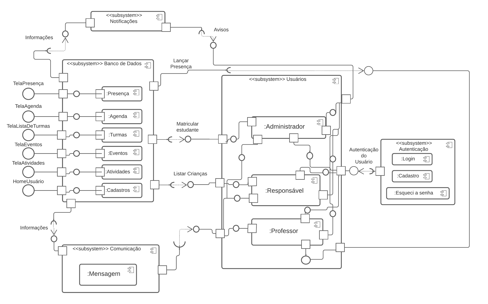

## Introdução
&emsp;&emsp;Um componente basicamente representa o código de uma funcionalidade ou conjunto de funcionalidades que é possível de ser reutilizado em diferentes projetos. Os componentes disponibilizam uma forma de acesso para serem utilizados, podendo ser combinados para a criação de outros componentes compostos. O diagrama de componentes em si, é um diagrama estrutural e busca explicitar um vislumbre do projeto por meio de relacionamentos, componentes e interfaces de comunicação. 
&emsp;&emsp;O diagrama de componentes é fundamental na criação de um sistema de software. É feito utilizando a linguagem UML, facilitando o entendimento da estrutura dos sistemas existentes, tornando possível ver os relacionamentos entre os componentes de todo o sistema. 

## Metodologia
&emsp;&emsp;O desenvolvimento do diagrama de componentes levou em consideração as decisões de tecnologias e estruturas que serão utilizadas no projeto. Sendo assim, o diagrama de componentes aborda a representação dos componentes que serão desenvolvidos na API do projeto, a qual contará com arquitetura MVC. 

[Diagrama 1: Diagrama de componentes](../../assets/imagens/diagrama-de-componentes/diagrama-de-componentes.png)

## Bibliografia
> -   UML Component Diagrams: <https://www.uml-diagrams.org/component-diagrams.html>. Último acesso em 21/08/2021.
> -   Diagrama de componentes UML: o que é, como fazer e exemplos: <https://www.lucidchart.com/pages/pt/diagrama-de-componentes-uml>. Último acesso em 21/08/2021.

## Versionamento
| Versão | Data | Modificação | Autor |
| :-: | -- | -- | -- |
|0.1| 13/08/2021 | Início do artefato | Mateus O. Patrício e Gabriel Bonifácio |
|1.0| 13/08/2021 | Abertura do documento e adição da introdução  | Mateus O. Patrício |
|1.2| 14/08/2021 | Melhoria do artefato | Mateus O. Patrício e Gabriel Bonifácio |
|1.3| 18/08/2021 | Melhoria do artefato | Mateus O. Patrício e Gabriel Bonifácio |
|1.4| 20/08/2021 | Finalizada versão 1.0 do artefato | Gabriel Bonifácio |
|2.0| 21/08/2021 | Adição do artefato e da bibliografia ao documento | Mateus O. Patrício |
|2.1| 21/08/2021 | Revisão por pares | Daniel Porto, Francisco Emanoel |
|2.2| 17/09/2021 | Revisão e correção do documento segundo feedback da professora | Edson Soares e Nilo Mendonça |