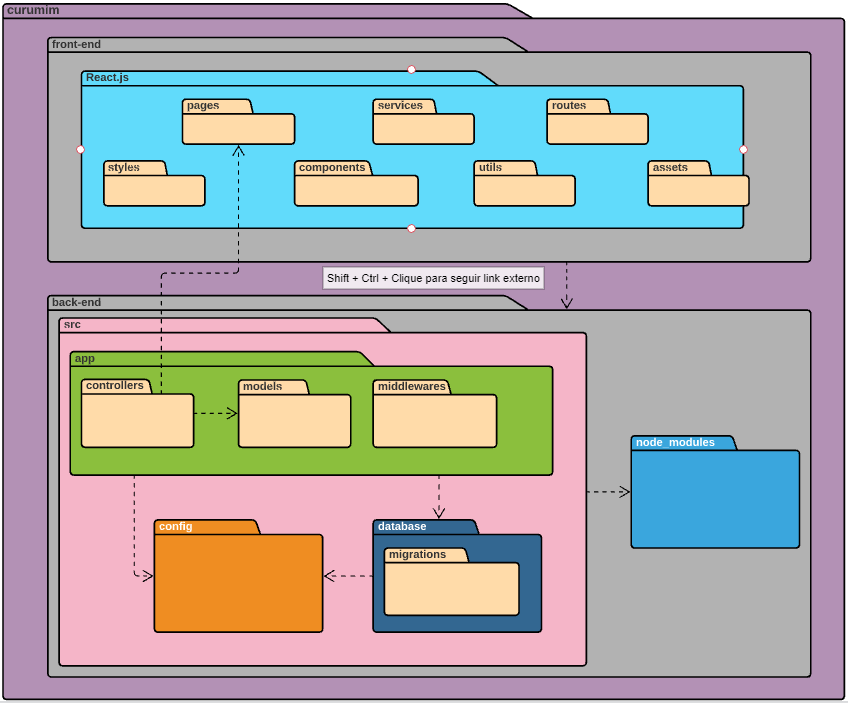

# Diagrama de Pacotes

## Introdução

&emsp;&emsp;Diagramas de pacotes são diagramas estruturais usados para mostrar, em uma forma de pacotes, a organização e disposição de vários elementos de modelos. Um pacote é um agrupamento de elementos UML relacionados, como diagramas, documentos, classes ou até mesmo outros pacotes.

### Versão 2.0

[Figura 1: Diagrama de pacotes 2.0](../../assets/imagens/diagrama-de-pacotes/diagrama_de_pacotes_v2.png)

### Versão 1.0

[Figura 2: Diagrama de pacotes 1.0](../../assets/imagens/diagrama-de-pacotes/Diagrama-de-pacotes.png)

## Bibliografia
> - UML Package Diagrams Overview. Disponível em: https://www.uml-diagrams.org/package-diagrams-overview.html. Acesso em: 12/08/2021.

> - Tudo sobre diagramas de pacotes UML. Disponível em:
https://www.lucidchart.com/pages/pt/diagrama-de-pacotes-uml. Acesso em: 12/08/2021

## Versionamento
| Versão | Data | Modificação | Autor |
| :-: | -- | -- | -- |
|1.0| 12/08/2021 | Criando documento e Diagrama de pacotes | Enzo Gabriel, Francisco Emanoel  |
|1.1| 14/08/2021 | Resolvendo erros encontrados no diagrama    | Enzo Gabriel, Francisco Emanoel |
|1.2| 21/08/2021 | Revisão por pares | Daniel Porto, Edson Soares|
|1.3| 08/09/2021 | Atualizando pacotes do front-end no diagrama | João Pedro, Enzo Gabriel |
|1.4| 13/09/2021 | Atualizando pacotes do back-end no diagrama e adição da v2 do diagrama ao documento | Mateus O. Patrício |
|1.5| 19/09/2021 | Revisão do diagrama v2.0 do back-end e do documento | Mateus O. Patrício e Daniel Porto |