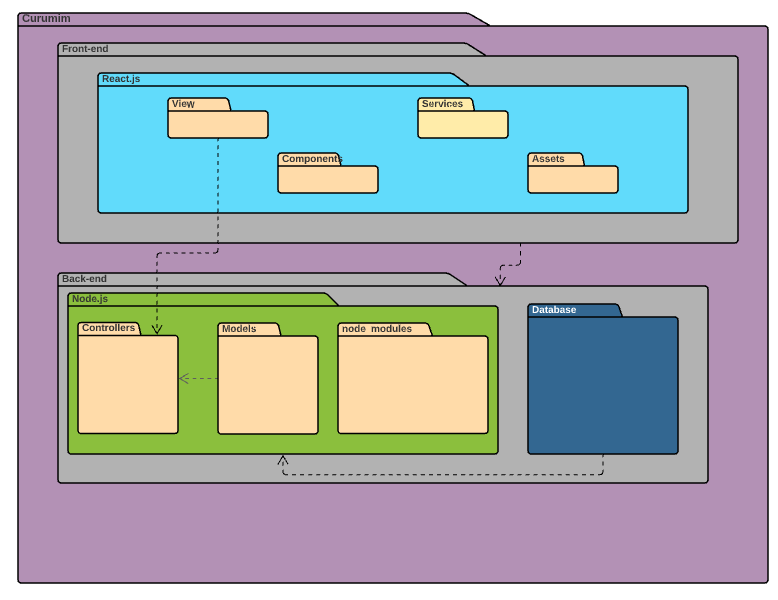

# Diagrama de Pacotes

## Introdução

&emsp;&emsp;Diagramas de pacotes pode ser definido como o produto da modelagem de estruturas de informação, tendo como objetivo representar a organização de Domínios, Subsistemas, Sistemas e Camadas de Sistemas. Basicamente tem o objetivo de mostrar como as classes são divididas dentro dos módulos; são diagramas lógicos e não implicam em uma divisão físicas de classes, mas agrupam os elementos modelados. 
&emsp;&emsp;Os pacotes podem ser usados para representar diferentes visões da arquitetura do Sistema. 

##### Recomendações: 
- É utilizado para modelar grupos de elementos e as diferentes visões da arquitetura de um sistema.

##### Benefícios: 
- Auxilia no controle da visibilidade dos elementos agrupados, possibilitando a visão externa do pacote;
- Auxilia na visualização dos grupos de elementos que podem ser manipulados como um todo.

## Metodologia
&emsp;&emsp;O desenvolvimento do diagrama de pacotes levou em consideração as decisões de técnologias e estruturas que serão utilizadas no projeto. Sendo assim, o diagrama de pacotes aborda a representação dos módulos que serão desenvolvidos na API do projeto, a qual contará com arquitetura MVC. 

[Figura 1: Diagrama de pacotes](../../assets/imagens/diagrama-de-pacotes/Diagrama-de-pacotes.png)

## Bibliografia
> - UML Package Diagrams Overview. Disponível em: <https://www.uml-diagrams.org/package-diagrams-overview.html>. Acesso em: 12/08/2021.
> - Tudo sobre diagramas de pacotes UML. Disponível em: <https://www.lucidchart.com/pages/pt/diagrama-de-pacotes-uml>. Acesso em: 12/08/2021.

## Versionamento
| Versão | Data | Modificação | Autor |
| :-: | -- | -- | -- |
|1.0| 12/08/2021 | Criando documento e Diagrama de pacotes | Enzo Gabriel e Francisco Emanoel  |
|1.1| 14/08/2021 | Resolvendo erros encontrados no diagrama    | Enzo Gabriel e Francisco Emanoel |
|1.2| 21/08/2021 | Revisão por pares | Daniel Porto e Edson Soares|
|1.3| 17/09/2021 | Revisão e correção do documento segundo feedback da professora | Edson Soares e Nilo Mendonça |