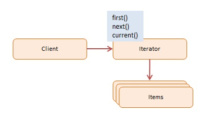
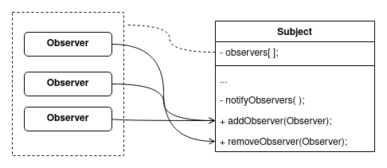
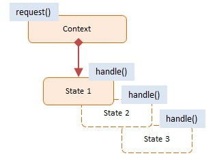
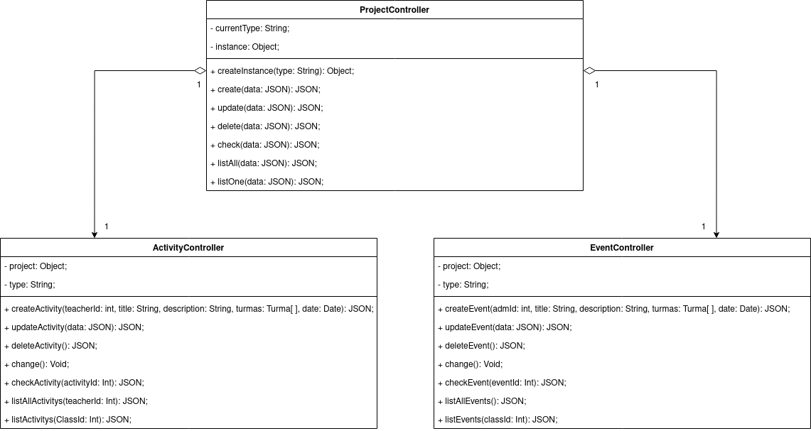

# GOFs Comportamentais

## Introdução
&emsp;&emsp;Diferentemente dos padrões de objetos criacionais, que buscam criar objetos de forma controlada, procurando diminuir a complexidade e instabilidade na criação dos objetos, como o [Factory Method](./gofs-criacionais.md), por exemplo. Aqui nos padrões comportamentais que enfatiza como "descrever como um grupos de objetos coopera para realizar uma tarefa que nenhum objeto individualmente pode realizar sozinho." (Gama et al. Design Patterns: Elements os
Reusable Object-Oriented Software. 1995) [[4]](#bibliografia). 
&emsp;&emsp;Neste documento apresentamos alguns padrões comportamentais que serão implementados no escopo do nosso projeto e uma breve introdução do que são os outros padrões comportamentais que não serão utilizados no contexto da aplicação Curumim.

## Command

&emsp;&emsp;O command é um padrão comportamental que transforma uma solicitação em um objeto independente que possui todas as informações sobre essa solicitação. 
&emsp;&emsp;Esse padrão encapsula ações como objetos, permitindo que o sistema tenha um baixo acoplamento, separando os objetos que emitem solicitações dos objetos que as processam. Tais solicitações e o código que as processam são chamados respectivamente de eventos e manipuladores de eventos. 
&emsp;&emsp;No nosso projeto, a command é utilizada em algumas situações. No exemplo mostramos a command sendo usada para englobar as ações que o [administrador](../../base/requisitos/modelagem/lexicos/#lexico-administrador) pode fazer envolvendo os [professores](../../base/requisitos/modelagem/lexicos/#lexico-professor).

~~~javascript
function TeacherButtons() {
    return (
        

            <button className="registerTeacherButton" onclick="RegisterCommand(teacher)">Registrar</button>
            <button className="excludeTeacherButton" onclick="ExcludeCommand(teacher)">Excluir</button>
            <button className="updateTeacherButton" onclick="UpdateCommand(teacher)">izar</button>
            <button className="addTeacherToClassButton" onclick="addToClassCommand(teacherAtual, class)">Adicionar a uma turma</button>
        

    )
}
~~~

&emsp;&emsp;A própria interface da aplicação é a cliente que utiliza a command, por meio dos botões.

~~~javascript
function registerTeacher(teacher) { 
    teachersList.push(teacher) // Registrando um professor
}

function excludeTeacher(teacher) { 
    thisTeacher = childrenList.indexOf(teacher.name)
    childrenList.remove(thisKid) // Excluindo um professor
}

function updateTeacher(teacher) { 
    thisTeacher = childrenList.indexOf(teacher.name)
    thisTeacher = thisKid // Atualizando um professor
}

function addTeacherToClass(teacher, class) { 
    class.teacher(teacher) // Adicionando um professor a uma sala
}

var Command = function (action, teacher) {
    this.action = execute;
    this.value = teacher;
}

var RegisterCommand = function (value) {
    return new Command(registerTeacher, value);
};

var ExcludeCommand = function (value) {
    return new Command(excludeTeacher, value);
};

var UpdateCommand = function (value) {
    return new Command(updateTeacher, value);
};

var addToClassCommand = function (value) {
    return new Command(addTeacherToClass, value);
};
~~~

&emsp;&emsp;Por fim as ações de registrar, excluir, atualizar e atribuir a [turma](../../base/requisitos/modelagem/lexicos/#lexico-turma), com o objeto [professor](../../base/requisitos/modelagem/lexicos/#lexico-professor), que contém os atributos capturados na interface.

## Iterator
&emsp;&emsp;O padrão Iterator, ou Iterador, permite com que se navegue em coleções de elementos. Propõe a criação de classes que implementem métodos especialmente pensados para realizar as iterações dado um conjunto de elementos.

[Figura 1: Padrão iterator.](../assets/imagens/gofs/gof-iterator.png)[ Fonte: dofactory.com](https://www.dofactory.com/javascript/design-patterns/iterator#diagram)

&emsp;&emsp;Esse padrão pode ser aplicado nas situações de iteração de qualquer tipo de coleção de elementos mas pode ser considerada uma aplicação exagerada caso o sistema em questão trabalhe apenas com coleções simples e de baixa complexidade. 
&emsp;&emsp;Sendo assim, como as coleções do projeto não têm uma complexidade elevada e as situações de iterações são bem específicas e pontuais, conclui-se que esse padrão não se aplicaria de forma muito vantajosa.

## Mediator

&emsp;&emsp;Define um objeto que encapsula como um conjunto de objetos
interage. O Mediator promove o acoplamento fraco ao evitar que os objetos se refiram
explicitamente uns aos outros, permitindo que você varie suas interações
independentemente. Definição de Erich Gamma, Richard Helm, Ralph Johnson e John
Vlissides. 
&emsp;&emsp;O padrão Mediator é responsável por controlar e coordenar a interação de um conjunto de objetos.

### Estrutura de Objetos
&emsp;&emsp;Para exemplificar a aplicação do padrão Mediator na interação dos objetos do chat entre Guardian, Administrador e Professor(a). Apresentamos um diagrama de objetos que se comunicam através de um intermediário. 
&emsp;&emsp;Na estrutura abaixo incluímos um componente do frontend que consiste em um botão para representar o envio de mensagem. Podemos observar a interação desse componente da seguinte maneira: O botão inicia desativado, sempre que um caractere seja digitado no campo de texto, o botão muda seu estado para ativado. Aqui podemos observar que o padrão mediator possibilita diversos objetos interagindo uns com os outros por meio de um mediador.

[Figura 2: Estrutura de objetos](../../assets/imagens/gofs/estrutura_objetos.jpg)

### Diagrama de classe (Chat)
&emsp;&emsp;

[Figura 3: Interação dos objetos](../../assets/imagens/gofs/mediator_diagrama_classe.jpg)

&emsp;&emsp;O diagrama acima demonstra a interação de objetos da seguinte situação: O sistema conta com um chat onde acontece uma troca de mensagens entre os usuários, porém essa comunicação acontece de uma forma relativamente complexa, pois o Guardian pode se comunicar com qualquer um dos outros dois usuários, Administrador ou com o(a) Professor(a). Logo, considera-se necessário criar um mediador para intermediar as mensagens e o chat fluir de uma melhor forma. Nesse caso os objetos conhecem apenas o Mediator.

### Implementação (Protótipo)
~~~javascript
        function User(name)
        {
        this.name = name
        this.chatroom = null
        }

        User.prototype = {
        send: function(message, toUser)
        {
            this.chatroom.send(message, this, toUser)
        },
        receive: function(message, fromUser)
        {
            return {"sender": fromUser.name, "receiver": this.name, "message": message}
        }
        }

        function Chatroom()
        {
        this.users = {}
        }

        Chatroom.prototype = {
        addUser: function(user)
        {
            this.users[user.name] = user
            user.chatroom = this
        },
        send: function(message, fromUser, toUser)
        {
            toUser.receive(message, fromUser)
        }
        }
~~~
## Observer
&emsp;&emsp;O padrão de projeto Observer, ou Observador, permite que objetos interessados sejam notificados sobre mudanças de estado ou ocorrência de eventos em outros objetos que estão sendo observado por eles. 
&emsp;&emsp;Esse padrão propõe a implementação de mecanismos de inscrição onde objetos possam estar contidos para receber as mudanças de estados e os eventos ocorridos no objeto observado. Praticamente, trata-se de um conjunto de métodos públicos que permitam com que os objetos observadores se incluam e se retirem do vetor de observadores também contido na classe observada. Além disso, é preciso de um método que notifique cada objeto contido no vetor de observadores.

[Figura 4: Padrão observer](../assets/imagens/gofs/gof-observer.png)

&emsp;&emsp;Esse padrão é muito bem aplicado em situações onde a mudança de estado de objetos pode acarretar a mudança de estado de outros objetos de forma bem específica. Sendo assim, notou-se que esse padrão não se aplicaria muito bem no escopo do nosso projeto pois não foi encontrada nenhuma situação semelhante no que tange o funcionamento do sistema.

## State
&emsp;&emsp;O padrão State permite com que um objeto altere o seu comportamento de acordo com o seu estado interno. Dessa forma, esse padrão sugere a implementação de classes para representar os diferentes estados do objeto e definir o comportamento de seus métodos e funções.

[Figura 5: Padrão state.](../assets/imagens/gofs/gof-state.jpg)[ Fonte: dofactory.com](https://www.dofactory.com/javascript/design-patterns/state#diagram)

&emsp;&emsp;Esse padrão é bem aplicado quando existem objetos que possam mudar de status de forma a modificar os seus comportamentos. Sendo assim, a equipe optou por adaptar a modelagem de forma a permitir a utilização desse padrão. 
&emsp;&emsp;Basicamente, esse padrão será utilizado para trabalhar duas classes semelhantes: ActivityController e a EventController. Será implementada a classe ProjectController para identificar o contexto de utilização de forma que ActivityController e a EventController representem o seu estado ou, mais apropriadamente, tipo. 
&emsp;&emsp;Para essa implementação, também será utilizado o auxílio do padrão criacional [Singleton]() na classe ProjectController.

[Figura 6: Padrão state.](../assets/imagens/gofs/gof-state-diagram.png)

&emsp;&emsp;A seguir tem-se um exemplo resumido a nível do código do que pode ser feito na implementação desse padrão.

~~~javascript
class ProjectController {
    #currentType;
    #instance

    function creataInstance (type){
        if(!instance){
            instance = new ProjectController(type);
        }else if(instance.currentType.getType != type){
            instance.currentType.change();
        }

        return instance;
    }

    constructor(type){
        if (type === "Activity"){
            this.currentType = new ActivityController(this);

        }else if(type === "Event"){
            this.currentType = new EventController(this);
        }else{
            //Err invalid type
        }
    }
    function setType(type){
        this.currentType = type;
    }

    function create(req, res) {
        this.currentType.create(req, res);
    }

    function update(res, res) {
        this.currentType.creat(req, res);
    }
}

class ActivityController{
    #project;
    #type = "Activity";

    constructor(project){
        this.project = project
    }

    function getType(){
        return this.type;
    }

    function change(){
        this.project.setType(new EventController(this.project))
    }

    function create(req, res){
        //create an Activity
    }

    function update(req, res){
        //update an Activity
    }
}

class EventController{
    #project;
    #type = "Event";

    constructor(project){
        this.project = project
    }

    function getType(){
        return this.type;
    }

    function change(){
        this.project.setType(new ActivityController(this.project))
    }

    function create(req, res){
        //create an Event
    }

    function update(req, res){
        //update an Event
    }
}
~~~

## Strategy
&emsp;&emsp;O padrão Strategy é utilizado para encapsular algoritmos semelhantes a fim de definir novas operações sem alterar as classes dos elementos sobre os quais opera. (Gamma et al. 1995)[[4]](#bibliografia), afirma que a grande vantagem de utilizar o padrão strategy é que além de permitir reutilização de código, as funcionalidades do projeto são facilmente estendidas e as manutenções no projeto acabam sendo menos custosas.

## Template Method
&emsp;&emsp;Seguindo as definições dos autores de Design Patterns, é dito que o padrão Template Method, "permite que as subclasses redefinam certas etapas de um algoritmo sem alterar a estrutura do algoritmo," (Gamma et al. 1995)[[4]](#bibliografia). Isso porque esse padrão é representado como um método em uma classe base, geralmente uma classe abstrata, contendo a estrutura das partes invariáveis do algoritmo. O padrão template method garante que o modelo geral seja sempre seguido.

## Visitor

&emsp;&emsp;O visitor permite a separação dos algoritmos com os objetos nos quais eles operam.

### Aplicabilidade

- Você pode utilizar o Visitor quando precisar realizar uma operação em todos os elementos da estrutura de objetos complexa. Ex: uma árvore de objetos. Ou seja, é possível executar uma operação sobre um conjunto de objetos com diferentes classes, implementando diversas variantes da mesma operação correspondentes às classes alvo.

- É possível utilizar o Visitor para remover a lógica de negócio de comportamentos auxiliares. Pois o mesmo permite tornar as classes primárias da aplicação mais focadas em seu trabalho principal.

- Utilize o padrão quando um comportamento faz sentido apenas dentro de algumas classes de uma uma hierarquia de classe. Você pode extrair esse comportamento para uma classe visitante separada e implementar somente aqueles métodos visitantes que aceitam objetos de classes relevantes, deixando o resto vazio.

&emsp;&emsp;Nosso projeto não se encaixa nos casos de aplicação do padrão.

## Memento

&emsp;&emsp;O Memento permite salvar e restaurar estados anteriores de um objeto sem revelar os detalhes de sua implementação.

### Aplicabilidade

- É possível utilizar o padrão quando quiser reproduzir cópias do estado de um objeto permitindo então restaurar a um estado anterior do mesmo. O Memento faz cópias completas do estado de um objeto, isso inclui campos privados, e as armazena separadamente do objeto. Duas grandes aplicações do padrão são para a funcionalidade de desfazer e quando se lida com transações, permitindo revertê-las.

- Você pode utilizar o padrão caso o acesso direto à informações de um objeto viola o seu encapsulamento. Com o memento o próprio objeto é responsável por criar sua cópia.

&emsp;&emsp;No nosso projeto faz mais sentido a utilização do padrão criacional Prototype, por se tratar de objetos intuitivos.

## Chain Of Responsibility

&emsp;&emsp;O Chain of Responsibility utiliza a passagem de pedidos por uma corrente de handlers. Onde ao receber um pedido, cada handler decide se deve processar ou passar o pedido para o próximo handler.

### Aplicabilidade

- Utilize o padrão se for esperado que seu programa processe diferentes tipos de pedido em várias maneiras, mas os exatos tipos de pedidos e suas sequências não são previamente conhecidos. O padrão permite a ligação de vários handlers em sequência, quando um handler recebe um pedido o mesmo decide se pode ou não processá-lo, desta forma todos os handlers podem processar o pedido.

- Se for necessário a execução de vários handlers em uma ordem pré-determinada. Como é possível escolher a ordem da corrente de handlers, todos os pedidos irão passar pelos handlers na ordem planejada.

- Caso necessário mudar o conjunto de handlers e suas encomendas em tempo de execução. Ao providenciar setters para campos de referência dentro das classes handlers, é possível inserir, remover ou reordenar os handlers de forma dinâmica.

&emsp;&emsp;Nosso projeto não se encaixa nos casos de aplicação do padrão.

## Bibliografia

> - [1] LARMAN, Craig. <b>Utilizando UML e Padrões</b>: Uma introdução à análise e ao projeto orientados a objetos e ao desenvolvimento iterativo. 3. ed. [S. l.: s. n.], 2004.
> - [2] GAMMA, Erich; HELM, Richard; JOHNSON, Ralph; VLISSIDES, John. Design
Patterns: Elements of Reusable Object-Oriented Software. Estados Unidos:
Hardback, 1995. 416 p. Erich Gamma, Richard Helm, Ralph Johnson, John
Vlissides
> - [3] Padrões de projeto comportamentais: https://refactoring.guru/pt-br/design-patterns/behavioral-patterns. Último acesso em 19/09/2021.
> - SHVETS, Alexander. **Dive Into Design Patterns**. Disponível em <https://refactoring.guru/design-patterns>. Acesso em 18/09/2021.
> - DOFACTORY. **Javascript Design Patterns**. Disponível em <https://www.dofactory.com/javascript/design-patterns/>. Acesso em 18/09/2021.

> - [4] Design Patterns: Elements os Reusable Object-Oriented Software. Addison-Wesley, 1995. Disponível em: <http://www.uml.org.cn/c%2B%2B/pdf/DesignPatterns.pdf>. Acesso em 19/09/2021.

## Versionamento
| Versão | Data | Modificação | Autor |
|--|--|--|--|
|1.0|10/09/2021| Abertura do documento | Mateus O. Patrício |
|1.1|13/09/2021| Adição do padrão Visitor | Mateus O. Patrício |
|1.2|16/09/2021| Introdução ao Mediator e inclusão de bibliografia [2] | Edson Soares |
|1.3|16/09/2021| Inclusão do diagrama Mediator | Edson Soares |
|1.4|17/09/2021| Explicação do diagrama de classe | Edson Soares |
|1.5|18/09/2021| Adição dos padrões Command, Iterator, Observer e State | Daniel Porto e Enzo Gabriel |
|1.6|19/09/2021| Adição dos padrões Memento e Chain of Responsibility | Mateus O. Patrício |
|1.7|19/09/2021| Revisão por pares | Daniel Porto e Edson Araujo |
|1.8|19/09/2021| Construção da estrutura de objetos | Edson Soares |
|1.9|19/09/2021| Implementação | Edson Soares |
|2.0|19/09/2021| Revisão do padrão Mediator | Bruno Felix e Eliseu Kadesh |
|2.1|19/09/2021| Revisão dos padrões Observer, State, Command e Iterator | Bruno Felix e Gabriel Bonifácio |
|2.2|20/09/2021| Introdução do documento + Bibliografia | Edson Soares |
|2.3|20/09/2021| Breve apresentação dos não aplicáveis (Strategy, Template Method) | Edson Soares |
|2.4|20/09/2021| Revisão do strategy e template method | Eliseu Kadesh, Francisco Emanoel |
|2.5|20/09/2021| Revisão dos padrões comportamentais | João, Nilo Mendonça |
|2.6|14/10/2021| Padronização do documento | Bruno Félix e Nilo Mendonça |