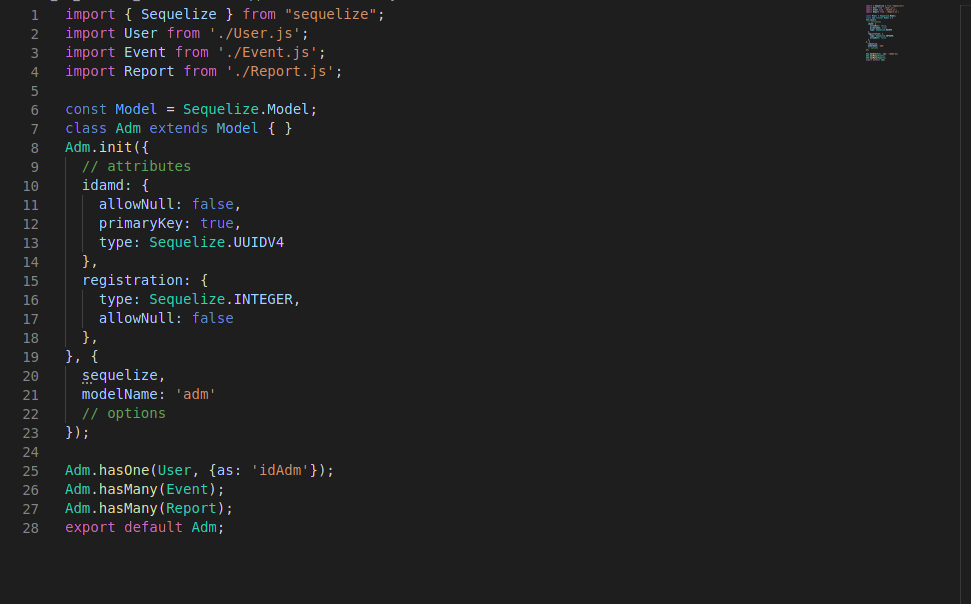
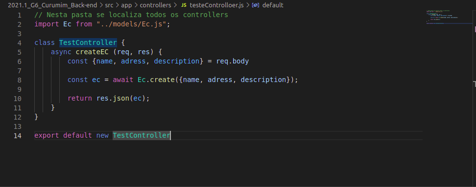

# GOFs Estruturais

## Adapter

&emsp;&emsp;Adpter é um padrão de projeto, que tem como objetivo converter a interface de uma classe em outra interface para o cliente. Os Adapters permitem que classes trabalhem juntas, mesmo que estejam em interfaces incompatíveis. [[1]](#bibliografia)

&emsp;&emsp;Algums problemas que o Adapter pode solucionar:

- Reutilização de interfaces;
- Incompatibilidade de interfaces;
  
&emsp;&emsp;No contexto do nosso projeto, temos um exemplo de Adapter nas models da nossa aplicação, que é criada a partir da biblioteca sequelize do nodejs, e essas models funcionam como uma ponte entre o banco de dados e o app. Com isso o app fica completamente independente de qual banco de dados será utilizado.

[Figura 1: Exemeplo de Adapter - Adm](../assets/imagens/gofs-adapters/adapters-model-adm.png)

[Figura 2: Exemeplo de Adapter - Adm](../assets/imagens/gofs-adapters/adapters-controller.png)

## Bridge
 
&emsp;&emsp;O Bridge é um padrão de projeto estrutural que permite que você divida uma classe grande ou um conjunto de classes intimamente ligadas em duas hierarquias separadas: **Abstração** e **Implementação** que podem ser desenvolvidas independentemente umas das outras.
 
&emsp;&emsp;De acordo com o GoF[[1]](#bibliografia), o padrão Bridge significa é desacoplar uma abstração de sua implementação para que as duas possam variar independentemente.
 
#### Abstração
 
&emsp;&emsp;Também chamado de interface é uma camada de controle de alto nível para alguma entidade. Essa camada não deve fazer nenhum tipo de trabalho por conta própria. Ela deve delegar o trabalho para a camada de implementação.
 
#### Implementação
 
&emsp;&emsp;Camada de que terá a responsabilidade de implementar um comportamento específico de um objeto.

## Composite

&emsp;&emsp;O Composite é um padrão de design de particionamento e descreve um grupo de objetos que é tratado da mesma maneira que uma única instância do mesmo tipo de objeto. O objetivo de um Composite é agrupar objetos em estruturas de árvore para representar hierarquias parte-todo. Ele permite que você tenha uma estrutura de árvore e peça a cada folha da árvore que execute uma tarefa. "O Composite é baseado no Polimorfismo e fornece variações protegidas a um cliente então não sofre impacto se seus objetos relacionados forem atômicos ou compostos" (LARMAN, 2004). 

O padrão Composite possui 4 participantes:

- Component: Uma interface ou classe base abstrata para os objetos na estrutura em árvore. Esta classe define o comportamento padrão para todos os objetos e comportamentos para acessar e gerenciar componentes filhos na árvore.
- Leaf: É uma classe que estende Component para representar folhas na estrutura de árvore que não tem nenhum filho.
- Composite: É uma classe que estende Component para representar nós na estrutura da árvore, podendo conter filhos. Esta classe armazena componentes Leaf e implementa os comportamentos definidos em Component para acessar e gerenciar componentes filhos.
- Client: interage com o Component para acessar e manipular objetos na composição.

&emsp;&emsp;Em nosso projeto, é possível utilizar o Composite para gerar o [mural](../../../base/requisitos/modelagem/lexicos/#lexico-mural), onde teremos BoardController sendo o Component, e as leaf sendo a classe Events e a classe Anotations. Abaixo temos um exemplo em javascript:

[Figura 3: Board Composite Code](../../assets/imagens/gofs/composite-code.png)

&emsp;&emsp;Em nível de modelagem, temos esse exemplo onde só foram descritos os métodos e atributos específicos utilizados no composite. É possível ver as classes mais completas no [Diagrama de classes](../modelagem/modelagem-estatica/diagrama-de-classes.md) do projeto.

[Figura 4: Composite](../../assets/imagens/gofs/CompositeModelagem.png)

## Proxy
&emsp;&emsp; O proxy é um padrão que tem intenção de fornecer um substituto de localização para outro objeto, com o objetivo de controlar esse objeto. Essa é a descrição que está na literatura de design patterns, mas de forma mais simplificada seria, o proxy é algo que fica no meio do caminho entre a chamada do objeto e o próprio objeto.

[Figura 5: Proxy](../../assets/imagens/gofs/proxy.png)

&emsp;&emsp; Quais as principais características  de um proxy? 

* O objeto proxy finge ser o objeto real.
* É usado para controle de acesso, logs, cache, lazy instantiation, lazy evaluation, distribuição de serviços.
* Pode escolher como e quando repassar chamadas de método para o objeto real.

&emsp;&emsp; Aleḿ dessas caracteristicas existe um variação de proxy, abaixo iremos lista algumas delas.
 
* **Proxy Virtual:** Controla acesso a recursos que podem ser pesados para criação e utilização.
* **Proxy Remoto:** Faz o controle de recursos que se encontram remotamente.
* **Proxy de Proteção:** Faz o controle de autenticação  e permissão para recursos que precisem de tal.
 
&emsp;&emsp; Na aplicação do curumim usamos a variação de **Proxy de Proteção**, que como já foi dito, é responsável pelo processo de autenticação, como podemos observar na imagem do código abaixo.

[Figura 6: Proxy](../../assets/imagens/gofs/proxy-code.png)

## Bibliografia

> - LARMAN, Craig. <b>Utilizando UML e Padrões</b>: Uma introdução à análise e ao projeto orientados a objetos e ao desenvolvimento iterativo. 3. ed. [S. l.: s. n.], 2004.

> - Composite Design Pattern. Geeks For Geeks Disponível em: <https://www.geeksforgeeks.org/composite-design-pattern/>. Acesso em: 10 de setembro de 2021.

> - ERICH, Gamma. <b>Padrões de projeto</b>:  soluções reutilizáveis de softwareorientado a objetos. Ed. Única 2000.

> - The GoF Design Patterns Reference. Disponível em: [http://www.w3sdesign.com/](http://www.w3sdesign.com/)

> - [1] GoF, Design Patters - Elements of Reusable Object-Oriented Software. Disponível em: [http://www.uml.org.cn/c%2B%2B/pdf/DesignPatterns.pdf](http://www.uml.org.cn/c%2B%2B/pdf/DesignPatterns.pdf). Acesso em: 14 set. de 2021.

## Versionamento
| Versão | Data | Modificação | Autor |
|--|--|--|--|
|1.0|10/09/2021| Abertura do documento | João Pedro |
|1.1|10/09/2021| Adicionando topico Composite | João Pedro, Eliseu Kadesh |
|1.2|13/09/2021| Adicionando topico Proxy | Francisco Ferreira|
|1.3|13/09/2021| Adicão do Adapter | Eliseu Kadesh 
