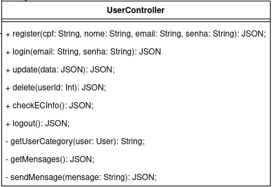
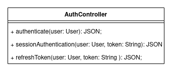
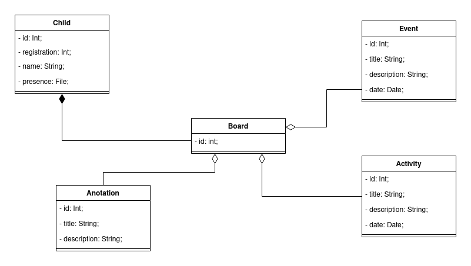

# GRASP - Padrões de Software para Atribuição de Responsabilidade Geral

&emsp;&emsp;Padrões GRASP são uma ajuda na hora de entender como desenhar um software orientado à objetos de maneira metódica, racional e explicável (LARMAN, 2004). Têm o intuito de tornar o código mais flexível, facilitando a manutenção e a extensibilidade.

## Criador

A instanciação de objetos é uma atividade comum em todo sistema orientado a objetos. Entender qual classe deve ser responsável por instanciar objetos reduz complexidade desnecessária do sistema.

Segundo Larman (2004), uma classe B deve ser responsável por criar instâncias de classe A se uma, ou quanto mais melhor, das seguintes afirmações se aplicarem:

- Instâncias de B contêm ou agregam instâncias de A;
- Instâncias de B gravam instâncias de A;
- Instâncias de B utilizam instâncias de A;
- Instâncias de B têm os dados necessários para iniciação das instâncias de A.

## Especialista

## Controlador

&emsp;&emsp;O controlador funciona quase que como um mediador entre a interface de [usuário](../../base/requisitos/modelagem/lexicos/#lexico-usuario) e o sistema desenvolvido. Ele tem a responsabilidade de coordenar todas as operações solicitadas pelo usuário e verificar quem são os responsáveis por tais tarefas. No controlador, não há regras de negócio, sendo sua única tarefa portanto, delegar e distribui as atividades do sistema. 
&emsp;&emsp;No nosso [diagrama de classes](../../modelagem/modelagem-estatica/diagrama-de-classes) podemos observar, que haverão alguns controladores dentro da aplicação. Como exemplo, temos:

- **UserController:**

[Figura 1: Classe User Controllerr](../assets/imagens/GRASPs/user_controller.png)

&emsp;&emsp;A classe **UserController** basicamente lida com tudo que pode envolver os [usuários](../../base/requisitos/modelagem/lexicos/#lexico-usuario) e distribui suas atividades para os devidos responsáveis.

## Invenção pura
&emsp;&emsp;O conceito de invenção pura aborda a utilização de soluções que não necessariamente se encaixem em algum padrão de projeto.
Com o objetivo de fortalecer a [alta coesão](#alta-coesao) e o [baixo acoplamento](#baixo-acoplamento), basicamente esse padrão consiste em atribuir um conjunto bem definido de responsabilidades para classes artificiais que não se encontram fundamentalmente no domínio do escopo do projeto. 
&emsp;&emsp;Com base no [diagrama de classes](../../modelagem/modelagem-estatica/diagrama-de-classes) desenvolvido, esse padrão foi aplicado ao modelar as seguintes classes:

- **Authentication Controller:**

&emsp;&emsp;A classe **authController** foi modelada para conter a responsabilidade de aplicar toda as regras de autenticação do sistema. Basicamente todas as requisições do [usuário](../../base/requisitos/modelagem/lexicos/#lexico-usuario) serão direcionadas às rotas, as quais inicialmente invocarão os métodos da **authController**, para, somente se autorizado pelos mesmos, continuar para a aplicação das regras de negócio inicialmente requisitadas e, finalmente, retornar uma resposta para a camada de view.

[Figura 2: Classe authController](../assets/imagens/GRASPs/invencao_auth.png)

- **Board:**

&emsp;&emsp;A classe [**Board**](../../base/requisitos/modelagem/lexicos/#lexico-mural) surgiu na necessidade de atribuir a responsabilidade de agrupar [atividades](../../base/requisitos/modelagem/lexicos/#lexico-atividade), [anotações](../../base/requisitos/modelagem/lexicos/#lexico-anotacao) e [eventos](../../base/requisitos/modelagem/lexicos/#lexico-evento) para a visualização por parte dos [responsáveis](../../base/requisitos/modelagem/lexicos/#lexico-responsavel). Essa classe tem sua validação na aplicação de regras específicas, como, por exemplo, a visualização de dados contidos nessas classes, em uma única tela, com a possibilidades de filtrar em um tipo de classe específica. 
&emsp;&emsp;Tais funcionalidades estão especificadas na [US06](../../product-backlog/#US06) e podem ser melhor visualizadas no [prótotipo de alta fidelidade](../../base/design-sprint/prototipo-alta/#prototipo-produzido).

[Figura 3: Classe Board](../assets/imagens/GRASPs/invencao_board.png)

## Alta Coesão

## Baixo Acoplamento

## Indireção

&emsp;&emsp;Esse padrão se configura por atribuir responsabilidades de mediador a classes intermediárias entre outros componentes, objetos ou serviços com objetivo, também, de contribuir com a [alta coesão](#alta-coesao) e o [baixo acoplamento](#baixo-acoplamento). 
&emsp;&emsp;**Camada Controller:** A indireção pode ser observada ao longo de todo o projeto simplesmente pela utilização da arquitetura **MVC**, visto que as classes contidas na camada de **controller** servem como mediadoras entre as camadas **view** e **model**. As classes controllers estão contidas nesse [diretório](). 
&emsp;&emsp;**Middlewares:** Além disso, o nosso projeto utilizará middlewares que são classes utilizadas internamente na api, pelos controllers na execução das regras de negócio, de forma a desacoplar métodos e rotinas estratégicas. Os middlewares do projeto estão contidos nesse [diretório]().

## Variações protegidas
&emsp;&emsp;O padrão Variações protegidas se caracteriza por tentar manter possível o isolamento de componentes, sem fazer comunicações desnecessárias, buscando eliminar impactos indesejáveis de elementos em outros elementos. Portanto aqui, nós buscamos identificar pontos de variação ou instabilidade previsíveis e atribuir responsabilidades para criar uma interface estável em torno deles.

## Polimorfismo

## Bibliografia

> - LARMAN, Craig. <b>Utilizando UML e Padrões</b>: Uma introdução à análise e ao projeto orientados a objetos e ao desenvolvimento iterativo. 3. ed. [S. l.: s. n.], 2004.
> - Videoaulas e materiais complementares presentes no moodle da disciplina Arquitetura e Desenho de Software. Disponível em <https://aprender3.unb.br/course/view.php?id=8603>. Acesso em: 27 jul. 2021.
> - Canal Vertice digital. Analise e Orientação a Objetos - Princípios do GRASP - Indirection ou Indireção. YouTube. Disponível em <https://www.youtube.com/watch?v=zPlAYo2E92o>. Acesso em: 02 set. 2021.
> - Canal Vertice digital. Analise e Orientação a Objetos - Princípios do GRASP - Pure Fabrication ou Invenção Pura. Disponível em <https://www.youtube.com/watch?v=4CteZ9144bw>. Acesso em: 02 set. 2021.
> - Canal Vertice digital. Analise e Orientação a Objetos - Princípios do GRASP - Controller ou Controlador. Disponível em <https://www.youtube.com/watch?v=CbB5Oy8eBzc>. Acesso em: 04 set. 2021.
> - Canal Vertice digital. Analise e Orientação a Objetos - Princípios do GRASP - Protected Variations ou Variações Protegidas. Disponível em <https://www.youtube.com/watch?v=AClwrkpYEG0>. Acesso em: 04 set. 2021.

## Versionamento
| Versão | Data | Modificação | Autor |
|--|--|--|--|
|1.0|01/09/2021| Abertura do documento | Mateus O. Patrício |
|1.1|01/09/2021| Adição da introdução e criador | Mateus O. Patrício |
|1.2|02/09/2021| Adição da invenção pura e indireção | Bruno Felix e Daniel Porto |
|1.7|04/09/2021| Adição da controlador e variações protegidas | Enzo Gabriel e Edson Araújo |