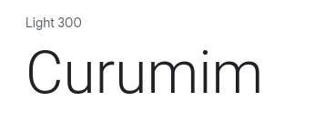
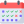

# Guia de estilo   Iniciativa Extra

## Introdução
&emsp;&emsp;Style Guide pode ser definido como um guia visual com um conjunto de regras que busca auxiliar uma equipe a se manter alinhada quanto a aparência de todo um projeto. Para isso são definindo cores, tipografias, espaçamentos, etc. 
&emsp;&emsp;Podem ser destacadas diversas vantagens com a utilização do Style Guide por uma equipe, entre elas permitir que diferentes membros da equipe vejam com clareza como ficará o produto final, permitir uma maior consistência no desenvolvimento da interface e nas aplicações de design, além de facilitar a comunicação e o trabalho da equipe. 

<!--## Logo -->

## Tipografia
&emsp;&emsp;Foi utilizada no projeto uma fonte em dois estilos diferentes, a Roboto Light 300 e a Roboto Medium 500, licenciada com licença Apache, Versão 2.0. Permitindo o uso livre em produtos e projetos e disponível no [Google Fonts](https://fonts.google.com/specimen/Roboto?preview.text=Curumim&preview.text_type=custom#standard-styles).

#### 1 - Roboto Light 300

	

Utilizada em:

- Menus;
- texto de mensagens;
- Subtítulos;
- Campos de texto;
- Informações de componentes;
- Botões internos da aplicação;

#### 2 - Roboto Medium 500

	

Utilizada em:

- Títulos de telas;
- Títulos de componentes;
- Botões de login e cadastro;

## Cores

	
	
	
	
	

## Ícones

&emsp;&emsp;Foi utilizado, para a definição dos ícones, a observação ao protótipo de alta fidelidade e adequação à aplicação, utilizando imagens disponibilizadas pelo [Flaticon](https://www.flaticon.com/br/).

        
| Ícones | | | |
|:--:|:--:|:--:|:--:|
|   |   |   |   | 
|   |   |   |    | 
|   |   | 

<figcaption>Tabela 1 - Ícones</figcaption>

## Componentes

&emsp;&emsp;Da mesma forma que utilizamos com os ícones, foi utilizado, para a definição dos componentes, a observação ao [protótipo de alta fidelidade](../../../base/requisitos/modelagem/lexicos/#lexico-prototipo-de-alta-fidelidade) e adequação à aplicação, utilizando imagens disponibilizadas pelo [Flaticon](https://www.flaticon.com/br/). 
As imagens abaixo definem um padrão geral dos nossos botões e a barra suspensa no topo da tela, como exemplos a serem seguidos.

### 1. Botões

&emsp;&emsp;Os botões utilizados durante toda a aplicação devem ter como predominância o [branco](#cores) e o [roxo](#cores), alternando entre essas duas cores o fundo, a fonte utilizada nas letras e a borda do botão, destacando também o [preto](#cores), utilizando-o principalmente na fonte das letras. Também pode-se utilizar as outras [Cores](#cores) quando se tem o objetivo de destacar algum botão específico, afim de melhor direcionar o [usuário](../../../base/requisitos/modelagem/lexicos/#lexico-usuario). Seguem alguns exemplos:

	
	
	

### 2. Topo da Tela

&emsp;&emsp;Para que o [usuário](../../../base/requisitos/modelagem/lexicos/#lexico-usuario) possa se orientar e poder voltar a uma tela ou acessar o menu a qualquer instante, o topo da tela deve ter um botão "voltar", quando a possibilidade voltar a uma outra tela existir, e o botão "menu", para que o [usuário](../../../base/requisitos/modelagem/lexicos/#lexico-usuario) tenha entendimento das opções e das telas que ele pode acessar. O padrão é esse, mas pode-se ter adaptações para telas especiais e na aplicação web. A ideia é que no centro também contenha uma identificação da aplicação, seja o nome "Curumim" ou a logo.

	

## Bibliografia
> - TORRES FILHOS, Flávio et al. Proposta de um guia de estilo CHESF para o Projeto de Interfaces Ergonômicas. 2008. Disponível em <http://dspace.sti.ufcg.edu.br:8080/jspui/handle/riufcg/17271>. Acesso em 07 de set. de 2021.
> - MOBILE APPLICATIONS STYLE GUIDE. 2020. Disponível em <https://scania.github.io/corporate-ui-docs/mobile-apps/assets/styleguide-for-apps.pdf>. Acesso em 07 de set. de 2021.
> - XNESKY. O que é e para o que serve o style guide de apps?. 22 de maio de 2020. <https://www.domestika.org/pt/blog/3631-o-que-e-e-para-o-que-serve-o-style-guide-de-apps>. Acesso em 07 de set. de 2021.

## Versionamento
| Versão | Data | Descrição | Autor(es) |
| :-: | -- | -- | -- |
| 1.0 | 07/09/2021 | Abertura do documento, adição de alguns itens a serem tratados e adição da bibliografia | Nilo Mendonça |
| 1.1 | 07/09/2021 | Adição da introdução, tipografia, cores e atualização da bibliografia | Nilo Mendonça |
| 1.2 | 11/09/2021 | Adição dos ícones e componentes | Gabriel Bonifácio |
| 1.3 | 12/09/2021 | Revisão do documento | Bruno Félix |