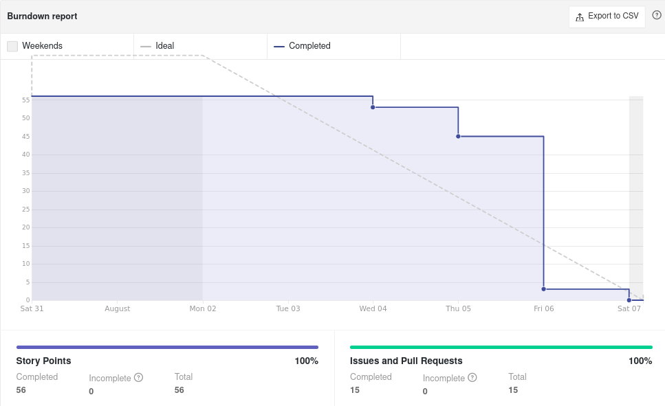

# Sprint Review - Sprint 0   Iniciativa Extra
 
## 1. Visão Geral
**Número da Sprint:** 0; 
**Data de Início:** 02/08/2021; 
**Data de Término:** 06/08/2021; 
**Duração:** 5 dias. 
 
## 2. Resultados

### [**Issue : #17 Prototipação (Débito técnico)**](https://github.com/UnBArqDsw2021-1/2021.1_G6_Curumim/issues/17)
 **Responsáveis: Mateus Oliveira** 
 **Pontuação: 8** 
 **Status: Concluída** 
 
### [**Issue : #18 Instalar Zenhub**](https://github.com/UnBArqDsw2021-1/2021.1_G6_Curumim/issues/18)
 **Responsáveis: Todos os integrantes** 
 **Pontuação: 1** 
 **Status: Concluída** 
 
### [**Issue : #19 Documentar a metodologia e o guia de contribuição**](https://github.com/UnBArqDsw2021-1/2021.1_G6_Curumim/issues/19)
 **Responsáveis: Daniel Porto **
 **Pontuação: 3 **
 **Status: Concluída **
 
### [**Issue : #20 NFR Framework**](https://github.com/UnBArqDsw2021-1/2021.1_G6_Curumim/issues/20)
 **Responsáveis: Nilo Mendonça** 
 **Pontuação: 3** 
 **Status: Concluída** 
 
### [**Issue : #21 Diagrama de Causa-Efeito**](https://github.com/UnBArqDsw2021-1/2021.1_G6_Curumim/issues/21)
 **Responsáveis: João Pedro** 
 **Pontuação: 3** 
 **Status: Concluída** 
 
### [**Issue : #23 Modelagem BPMN**](https://github.com/UnBArqDsw2021-1/2021.1_G6_Curumim/issues/23)
 **Responsáveis: Danilo Porto** 
 **Pontuação: 5** 
 **Status: Concluída** 
 
### [**Issue : #24 Plano de Riscos**](https://github.com/UnBArqDsw2021-1/2021.1_G6_Curumim/issues/24)
 **Responsáveis: Edson Soares** 
 **Pontuação: 5** 
 **Status: Concluída** 
 
### [**Issue : #28 Criar Product Backlog**](https://github.com/UnBArqDsw2021-1/2021.1_G6_Curumim/issues/28)
 **Responsáveis: Bruno Felix** 
 **Pontuação: 5** 
 **Status: Concluída** 
 
### [**Issue : #31 iStar inicial**](https://github.com/UnBArqDsw2021-1/2021.1_G6_Curumim/issues/31)
 **Responsáveis: Mateus Oliveira** 
 **Pontuação: 8** 
 **Status: Concluída** 
 
### [**Issue : #35 Adicionar informações no "Sobre"**](https://github.com/UnBArqDsw2021-1/2021.1_G6_Curumim/issues/35)
 **Responsáveis: Gabriel Bonifácio** 
 **Pontuação: 2** 
 **Status: Concluída** 
 
### [**Issue : #40 Primeira Avaliação por Pares**](https://github.com/UnBArqDsw2021-1/2021.1_G6_Curumim/issues/40)
 **Responsáveis: Todos os integrantes** 
 **Pontuação: 3** 
 **Status: Concluída** 
 
### [**Issue : #42 Criar documento de especificação suplementar**](https://github.com/UnBArqDsw2021-1/2021.1_G6_Curumim/issues/42)
 **Responsáveis: João Pedro** 
 **Pontuação: 5** 
 **Status: Concluída** 
 
### [**Issue : #46 Criar TAP**](https://github.com/UnBArqDsw2021-1/2021.1_G6_Curumim/issues/46)
 **Responsáveis: Edson Araujo, Eliseu Kadesh, João Pedro** 
 **Pontuação: 5** 
 **Status: Concluída** 
 
### [**Issue : #48 Léxico**](https://github.com/UnBArqDsw2021-1/2021.1_G6_Curumim/issues/48)
 **Responsáveis: Todos os integrantes** 
 **Pontuação: 8** 
 **Status: Concluída** 

### **Débitos técnicos para a Sprint 1**
 - Finalização dos protótipos;
 - Criação do Storyboard final;
 - Complementar o iStar;

## 3. Retrospectiva
 
### **Pontos positivos**
 - Dedicação dos integrantes;
 - Boa comuicação da equipe;
 - Integrantes mostraram conhecimento e experiência;
 
### **Pontos negativos**
 - Confusão no workflow do git;
 - Mau uso do Mkdocs;
 - Faltou capricho em alguns documentos;
 - Reuniões muito longas e com pouca objetividade;
  
### **Pontos a melhorar**
 - Aprimorar o uso das issues;
 - Rigor com a política de branches;
 - Conhecimento técnico das ferramentas do git;
 - Divisão do trabalho;
 - Melhorar github para a comunidade (CONTRIBUTING, Issue Template, PR template);
 
## 4. Burndown

[Figura 1: Burndown Report gerado pelo Zenhub](../../assets/imagens/sprint-review/sprint0/burndown-report.png)

 
## 5. Velocity

[Figura 2: Velocity Tracking gerado pelo Zenhub](../../assets/imagens/sprint-review/sprint0/velocity-tracking.png)

#### **Observações**:  
- A reta que representa o Average Story Points está exatamente na altura da Sprint 0 porque o gráfico do Velocity da Sprint 0 foi o primeiro a ser gerado. 
- A ideia inicial era apenas apresentar o Velocity Tracking da Sprint que está sendo revisada, mas como o Velocity foi gerado após o fechamento da Sprint 0, a Sprint 1 que é a Sprint atual, aparece também no gráfico.

## Versionamento
| Versão | Data       | Modificação                                | Autor                |
| :----: | ---------- | ------------------------------------------ | -------------------- |
|  0.1   | 07/08/2021 | Revisão e Retrospectiva com os integrantes | Todos os integrantes |
|  1.0   | 11/08/2021 | Abertura do documento                      | Eliseu Kadesh        |
|  1.1   | 11/08/2021 | Correções gerais no documento              | Eliseu Kadesh        |
|  2.0   | 11/08/2021 | Adição do Velocity                         | Eliseu Kadesh        |