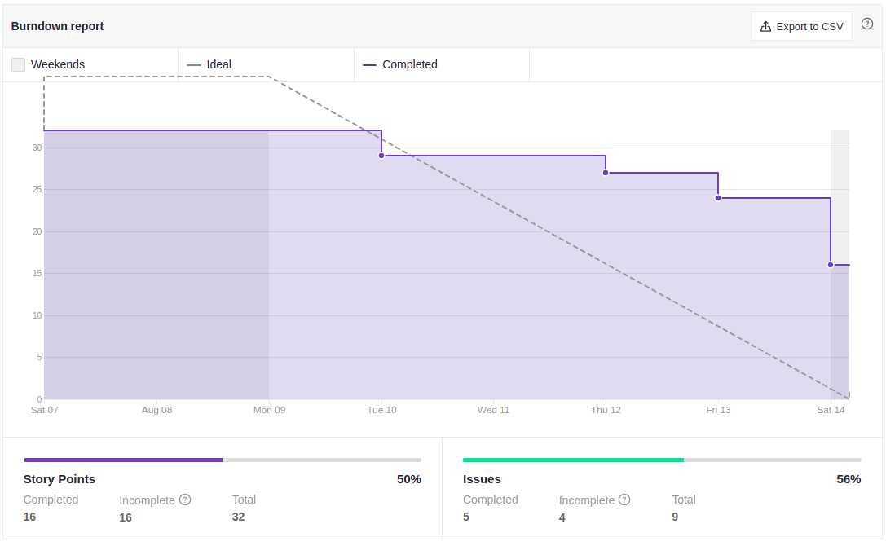
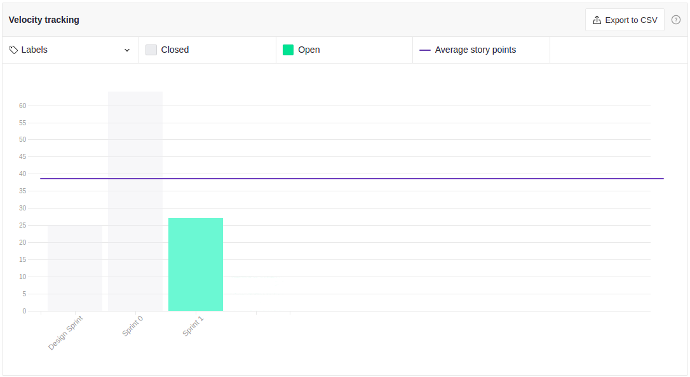

# Sprint Review - Sprint 1
 
## 1. Visão Geral
**Número da Sprint:** 1; 
**Data de Início:** 07/08/2021; 
**Data de Término:** 14/08/2021; 
**Duração:** 7 dias. 

 
## 2. Resultados

### [**Issue : #62 Diagrama de Atividades**](https://github.com/UnBArqDsw2021-1/2021.1_G6_Curumim/issues/62)
 **Responsáveis: Edson e João.** 
 **Pontuação: 5** 
 **Status: Dívida.** 

### [**Issue : #60 Diagrama de componentes**](https://github.com/UnBArqDsw2021-1/2021.1_G6_Curumim/issues/60)
 **Responsáveis: Gabriel e Mateus.** 
 **Pontuação: 8** 
 **Status: Dívida.** 

### [**Issue : #59 Aprimorar Product Backlog**](https://github.com/UnBArqDsw2021-1/2021.1_G6_Curumim/issues/59)
 **Responsáveis: Bruno Felix.** 
 **Pontuação: 3** 
 **Status: Concluída.** 

### [**Issue : #58 Desenvolver Roadmap**](https://github.com/UnBArqDsw2021-1/2021.1_G6_Curumim/issues/58)
 **Responsáveis: Bruno Felix.** 
 **Pontuação: 3** 
 **Status: Concluída.** 

### [**Issue : #57 Definir as tecnologias para o Front-end**](https://github.com/UnBArqDsw2021-1/2021.1_G6_Curumim/issues/57)
 **Responsáveis: Bruno, Enzo, Gabriel, João, Nilo.** 
 **Pontuação: 3** 
 **Status: Concluída.** 

### [**Issue : #56 Diagrama de pacotes**](https://github.com/UnBArqDsw2021-1/2021.1_G6_Curumim/issues/56)
 **Responsáveis: Enzo e francisco.** 
 **Pontuação: 5** 
 **Status: Concluída.** 

### [**Issue : #55 Criar diagrama de casos de uso**](https://github.com/UnBArqDsw2021-1/2021.1_G6_Curumim/issues/55)
 **Responsáveis: Nilo Mendonça.** 
 **Pontuação: 5** 
 **Status: Concluída.** 

### [**Issue : #54 Diagrama de Classes**](https://github.com/UnBArqDsw2021-1/2021.1_G6_Curumim/issues/54)
 **Responsáveis: Daniel e Eliseu.** 
 **Pontuação: 3** 
 **Status: Dívida.** 

### [**Issue : #53 Revisar e corrigir os hiperlinks para os léxicos**](https://github.com/UnBArqDsw2021-1/2021.1_G6_Curumim/issues/53)
 **Responsáveis: Grupo.** 
 **Pontuação: 3** 
 **Status: Dívida.** 

### [**Issue : #52 Definir as tecnologias para o Back-end**](https://github.com/UnBArqDsw2021-1/2021.1_G6_Curumim/issues/52)
 **Responsáveis: Daniel, Edson, Eliseu, Francisco, Mateus.** 
 **Pontuação: 3** 
 **Status: Concluída.** 
 

### **Débitos técnicos para a Sprint 1**
- Complementar iStart.
- Criação do storyboard final.
- Finalizar protótipo de alta fidelidade.

## 3. Retrospectiva

### **Pontos positivos**
- Aprimorar o uso das issues.
- Conhecimento técnico de git.
- Divisão de trabalho de forma satisfatória para os membros.
- O grupo conseguiu adiantar os estudos durante a sprint.
- O grupo trabalhou de maneira organizada, devido a aplicação da metodologia utlizada (Scrum, XP e Kanban).
- Melhoria do repositório para a comunidade (CONTRIBUTING, Issue Template, PR template).
- Pareamento
- Planning Poker trouxe bons resultados com relação a otimização de tempo.
- Rigor com a política de branches.

### **Pontos negativos**
- Inatividade de alguns membros durante as reuniões.
- Membros com sobrecarga derivada de outras disciplinas, estágio e outras atividades.
- Pequenos ajustes na comunicação do grupo.
- Velocidade do PR(PRs estão acumulando).
  
### **Pontos a melhorar**
- Abrir issue mais rapidamente.
- Criar Planning Poker assim que abrir a issue.
- Tentar finalizar a issue com um intervalo de segurança.
 
## 4. Burndown

[Figura 1: Burndown Report gerado pelo Zenhub.](../../assets/imagens/sprint-review/sprint1/burndown-report.png)

## 5. Velocity

[Figura 1: Velocity Tracking gerado pelo Zenhub.](../../assets/imagens/sprint-review/sprint1/velocity-tracking.png)

## Versionamento
| Versão | Data       | Modificação                                | Autor                |
| :----: | ---------- | ------------------------------------------ | -------------------- |
|  0.1   | 14/08/2021 | Revisão e Retrospectiva com os integrantes | Todos os integrantes |
|  1.0   | 16/08/2021 | Abertura do documento  | Edson Soares |
|  1.1   | 16/08/2021 |  Documentação dos resultados | Edson Soares |
|  1.2   | 16/08/2021 |  Débitos e Retrospectiva | Edson Soares |
|  2.0   | 16/08/2021 |  Burndown e Velocity | Edson Soares |

