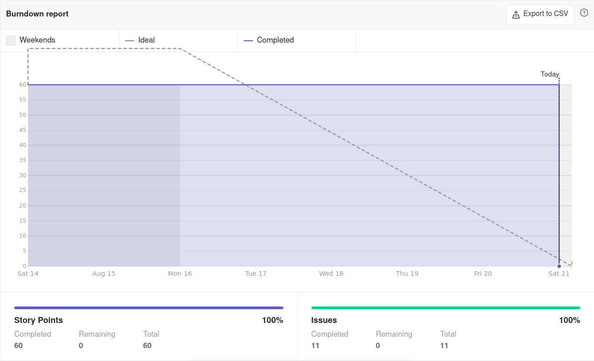
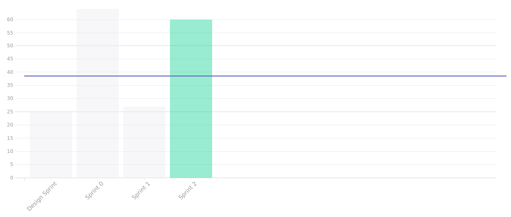

# Sprint Review - Sprint 2   Iniciativa Extra
 
## 1. Visão Geral
**Número da Sprint:** 2; 
**Data de Início:** 14/08/2021; 
**Data de Término:** 21/08/2021; 
**Duração:** 7 dias. 
 
## 2. Resultados

### **Issue:** [#53 Revisar e corrigir os hiperlinks para os léxicos](https://github.com/UnBArqDsw2021-1/2021.1_G6_Curumim/issues/53) 
**Responsáveis: Gabriel Bonifácio** 
 **Pontuação: 3** 
 **Status: Concluída.** 

### **Issue:** [#54 Diagrama de Classes](https://github.com/UnBArqDsw2021-1/2021.1_G6_Curumim/issues/54) 
**Responsáveis: Daniel Porto e Eliseu Kadesh** 
 **Pontuação: 5** 
 **Status: Concluída.** 

### **Issue:** [#60 Diagrama de componentes](https://github.com/UnBArqDsw2021-1/2021.1_G6_Curumim/issues/60) 
**Responsáveis: Gabriel Bonifácio e Mateus Oliveira** 
 **Pontuação: 8** 
 **Status: Concluída.** 

### **Issue:** [#62 Diagrama de atividades](https://github.com/UnBArqDsw2021-1/2021.1_G6_Curumim/issues/62) 
**Responsáveis: Edson Araujo e João Pedro** 
 **Pontuação: 5** 
 **Status: Concluída.** 

### **Issue:** [#72 Diagrama de sequência](https://github.com/UnBArqDsw2021-1/2021.1_G6_Curumim/issues/72) 
**Responsáveis: Edson Araujo e Enzo Gabriel** 
 **Pontuação: 8** 
 **Status: Concluída.** 

### **Issue:** [#73 Diagrama de Estados](https://github.com/UnBArqDsw2021-1/2021.1_G6_Curumim/issues/73) 
**Responsáveis: Bruno felix e Nilo Mendonça** 
 **Pontuação: 5** 
 **Status: Concluída.** 

### **Issue:** [#79 Aprimorar protótipo de alta fidelidade](https://github.com/UnBArqDsw2021-1/2021.1_G6_Curumim/issues/79) 
**Responsáveis: Bruno Felix** 
 **Pontuação: 5** 
 **Status: Concluída.** 

### **Issue:** [#80 Diagrama de comunicação](https://github.com/UnBArqDsw2021-1/2021.1_G6_Curumim/issues/80) 
**Responsáveis: Daniel Porto, João Pedro Eliseu Kadesh** 
 **Pontuação: 5** 
 **Status: Concluída.** 

### **Issue:** [#81 Modelagem do banco de dados](https://github.com/UnBArqDsw2021-1/2021.1_G6_Curumim/issues/81) 
**Responsáveis: Daniel Porto e Francisco Ferreira** 
 **Pontuação: 8** 
 **Status: Concluída.** 

### **Issue:** [#83 Construir Ambiente de Desenvolvimento](https://github.com/UnBArqDsw2021-1/2021.1_G6_Curumim/issues/83) 
**Responsáveis: Francisco Ferreira e Mateus Oliveira** 
 **Pontuação: 5** 
 **Status: Concluída.** 

### **Issue:** [#89 Revisar Navegação Wiki](https://github.com/UnBArqDsw2021-1/2021.1_G6_Curumim/issues/89) 
**Responsáveis: Todos** 
 **Pontuação: ** 
 **Status: Concluída.** 

### **Débitos técnicos para a Sprint 3**
- Não foram deixados débitos técnicos nessa sprint.

## 3. Retrospectiva

### **Pontos positivos**
- As issues foram abertas mais rapidamente;
- O planning poker foi aberto as juntamente com a abertura das issues;
- A sprint foi encerradas sem deixar dívidas técnicas;
- Os pareamentos deram bons resultados;
- Os ambientes de desenvolvimento estão prontos para trabalho;
- Tendo em vista a entrega, as issues foram concluídas com folga de tempo.

### **Pontos negativos**
- A semana da sprint contou com um volume muito grande de atividades e compromissos de outras disciplinas.
  
### **Pontos a melhorar**
- Velocidade na votação do planning poker;
- Velocidade na documentação do planning;
- Adesão a daily.
 
## 4. Burndown

[Figura 1: Burndown Report gerado pelo Zenhub](../../assets/imagens/sprint-review/sprint2/burndown-report.png)

## 5. Velocity

[Figura 2: Velocity Tracking gerado pelo Zenhub](../../assets/imagens/sprint-review/sprint2/velocity-tracking.png)

## Versionamento
| Versão | Data       | Modificação                                | Autor                |
| :----: | ---------- | ------------------------------------------ | -------------------- |
|  0.1   | 21/08/2021 | Revisão e Retrospectiva com os integrantes | Todos os integrantes |
|  1.0   | 21/08/2021 | Abertura do documento                      | Daniel Porto         |
|  1.1   | 21/08/2021 | Adição do velocity e do burndown           | Daniel Porto         |