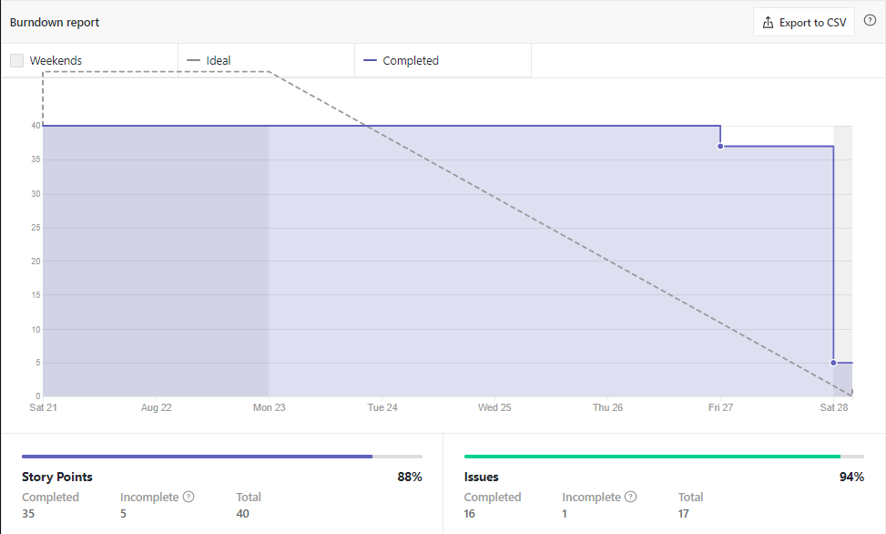
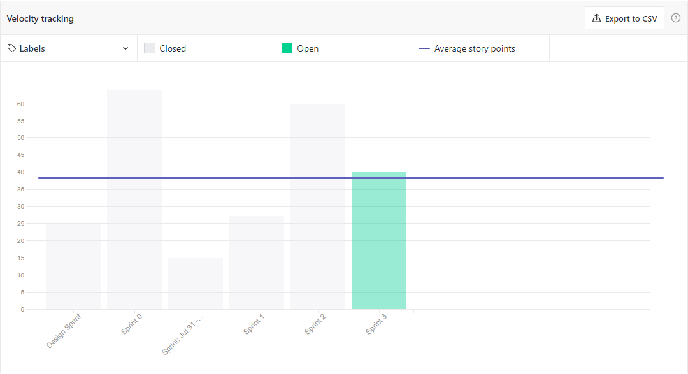

# Sprint Review - Sprint 3   Iniciativa Extra
 
## 1. Visão Geral
**Número da Sprint:** 3; 
**Data de Início:** 21/08/2021; 
**Data de Término:** 28/08/2021; 
**Duração:** 7 dias. 
 
## 2. Resultados

### **Issue:** [#99 Revisão de documentação - 5W2H](https://github.com/UnBArqDsw2021-1/2021.1_G6_Curumim/issues/99) 
**Responsáveis: Nilo Mendonça e Bruno Félix** 
 **Pontuação: 2** 
 **Status: Concluída.** 

### **Issue:** [#100 Revisão de documentação - Mapa mental](https://github.com/UnBArqDsw2021-1/2021.1_G6_Curumim/issues/100) 
**Responsáveis: Enzo Gabriel e João Pedro** 
 **Pontuação: 2** 
 **Status: Concluída.** 

### **Issue:** [#101 Revisão de documentação - Argumentação](https://github.com/UnBArqDsw2021-1/2021.1_G6_Curumim/issues/101) 
**Responsáveis: Enzo Gabriel e João Pedro** 
 **Pontuação: 2** 
 **Status: Concluída.** 

### **Issue:** [#102 Revisão de documentação - NFR Framework](https://github.com/UnBArqDsw2021-1/2021.1_G6_Curumim/issues/102) 
**Responsáveis: Eliseu Kadesh e Edson Araújo** 
 **Pontuação: 2** 
 **Status: Concluída.** 

### **Issue:** [#104 Revisão de documentação - TAP](https://github.com/UnBArqDsw2021-1/2021.1_G6_Curumim/issues/104) 
**Responsáveis: Daniel Porto e Mateus Oliveira** 
 **Pontuação: 3** 
 **Status: Concluída.** 

### **Issue:** [#106 Segunda avaliação por pares](https://github.com/UnBArqDsw2021-1/2021.1_G6_Curumim/issues/106) 
**Responsáveis: Todos os integrantes** 
 **Pontuação: 3** 
 **Status: Concluída.** 

### **Issue:** [#107 Revisão de documentação - Planejamento da Avaliação do Protótipo de Alta Fidelidade](https://github.com/UnBArqDsw2021-1/2021.1_G6_Curumim/issues/107) 
**Responsáveis: Eliseu Kadesh e Edson Araújo** 
 **Pontuação: 2** 
 **Status: Concluída.** 

### **Issue:** [#108 Revisão de documentação - Protótipo de Alta Fidelidade](https://github.com/UnBArqDsw2021-1/2021.1_G6_Curumim/issues/108) 
**Responsáveis: Enzo Gabriel e João Pedro** 
 **Pontuação: 3** 
 **Status: Concluída.** 

### **Issue:** [#109 Revisão de documentação - Protótipo de Baixa Fidelidade](https://github.com/UnBArqDsw2021-1/2021.1_G6_Curumim/issues/109) 
**Responsáveis: Gabriel Bonifácio e Francisco Ferreira** 
 **Pontuação: 3** 
 **Status: Concluída.** 

### **Issue:** [#110 Revisão de documentação - Prototipação → Introdução](https://github.com/UnBArqDsw2021-1/2021.1_G6_Curumim/issues/110) 
**Responsáveis: Nilo Mendonça e Bruno Félix** 
 **Pontuação: 2** 
 **Status: Concluída.** 

### **Issue:** [#111 Revisão de documentação - iStar](https://github.com/UnBArqDsw2021-1/2021.1_G6_Curumim/issues/111) 
**Responsáveis: Gabriel Bonifácio e Francisco Ferreira** 
 **Pontuação: 3** 
 **Status: Concluída.** 

### **Issue:** [#112 Revisão de documentação - Léxicos](https://github.com/UnBArqDsw2021-1/2021.1_G6_Curumim/issues/112) 
**Responsáveis: Nilo Mendonça e Bruno Félix** 
 **Pontuação: 2** 
 **Status: Concluída.** 

### **Issue:** [#113 Revisão de documentação - Product Backlog](https://github.com/UnBArqDsw2021-1/2021.1_G6_Curumim/issues/113) 
**Responsáveis: Daniel Porto e Mateus Oliveira** 
 **Pontuação: 2** 
 **Status: Concluída.** 

### **Issue:** [#114 Revisão de documentos - Moscow](https://github.com/UnBArqDsw2021-1/2021.1_G6_Curumim/issues/114) 
**Responsáveis: Gabriel Bonifácio e Francisco Ferreira** 
 **Pontuação: 2** 
 **Status: Concluída.** 

### **Issue:** [#115 Revisão de documentos - Storyboards](https://github.com/UnBArqDsw2021-1/2021.1_G6_Curumim/issues/115) 
**Responsáveis: Daniel Porto e Mateus Oliveira** 
 **Pontuação: 2** 
 **Status: Concluída.** 

### **Issue:** [#117 Revisão de documentos - Design Sprint](https://github.com/UnBArqDsw2021-1/2021.1_G6_Curumim/issues/117) 
**Responsáveis: Nilo Mendonça e Bruno Félix** 
 **Pontuação: 2** 
 **Status: Concluída.** 

### **Débitos técnicos para a Sprint 3**
- Modelagem lógica do banco de dados.
- Criação de issues para revisão de todos os documentos.

## 3. Retrospectiva

### **Pontos positivos**
- Divisão por pares funcionou bem;
- Dividir os revisores na planning também funcionou bem;
- Divisões de pares feita por sorteio, o que faz com que todos os membros do grupo eventualmente interajam ao longo do projeto;
- Membros mexeram em documentos que não tinham mexido antes, o que fez número de perspectivas do documentos;
- Velocidade na votação do planning poker.

### **Pontos negativos**
- Integrante caiu no risco 'Durante um processo, um membro fica sem internet'.
  
### **Pontos a melhorar**
- Integrantes se atentarem aos riscos para informar ao grupo caso caiam em algum;
- Velocidade na documentação do planning;
- Adesão a daily.

## 4. Burndown

[Figura 1: Burndown Report gerado pelo Zenhub](../../assets/imagens/sprint-review/sprint3/burndown-report.png)

## 5. Velocity

[Figura 2: Velocity Tracking gerado pelo Zenhub](../../assets/imagens/sprint-review/sprint3/velocity-tracking.png)

## Versionamento
| Versão | Data       | Modificação                                | Autor                |
| :----: | ---------- | ------------------------------------------ | -------------------- |
|  0.1   | 28/08/2021 | Revisão e Retrospectiva com os integrantes | Todos os integrantes |
|  1.0   | 29/08/2021 | Abertura do documento | Enzo Gabriel |
|  1.1   | 29/08/2021 | Adicionando retrospectiva | Enzo Gabriel |
|  1.2   | 29/08/2021 | Adicionando gráficos de Burndown e Velocity | Enzo Gabriel |
