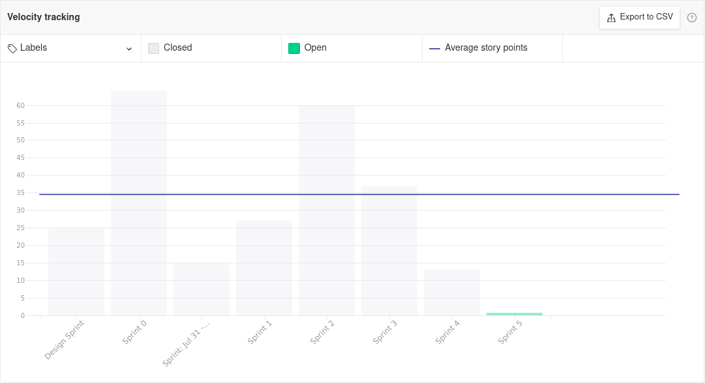

# Sprint Review - Sprint 4   Iniciativa Extra

## 1. Visão Geral
**Número da Sprint:** 4; 
**Data de Início:** 28/08/2021; 
**Data de Término:** 04/09/2021; 
**Duração:** 7 dias. 

## 2. Resultados

1. **Issue:** [#116 Modelagem lógica do banco de dados](https://github.com/UnBArqDsw2021-1/2021.1_G6_Curumim/issues/116)  
**Responsáveis:** Edson Araújo e Eliseu Kadesh 
**Pontuação: 5** 
**Status: Concluída.**  

2. **Issue:** [#127 Pontuar as histórias de usuário](https://github.com/UnBArqDsw2021-1/2021.1_G6_Curumim/issues/127)  
**Responsável:** Daniel Porto 
**Pontuação: 3** 
**Status: Concluída.** 

3. **Issue:** [#131 GRASPs](https://github.com/UnBArqDsw2021-1/2021.1_G6_Curumim/issues/131)  
**Responsáveis:** Todos os integrantes 
**Pontuação: 8** 
**Status: Dívida.**   

4. **Issue:** [#3 Configurar a estrutura de pacotes](https://github.com/UnBArqDsw2021-1/2021.1_G6_Curumim_Back-end/issues/3)  
**Responsáveis:** Francisco Ferreira e Mateus Oliveira 
**Pontuação: 3** 
**Status: Concluída.** 

5. **Issue:** [#4 Configurar o banco de dados](https://github.com/UnBArqDsw2021-1/2021.1_G6_Curumim_Back-end/issues/4)  
**Responsáveis:** Daniel Porto e Eliseu Kadesh   
**Pontuação: 5** 
**Status: Dívida.** 

6. **Issue:** [#5 Implementar o sistema de autenticação](https://github.com/UnBArqDsw2021-1/2021.1_G6_Curumim_Back-end/issues/5)  
**Responsáveis:** Edson Araújo e Mateus Oliveira 
**Pontuação: 5** 
**Status: Dívida.** 

 ## 3. Retrospectiva

### **Pontos positivos**
- Técnica de estudos com batedores funcionou bem;
- A organização para o desenvolvimento do documento dos padrões GRASPs funcionou bem;
- Todos se envolveram no tópico da disciplina.

### **Pontos negativos**
- A semana da sprint contou com um volume muito grande de atividades e compromissos de outras disciplinas;
- O planning não foi a contento, deixou muitas questões subjetivas em aberto e isso prejudicou o andamento da sprint, o que se enquadra no risco "Falha no autogerenciamento do grupo.";
- A sprint se deu forma mais improdutiva que as anteriores;
- Notou-se falta de comunicação entre os integrantes, o que se enquadra no risco "Falta de comunicação dentro da equipe";
- Notou-se indisponibilidade para reuniões por parte de alguns membros, o que se enquadra no risco "Indisponibilidade dos integrantes do grupo para reuniões e eventuais encontros durante o desenvolvimento do projeto".
  
### **Pontos a melhorar**
- Integrantes se atentarem aos riscos para informar ao grupo caso caiam em algum;
- Velocidade na documentação do planning;
- Adesão a daily;
- Comunicação nos pareamentos;
- Pontualidade;
- Melhorara o planejamento para deixar as atividades mais concretas e objetivas;
- Realização de avisos prévios sobre potenciais faltas ou indisponibilidades.

## 4. Burndown

[Figura 1: Burndown Report gerado pelo Zenhub](../../assets/imagens/sprint-review/sprint4/burndown-report.png)

## 5. Velocity

[Figura 2: Velocity Tracking gerado pelo Zenhub](../../assets/imagens/sprint-review/sprint4/velocity-tracking.png)

## Versionamento
| Versão | Data       | Modificação                                | Autor                |
| :----: | ---------- | ------------------------------------------ | -------------------- |
|  0.1   | 04/09/2021 | Revisão e Retrospectiva com os integrantes | Todos os integrantes |
|  1.0   | 05/09/2021 | Abertura do documento | Daniel Porto |
|  1.1   | 05/09/2021 | Adição dos resultados, da retrospectiva e dos gráficos | Daniel Porto |