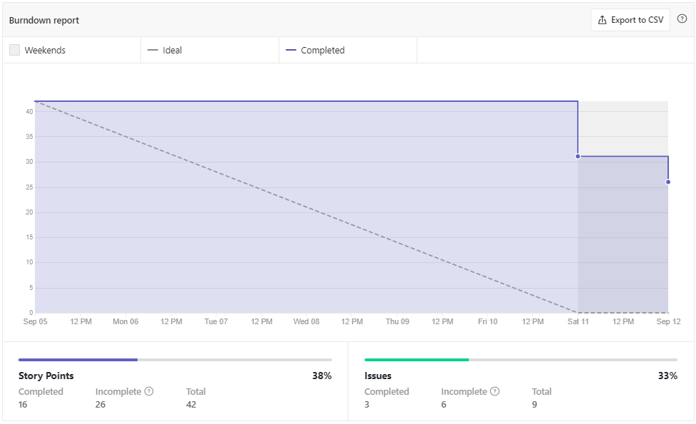
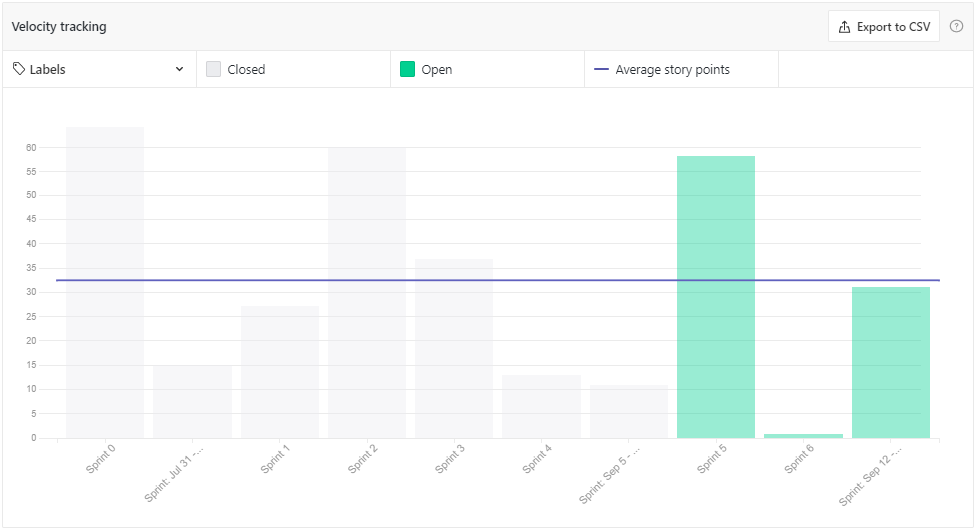

# Sprint Review - Sprint 5   Iniciativa Extra

## 1. Visão Geral
**Número da Sprint:** 5; 
**Data de Início:** 04/09/2021; 
**Data de Término:** 11/09/2021; 
**Duração:** 7 dias. 

## 2. Resultados

1. **Issue:** [#131 GRASPs](https://github.com/UnBArqDsw2021-1/2021.1_G6_Curumim/issues/131)  
**Responsáveis:** Todos os integrantes 
**Pontuação: 8** 
**Status: Concluida.** 

2. **Issue:** [#141 Guia de estilo](https://github.com/UnBArqDsw2021-1/2021.1_G6_Curumim/issues/141)  
**Responsável:** Nilo Mendonça e Gabriel Bonifácio 
**Pontuação: 5** 
**Status: Concluída.** 

3. **Issue:** [#145 GOFS Estruturais](https://github.com/UnBArqDsw2021-1/2021.1_G6_Curumim/issues/145)  
**Responsáveis:** Francisco Emanuel, Eliseu Kadesh e João Pedro 
**Pontuação: 8** 
**Status: Dívida.**   

4. **Issue:** [#146 GOFS Comportamentais](https://github.com/UnBArqDsw2021-1/2021.1_G6_Curumim/issues/146)  
**Responsáveis:** Francisco Emanuel, Eliseu Kadesh e João Pedro 
**Pontuação: ** 
**Status: Dívida.**  

5. **Issue:** [#147 Atualizar documento do diagrama de pacotes](https://github.com/UnBArqDsw2021-1/2021.1_G6_Curumim/issues/147)  
**Responsáveis:** Mateus Oliveira 
**Pontuação: ** 
**Status: Dívida.**  

6. **Issue:** [#4 Configurar o banco de dados](https://github.com/UnBArqDsw2021-1/2021.1_G6_Curumim_Back-end/issues/4)  
**Responsáveis:** Daniel Porto e Eliseu Kadesh 
**Pontuação: 5** 
**Status: Dívida.** 

7. **Issue:** [#5 Implementar o sistema de autenticação](https://github.com/UnBArqDsw2021-1/2021.1_G6_Curumim_Back-end/issues/5)  
**Responsáveis:** Edson Araújo e Mateus Oliveira 
**Pontuação: 5** 
**Status: Dívida.** 

8. **Issue:** [#2 Configurar pacotes do front](https://github.com/unbarqdsw2021-1/2021.1_g6_curumim_front-end/issues/2)  
**Responsáveis:** Enzo Gabriel e João Pedro 
**Pontuação: 3** 
**Status: Concluída.** 

9. **Issue:** [#3 Criar Telas](https://github.com/unbarqdsw2021-1/2021.1_g6_curumim_front-end/issues/3)  
**Responsáveis:** Nilo Mendonça, Enzo Gabriel, Bruno Félix, Gabriel Bonifácio e João Pedro 
**Pontuação: 8** 
**Status: Dívida.** 

### **Débitos técnicos para a Sprint 6**
 - GOFS Estruturais;
 - GOFS Comportamentais;
 - Atualizar documento do diagrama de pacotes;
 - Configurar o banco de dados;
 - Implementar o sistema de autenticação;
 - Criar Telas;

## 3. Retrospectiva

### **Pontos positivos**
- Semana de bastante aprendizado devido as entregas;
- Início do desenvolvimento;

### **Pontos negativos**
- Poucas pessoas participando das reuniões;
- Integrante caiu no risco 'Durante um processo, um membro fica sem internet';
- Comunicação desgastada por conta do decorrer do semestre;
- Baixa adesão a daily;
  
### **Pontos a melhorar**
- Planning mais eficazes;
- Pontualidade;
- Mais partes;
- Documentação das reuniões de planejamento;

## 4. Burndown

[Figura 1: Burndown Report gerado pelo Zenhub](../../assets/imagens/sprint-review/sprint5/burndown-report.png)

## 5. Velocity

[Figura 2: Velocity Tracking gerado pelo Zenhub](../../assets/imagens/sprint-review/sprint5/velocity-tracking.png)

## Versionamento
| Versão | Data       | Modificação                                | Autor                |
| :----: | ---------- | ------------------------------------------ | -------------------- |
|  0.1   | 11/09/2021 | Revisão e Retrospectiva com os integrantes | Todos os integrantes |
|  1.0   | 13/09/2021 | Abertura do documento | Enzo Gabriel |
|  1.1   | 13/09/2021 | Finalização do documento | Enzo Gabriel |