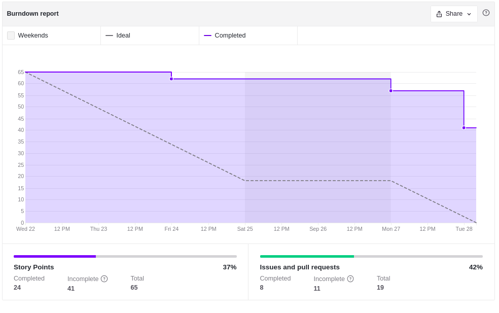
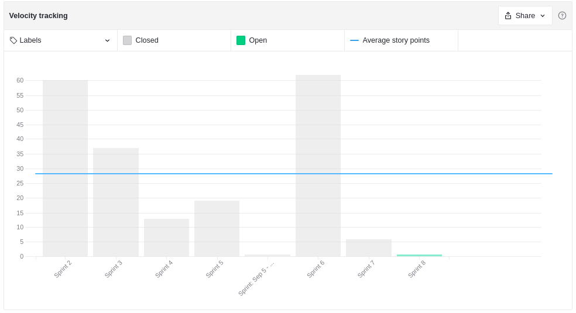

# Sprint Review - Sprint 7   Iniciativa Extra

## 1. Visão Geral
**Número da Sprint:** 7; 
**Data de Início:** 22/09/2021; 
**Data de Término:** 28/09/2021; 
**Duração:** 7 dias. 

## 2. Resultados

1. **Issue:** [#11 US05 - Eu, como responsável, desejo fazer cadastro e login na aplicação](https://github.com/UnBArqDsw2021-1/2021.1_G6_Curumim_Back-end/issues/11) 
**Responsáveis:** Mateus O. Patrício e Francisco Emanoel 
**Pontuação: 5** 
**Status: Concluída.** 

2. **Issue:** [#17 US01 - Eu, como administrador, desejo cadastrar uma criança no centro educacional](https://github.com/UnBArqDsw2021-1/2021.1_G6_Curumim_Back-end/issues/17) 
**Responsáveis:** Daniel Porto e Eliseu Kadesh 
**Pontuação: 8** 
**Status: Concluída.** 

3. **Issue:** [#16 US02 - Eu, como administrador, desejo cadastrar um professor no centro educacional](https://github.com/UnBArqDsw2021-1/2021.1_G6_Curumim_Back-end/issues/16) 
**Responsáveis:** Mateus O. Patrício e Francisco Emanoel 
**Pontuação: 5** 
**Status: Concluída.** 

4. **Issue:** [#161 Revisão da documentação - Entrega 2](https://github.com/UnBArqDsw2021-1/2021.1_G6_Curumim/issues/161) 
**Responsáveis:** Nilo Mendonça e Edson Soares 
**Pontuação: 3** 
**Status: Concluída.** 

5. **Issue:** [#175 Terceira Avaliação por Pares](https://github.com/UnBArqDsw2021-1/2021.1_G6_Curumim/issues/175) 
**Responsáveis:** Todos os membros da equipe 
**Pontuação: 3** 
**Status: Concluída.** 

6. **Issue:** [#192 Documentação da API](https://github.com/UnBArqDsw2021-1/2021.1_G6_Curumim/issues/192) 
**Responsáveis:** Matheus Patrício, Edson Soares, Francisco Emanoel, Daniel Porto e Eliseu Kadesh 
**Pontuação: 3** 
**Status: Dívida.** 

7. **Issue:** [#21 US10 - Eu, como responsável, desejo visualizar a lista de todos os eventos do centro educacional](https://github.com/UnBArqDsw2021-1/2021.1_G6_Curumim_Back-end/issues/21) 
**Responsáveis:** Francisco Emanoel e Eliseu Kadesh 
**Pontuação: 5** 
**Status: Dívida.** 

8. **Issue:** [#20 US04 - Eu, como professor, desejo criar, editar e excluir atividades para minha turma](https://github.com/UnBArqDsw2021-1/2021.1_G6_Curumim_Back-end/issues/20) 
**Responsáveis:** Matheus Patrício e Edson Soares 
**Pontuação: 5** 
**Status: Dívida.** 

9. **Issue:** [#18 US09 - Eu, como administrador, desejo criar, editar e excluir um evento para o centro educacional](https://github.com/UnBArqDsw2021-1/2021.1_G6_Curumim_Back-end/issues/18) 
**Responsáveis:** Daniel Porto e Edson Soares 
**Pontuação: 5** 
**Status: Dívida.** 

10. **Issue:** [#15 US03 - Eu, como administrador, desejo criar, editar e excluir uma turma para o centro educacional](https://github.com/UnBArqDsw2021-1/2021.1_G6_Curumim_Back-end/issues/15) 
**Responsáveis:** Francisco Emanoel e Eliseu Kadesh 
**Pontuação: 5** 
**Status: Dívida.** 

11. **Issue:** [#14 US07 - Eu, como responsável, desejo visualizar a lista de todas as atividades da minha criança](https://github.com/UnBArqDsw2021-1/2021.1_G6_Curumim_Back-end/issues/14) 
**Responsáveis:** Matheus Patrício e Edson Soares 
**Pontuação: 5** 
**Status: Dívida.** 

12. **Issue:** [#13 US08 - Eu, como responsável, desejo visualizar os detalhes de uma atividade da minha criança](https://github.com/UnBArqDsw2021-1/2021.1_G6_Curumim_Back-end/issues/13) 
**Responsáveis:** Daniel Porto e Edson Soares 
**Pontuação: 5** 
**Status: Dívida.** 

13. **Issue:** [#12 US06 - Eu, como responsável, desejo ter um espaço que contenha as atividades, eventos e agenda dos próximos dias](https://github.com/UnBArqDsw2021-1/2021.1_G6_Curumim_Back-end/issues/12) 
**Responsáveis:** Daniel Porto e Eliseu Kadesh 
**Pontuação: 8** 
**Status: Dívida.** 

14. **Issue:** [#7 Telas Enzo e Gabriel](https://github.com/UnBArqDsw2021-1/2021.1_G6_Curumim_Front-end/issues/7) 
**Responsáveis:** Enzo Gabriel e Gabriel Bonifácil 
**Pontuação: 8** 
**Status: Dívida.** 

15. **Issue:** [#6 Cadastro, Login e Home](https://github.com/UnBArqDsw2021-1/2021.1_G6_Curumim_Front-end/issues/6) 
**Responsáveis:** Bruno Félix 
**Pontuação: 8** 
**Status: Dívida.** 

16. **Issue:** [#5 Pareamento Nilo - João | Sprint 7](https://github.com/UnBArqDsw2021-1/2021.1_G6_Curumim_Front-end/issues/5) 
**Responsáveis:** Nilo Mendonça e João Pedro 
**Pontuação: 8** 
**Status: Dívida.** 

### **Débitos técnicos para a Sprint 8**

- [#6](https://github.com/UnBArqDsw2021-1/2021.1_G6_Curumim_Front-end/issues/6) Home page Professor ([Front-end](https://github.com/UnBArqDsw2021-1/2021.1_G6_Curumim_Front-end));
- [#6](https://github.com/UnBArqDsw2021-1/2021.1_G6_Curumim_Front-end/issues/6) Home page Responsável ([Front-end](https://github.com/UnBArqDsw2021-1/2021.1_G6_Curumim_Front-end));
- [#6](https://github.com/UnBArqDsw2021-1/2021.1_G6_Curumim_Front-end/issues/6) Cadastro e login (Autenticação/login e persistência) ([Front-end](https://github.com/UnBArqDsw2021-1/2021.1_G6_Curumim_Front-end));
- [#7](https://github.com/UnBArqDsw2021-1/2021.1_G6_Curumim_Front-end/issues/7) Administrador cadastrar professor ([Front-end](https://github.com/UnBArqDsw2021-1/2021.1_G6_Curumim_Front-end));
- [#7](https://github.com/UnBArqDsw2021-1/2021.1_G6_Curumim_Front-end/issues/7) Administrador cadastrar aluno ([Front-end](https://github.com/UnBArqDsw2021-1/2021.1_G6_Curumim_Front-end));
- [#7](https://github.com/UnBArqDsw2021-1/2021.1_G6_Curumim_Front-end/issues/7) Professor criar Atividade ([Front-end](https://github.com/UnBArqDsw2021-1/2021.1_G6_Curumim_Front-end));
- [#7](https://github.com/UnBArqDsw2021-1/2021.1_G6_Curumim_Front-end/issues/7) Administrador criar evento ([Front-end](https://github.com/UnBArqDsw2021-1/2021.1_G6_Curumim_Front-end));
- [#7](https://github.com/UnBArqDsw2021-1/2021.1_G6_Curumim_Front-end/issues/7) Administrador criar Turma ([Front-end](https://github.com/UnBArqDsw2021-1/2021.1_G6_Curumim_Front-end));
- [#7](https://github.com/UnBArqDsw2021-1/2021.1_G6_Curumim_Front-end/issues/7) Professor criar anotação ([Front-end](https://github.com/UnBArqDsw2021-1/2021.1_G6_Curumim_Front-end));
- [#5](https://github.com/UnBArqDsw2021-1/2021.1_G6_Curumim_Front-end/issues/5) Responsável visualizar todos os eventos ([Front-end](https://github.com/UnBArqDsw2021-1/2021.1_G6_Curumim_Front-end));
- [#5](https://github.com/UnBArqDsw2021-1/2021.1_G6_Curumim_Front-end/issues/5) Responsável visualizar os detalhes de um evento ([Front-end](https://github.com/UnBArqDsw2021-1/2021.1_G6_Curumim_Front-end));
- [#5](https://github.com/UnBArqDsw2021-1/2021.1_G6_Curumim_Front-end/issues/5) Responsável visualizar a lista de todas as atividades ([Front-end](https://github.com/UnBArqDsw2021-1/2021.1_G6_Curumim_Front-end));
- [#5](https://github.com/UnBArqDsw2021-1/2021.1_G6_Curumim_Front-end/issues/5) Responsável visualizar os detalhes de uma atividade ([Front-end](https://github.com/UnBArqDsw2021-1/2021.1_G6_Curumim_Front-end));
- [#5](https://github.com/UnBArqDsw2021-1/2021.1_G6_Curumim_Front-end/issues/5) Responsável visualizar todas as anotações ([Front-end](https://github.com/UnBArqDsw2021-1/2021.1_G6_Curumim_Front-end));
- [#5](https://github.com/UnBArqDsw2021-1/2021.1_G6_Curumim_Front-end/issues/5) Responsável visualizar os detalhes de uma anotação ([Front-end](https://github.com/UnBArqDsw2021-1/2021.1_G6_Curumim_Front-end));
- [#7](https://github.com/UnBArqDsw2021-1/2021.1_G6_Curumim_Front-end/issues/7) Header ([Front-end](https://github.com/UnBArqDsw2021-1/2021.1_G6_Curumim_Front-end));
- [#21](https://github.com/UnBArqDsw2021-1/2021.1_G6_Curumim_Back-end/issues/21) US10 ([Back-end](https://github.com/UnBArqDsw2021-1/2021.1_G6_Curumim_Back-end));
- [#18](https://github.com/UnBArqDsw2021-1/2021.1_G6_Curumim_Back-end/issues/18) US09 ([Back-end](https://github.com/UnBArqDsw2021-1/2021.1_G6_Curumim_Back-end));
- [#15](https://github.com/UnBArqDsw2021-1/2021.1_G6_Curumim_Back-end/issues/15) US03 ([Back-end](https://github.com/UnBArqDsw2021-1/2021.1_G6_Curumim_Back-end));
- [#12](https://github.com/UnBArqDsw2021-1/2021.1_G6_Curumim_Back-end/issues/12) US06 ([Back-end](https://github.com/UnBArqDsw2021-1/2021.1_G6_Curumim_Back-end));
- [#13](https://github.com/UnBArqDsw2021-1/2021.1_G6_Curumim_Back-end/issues/13) US08 ([Back-end](https://github.com/UnBArqDsw2021-1/2021.1_G6_Curumim_Back-end));
- [#20](https://github.com/UnBArqDsw2021-1/2021.1_G6_Curumim_Back-end/issues/20) US04 ([Back-end](https://github.com/UnBArqDsw2021-1/2021.1_G6_Curumim_Back-end));
- [#192](https://github.com/UnBArqDsw2021-1/2021.1_G6_Curumim/issues/192) Documentação da API;

## 3. Retrospectiva

### **Pontos positivos**
- Já iniciamos a entrega das funcionalidades da aplicação;
- Melhorou o trabalho em equipe entre o [Front-end](https://github.com/UnBArqDsw2021-1/2021.1_G6_Curumim_Front-end) e o [Back-end](https://github.com/UnBArqDsw2021-1/2021.1_G6_Curumim_Back-end);
- Os objetivos das entregas ficaram mais visíveis;

### **Pontos negativos**
- Dificuldade inicial com as tecnologias para começar o desenvolvimento;
- Dificuldade dos integrantes em encontrar horários para realizar os pareamentos;
- Alguns integrantes ficaram sobrecarregados;
- Poucas entregas na [Sprint 7](https://github.com/UnBArqDsw2021-1/2021.1_G6_Curumim/milestone/9);
  
### **Pontos a melhorar**
- Melhorar o pareamento;

## 4. Burndown

[Figura 1: Burndown Report gerado pelo Zenhub](../../assets/imagens/sprint-review/sprint7/burndown-report.png)

## 5. Velocity

[Figura 2: Velocity Tracking gerado pelo Zenhub](../../assets/imagens/sprint-review/sprint7/velocity-tracking.png)

## Versionamento
| Versão | Data       | Modificação                                | Autor                |
| :----: | ---------- | ------------------------------------------ | -------------------- |
|  0.1   | 28/09/2021 | Revisão e Retrospectiva com os integrantes | Todos os integrantes |
|  1.0   | 29/09/2021 | Abertura e adição da informações ao documento | Nilo Mendonça |
|  1.1   | 29/09/2021 | Revisão do documento | Gabriel Bonifácio e Eliseu Kadesh |