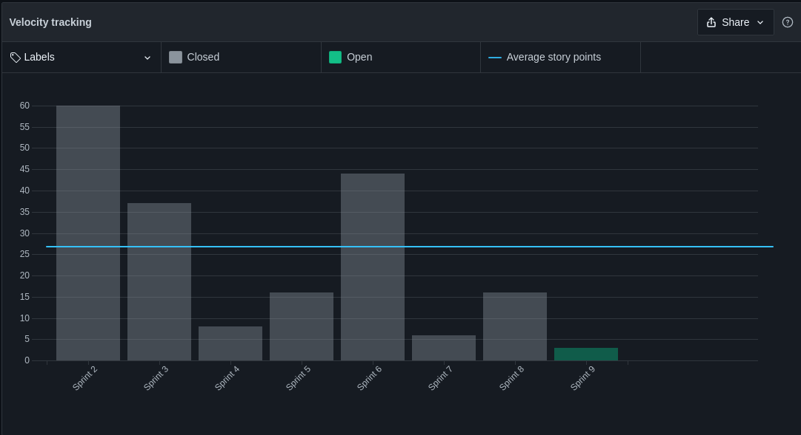

# Sprint Review - Sprint 8   Iniciativa Extra

## 1. Visão Geral
**Número da Sprint:** 8; 
**Data de Início:** 28/09/2021; 
**Data de Término:** 05/10/2021; 
**Duração:** 7 dias. 

## 2. Resultados

**Status: Dívida.** 
**Status: Concluída.** 

1. **Issue:** [#196 Abertura e finalização do documento de arquitetura](https://github.com/UnBArqDsw2021-1/2021.1_G6_Curumim/issues/196) 
**Responsáveis:** Daniel e Eliseu. 
**Pontuação: 5** 
**Status: Dívida.** 
 
2. **Issue:** [#197 Doc. de arquitetura - visão de casos de uso](https://github.com/UnBArqDsw2021-1/2021.1_G6_Curumim/issues/197) 
**Responsáveis:** Mateus e Gabriel. 
**Pontuação: 5** 
**Status: Concluída.** 
 
3. **Issue:** [#198 Doc. de arquitetura - Visão de implementação](https://github.com/UnBArqDsw2021-1/2021.1_G6_Curumim/issues/198) 
**Responsáveis:** Nilo e Francisco. 
**Pontuação: 5** 
**Status: Concluída.** 
 
4. **Issue:** [#199 Doc. de arquitetura - visão lógica](https://github.com/UnBArqDsw2021-1/2021.1_G6_Curumim/issues/199) 
**Responsáveis:** Bruno e Edson. 
**Pontuação: 3** 
**Status: Concluída.** 
 
 
5. **Issue:** [#200 Doc de arquitetura - visão de processo](https://github.com/UnBArqDsw2021-1/2021.1_G6_Curumim/issues/200) 
**Responsáveis:** Enzo e João. 
**Pontuação: 3** 
**Status: Concluída.** 

 
6. **Issue:** [#5 Pareamento Nilo - João | Sprint 7 (Débito Técnico)](https://github.com/UnBArqDsw2021-1/2021.1_G6_Curumim_Front-end/issues/5) 
**Responsável:** Nilo e João 
**Pontuação: 8** 
**Status: Dívida.** 
 
7. **Issue:** [#6 Cadastro, Login e Home (Débito Técnico)](https://github.com/UnBArqDsw2021-1/2021.1_G6_Curumim_Front-end/issues/6) 
**Responsável:** Bruno 
**Pontuação: 8** 
**Status: Dívida.** 
 
8. **Issue:** [#7 Telas Enzo e Gabriel](https://github.com/UnBArqDsw2021-1/2021.1_G6_Curumim_Front-end/issues/7) 
**Responsável:** Enzo e Gabriel 
**Pontuação: 8** 
**Status: Dívida.** 
 
9. **Issue:** [#9 Pareamento Nilo - João | Sprint 8](https://github.com/UnBArqDsw2021-1/2021.1_G6_Curumim_Front-end/issues/9) 
**Responsável:** Nilo e João 
**Pontuação: 8** 
**Status: Dívida.** 
 
10. **Issue:** [#12 US06 - Eu, como responsável, desejo ter um espaço que contenha as atividades, eventos e agenda dos próximos dias (Débito Técnico)](https://github.com/UnBArqDsw2021-1/2021.1_G6_Curumim_Back-end/issues/12) 
**Responsáveis:** Daniel e Kadesh 
**Pontuação: 8** 
**Status: Dívida.** 
 
11. **Issue:** [#13 US08 - Eu, como responsável, desejo visualizar os detalhes de uma atividade da minha criança (Débito Técnico)](https://github.com/UnBArqDsw2021-1/2021.1_G6_Curumim_Back-end/issues/13) 
**Responsáveis:** Daniel e Edson 
**Pontuação: 5** 
**Status: Concluída.** 
 
12. **Issue:** [#14 US07 - Eu, como responsável, desejo visualizar a lista de todas as atividades da minha criança (Débito Técnico)](https://github.com/UnBArqDsw2021-1/2021.1_G6_Curumim_Back-end/issues/14) 
**Responsáveis:** Edson e Mateus 
**Pontuação: 5** 
**Status: Dívida.** 
 
13. **Issue:** [#15 US03 - Eu, como administrador, desejo criar, editar e excluir uma turma para o centro educacional (Débito Técnico)](https://github.com/UnBArqDsw2021-1/2021.1_G6_Curumim_Back-end/issues/15) 
**Responsáveis:** Francisco e Kadesh 
**Pontuação: 5** 
**Status: Dívida.** 
 
14. **Issue:** [#18 US09 - Eu, como administrador, desejo criar, editar e excluir um evento para o centro educacional (Débito Técnico)](https://github.com/UnBArqDsw2021-1/2021.1_G6_Curumim_Back-end/issues/18) 
**Responsáveis:** Daniel e Edson 
**Pontuação: 5** 
**Status: Concluída.** 
 
 
15. **Issue:** [#20 US04 - Eu, como professor, desejo criar, editar e excluir atividades para minha turma (Débito Técnico)](#TODO:_adicionar_link) 
**Responsáveis:** Edson e Mateus 
**Pontuação: 5** 
**Status: Concluída.** 
 
16.  **Issue:** [#21 US10 - Eu, como responsável, desejo visualizar a lista de todos os eventos do centro educacional (Débito Técnico)](https://github.com/UnBArqDsw2021-1/2021.1_G6_Curumim_Back-end/issues/21) 
**Responsáveis:** Francisco e Kadesh 
**Pontuação: 5** 
**Status: Dívida.** 
 

### **Débitos técnicos para a Sprint 9**

- [#5](https://github.com/UnBArqDsw2021-1/2021.1_G6_Curumim_Front-end/issues/5) Pareamento Nilo - João | Sprint 7 (Débito Técnico)
[Front-end](https://github.com/UnBArqDsw2021-1/2021.1_G6_Curumim_Front-end)

- [#7](https://github.com/UnBArqDsw2021-1/2021.1_G6_Curumim_Front-end/issues/7) Telas Enzo e Gabriel
[Front-end](https://github.com/UnBArqDsw2021-1/2021.1_G6_Curumim_Front-end)

- [#9](https://github.com/UnBArqDsw2021-1/2021.1_G6_Curumim_Front-end/issues/9)  Pareamento Nilo - João | Sprint 8
[Front-end](https://github.com/UnBArqDsw2021-1/2021.1_G6_Curumim_Front-end)

- [#12](https://github.com/UnBArqDsw2021-1/2021.1_G6_Curumim_Back-end/issues/12) Eu, como responsável, desejo ter um espaço que contenha as atividades, eventos e agenda dos próximos dias
[Back-end](https://github.com/UnBArqDsw2021-1/2021.1_G6_Curumim_Back-end)

- [#14 ](https://github.com/UnBArqDsw2021-1/2021.1_G6_Curumim_Back-end/issues/14) Eu, como responsável, desejo visualizar a lista de todas as atividades da minha criança (Débito Técnico
[Back-end](https://github.com/UnBArqDsw2021-1/2021.1_G6_Curumim_Back-end)

- [#15 ](https://github.com/UnBArqDsw2021-1/2021.1_G6_Curumim_Back-end/issues/15) Eu, como administrador, desejo criar, editar e excluir uma turma para o centro educacional 
[Back-end](https://github.com/UnBArqDsw2021-1/2021.1_G6_Curumim_Back-end)

- [#21 ](https://github.com/UnBArqDsw2021-1/2021.1_G6_Curumim_Back-end/issues/21) Eu, como responsável, desejo visualizar a lista de todos os eventos do centro educacional 
[Back-end](https://github.com/UnBArqDsw2021-1/2021.1_G6_Curumim_Back-end)

- [#196](https://github.com/UnBArqDsw2021-1/2021.1_G6_Curumim/issues/196) Abertura e finalização do documento de arquitetura

## 3. Retrospectiva

### **Pontos positivos**

- Avanço e desenvolvimendo do [Front-end](https://github.com/UnBArqDsw2021-1/2021.1_G6_Curumim_Front-end) e o [Back-end](https://github.com/UnBArqDsw2021-1/2021.1_G6_Curumim_Back-end)

- Os objetivos das entregas ficaram mais visíveis;

### **Pontos negativos**

- Dificuldade dos integrantes em encontrar horários para realizar os pareamentos;

  
### **Pontos a melhorar**
- Melhorar o pareamento;

## 4. Burndown

[Figura 1: Burndown gerado pelo Zenhub](../../assets/imagens/sprint-review/sprint8/Burndown.png)

## 5. Velocity

[Figura 2: Velocity Tracking gerado pelo Zenhub](../../assets/imagens/sprint-review/sprint8/Velocity.png)

## Versionamento
| Versão | Data       | Modificação                                | Autor                |
| :----: | ---------- | ------------------------------------------ | -------------------- |
|  1.0  | 05/10/2021 | Revisão e Retrospectiva com os integrantes | Todos os integrantes |
| 1.2 | 05/10/2021 | Adicionando imagens do Velocity e Burndown | Francisco Emanoel |
| 1.3 | 05/10/2021 | Revisor| Edson Soares|